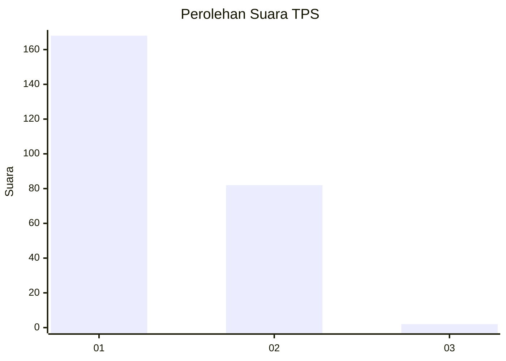
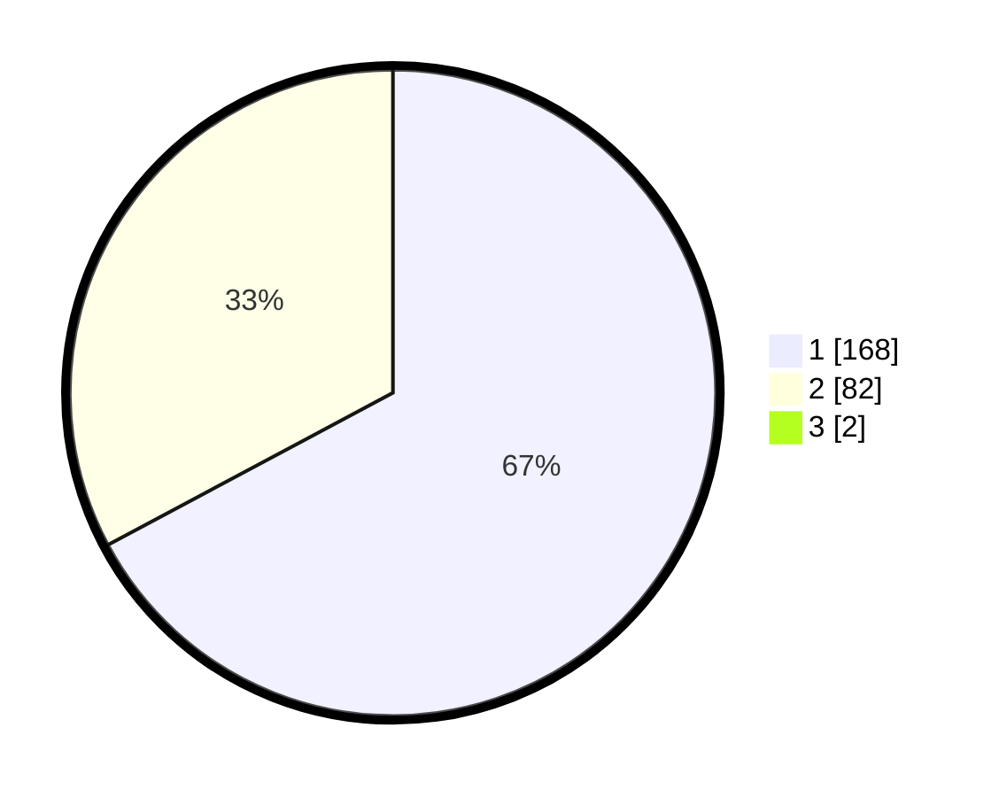

# Hasil

## Grafik

## Tabel

| No. | Nama Paslon    | Suara | Suara (raw) | Persentase |
|:--- |:-------------- | -----:| -----------:| ----------:|
| 1   | ANIES MUHAIMIN | 168   | [168][p-1]  | 66,67      |
| 2   | PRABOWO GIBRAN | 82    | [82][p-2]   | 32,54      |
| 3   | GANJAR MAHFUD  | 2     | [2][p-3]    | 0,79       |

[p-1]: https://github.com/gigit-pemilu/pemilu-2024/blob/main/pilpres/hitung-suara/sub/12-sumatera-utara/sub/10-labuhanbatu/sub/02-rantau-selatan/sub/1002-sioldengan/sub/021-tps/sub/paslon-1.txt
[p-2]: https://github.com/gigit-pemilu/pemilu-2024/blob/main/pilpres/hitung-suara/sub/12-sumatera-utara/sub/10-labuhanbatu/sub/02-rantau-selatan/sub/1002-sioldengan/sub/021-tps/sub/paslon-2.txt
[p-3]: https://github.com/gigit-pemilu/pemilu-2024/blob/main/pilpres/hitung-suara/sub/12-sumatera-utara/sub/10-labuhanbatu/sub/02-rantau-selatan/sub/1002-sioldengan/sub/021-tps/sub/paslon-3.txt

## Foto C Plano

https://sirekap-obj-formc.kpu.go.id/0ff4/pemilu/ppwp/12/10/02/10/02/1210021002021-20240215-001354--9c1fcf3e-7466-421a-8a2e-66343e2d601d.jpg

https://sirekap-obj-formc.kpu.go.id/0ff4/pemilu/ppwp/12/10/02/10/02/1210021002021-20240214-202004--3bdfa601-f7f8-4631-a837-bcbb5d9a6460.jpg

https://sirekap-obj-formc.kpu.go.id/0ff4/pemilu/ppwp/12/10/02/10/02/1210021002021-20240214-202011--3e8249cb-b603-454f-afa3-25ac07178017.jpg

## Metadata

| Key        | Value               |
| ---------- | ------------------- |
| Time Stamp | 2024-02-15 17:30:25 |

