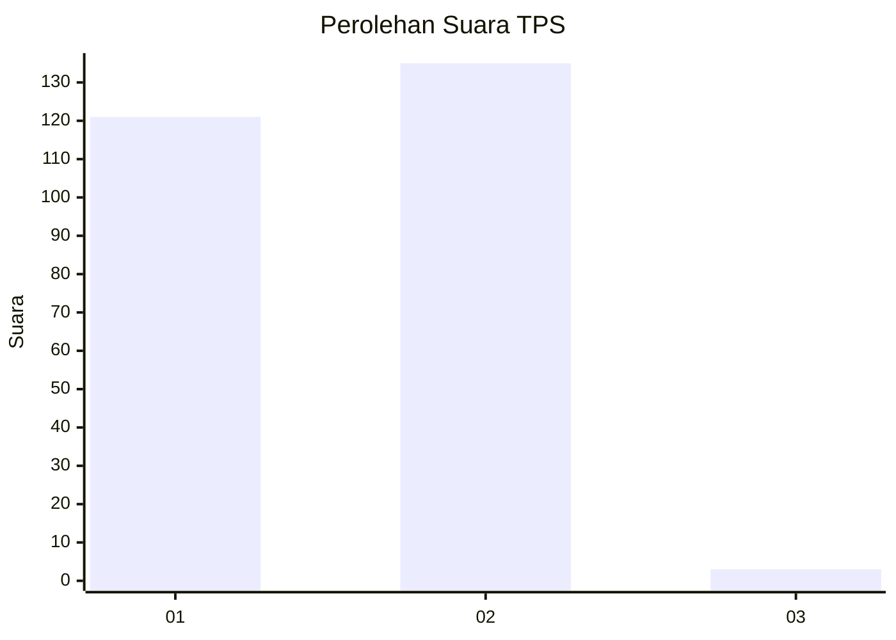
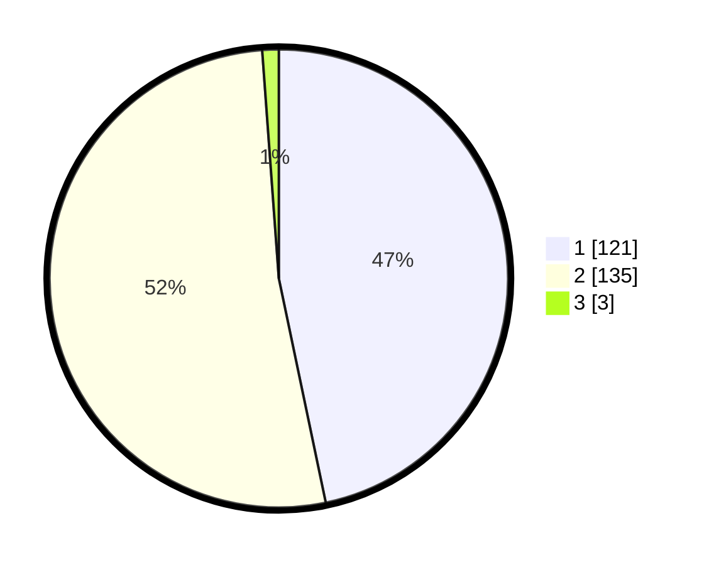

# Hasil

## Grafik

## Tabel

| No. | Nama Paslon    | Suara | Suara (raw) | Persentase |
|:--- |:-------------- | -----:| -----------:| ----------:|
| 1   | ANIES MUHAIMIN | 121   | [121][p-1]  | 46,72      |
| 2   | PRABOWO GIBRAN | 135   | [135][p-2]  | 52,12      |
| 3   | GANJAR MAHFUD  | 3     | [3][p-3]    | 1,16       |

[p-1]: https://github.com/gigit-pemilu/pemilu-2024/blob/main/pilpres/hitung-suara/sub/12-sumatera-utara/sub/10-labuhanbatu/sub/02-rantau-selatan/sub/1002-sioldengan/sub/026-tps/sub/paslon-1.txt
[p-2]: https://github.com/gigit-pemilu/pemilu-2024/blob/main/pilpres/hitung-suara/sub/12-sumatera-utara/sub/10-labuhanbatu/sub/02-rantau-selatan/sub/1002-sioldengan/sub/026-tps/sub/paslon-2.txt
[p-3]: https://github.com/gigit-pemilu/pemilu-2024/blob/main/pilpres/hitung-suara/sub/12-sumatera-utara/sub/10-labuhanbatu/sub/02-rantau-selatan/sub/1002-sioldengan/sub/026-tps/sub/paslon-3.txt

## Foto C Plano

https://sirekap-obj-formc.kpu.go.id/b595/pemilu/ppwp/12/10/02/10/02/1210021002026-20240215-001056--53f60c93-ab7b-4216-92b3-76fdc966b577.jpg

https://sirekap-obj-formc.kpu.go.id/b595/pemilu/ppwp/12/10/02/10/02/1210021002026-20240215-001310--92a720ef-cd2a-495a-b40c-32578b5156c2.jpg

https://sirekap-obj-formc.kpu.go.id/b595/pemilu/ppwp/12/10/02/10/02/1210021002026-20240215-001413--513848c2-13c7-40e4-b5af-fe728cf7d734.jpg

## Metadata

| Key        | Value               |
| ---------- | ------------------- |
| Time Stamp | 2024-02-15 22:30:27 |

