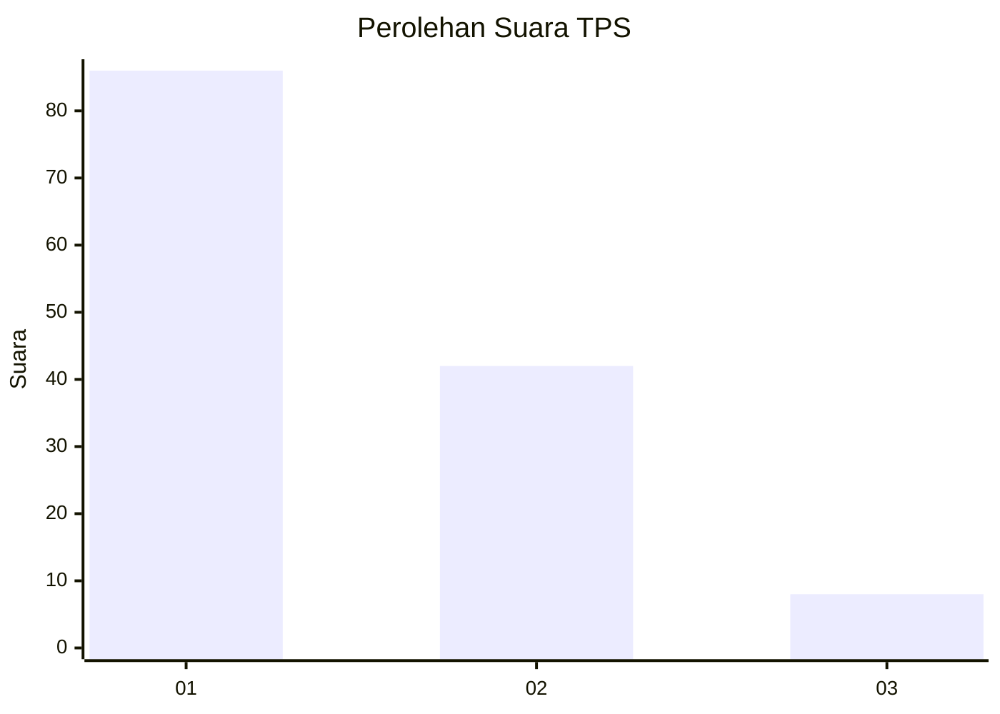
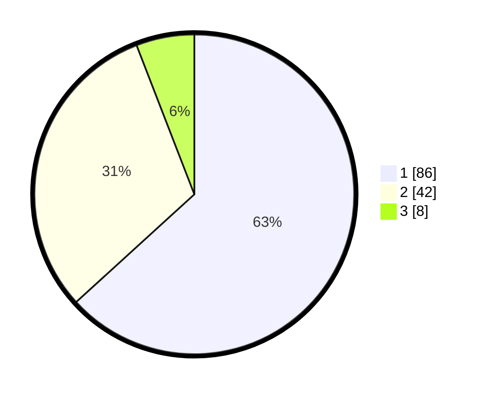

# Hasil

## Grafik

## Tabel

| No. | Nama Paslon    | Suara | Suara (raw) | Persentase |
|:--- |:-------------- | -----:| -----------:| ----------:|
| 1   | ANIES MUHAIMIN | 86    | [86][p-1]   | 63,24      |
| 2   | PRABOWO GIBRAN | 42    | [42][p-2]   | 30,88      |
| 3   | GANJAR MAHFUD  | 8     | [8][p-3]    | 5,88       |

[p-1]: https://github.com/gigit-pemilu/pemilu-2024/blob/main/pilpres/hitung-suara/sub/12-sumatera-utara/sub/10-labuhanbatu/sub/02-rantau-selatan/sub/1003-urung-kompas/sub/024-tps/sub/paslon-1.txt
[p-2]: https://github.com/gigit-pemilu/pemilu-2024/blob/main/pilpres/hitung-suara/sub/12-sumatera-utara/sub/10-labuhanbatu/sub/02-rantau-selatan/sub/1003-urung-kompas/sub/024-tps/sub/paslon-2.txt
[p-3]: https://github.com/gigit-pemilu/pemilu-2024/blob/main/pilpres/hitung-suara/sub/12-sumatera-utara/sub/10-labuhanbatu/sub/02-rantau-selatan/sub/1003-urung-kompas/sub/024-tps/sub/paslon-3.txt

## Foto C Plano

https://sirekap-obj-formc.kpu.go.id/ae64/pemilu/ppwp/12/10/02/10/03/1210021003024-20240214-155243--59fe76f5-7fa1-4420-b20e-492e9e89fe46.jpg

https://sirekap-obj-formc.kpu.go.id/ae64/pemilu/ppwp/12/10/02/10/03/1210021003024-20240214-155234--a3e53407-c369-46dd-be1e-7bd0db726434.jpg

https://sirekap-obj-formc.kpu.go.id/ae64/pemilu/ppwp/12/10/02/10/03/1210021003024-20240214-155404--af4cea81-99c2-4eda-b571-ad12514b62e4.jpg

## Metadata

| Key        | Value               |
| ---------- | ------------------- |
| Time Stamp | 2024-02-15 22:30:27 |

