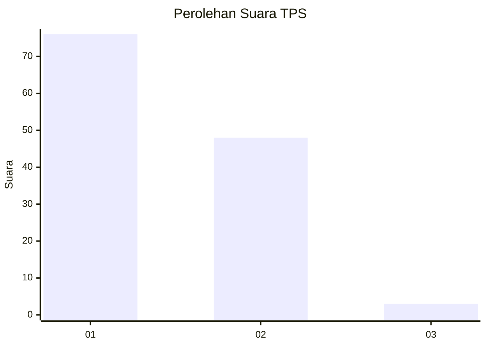
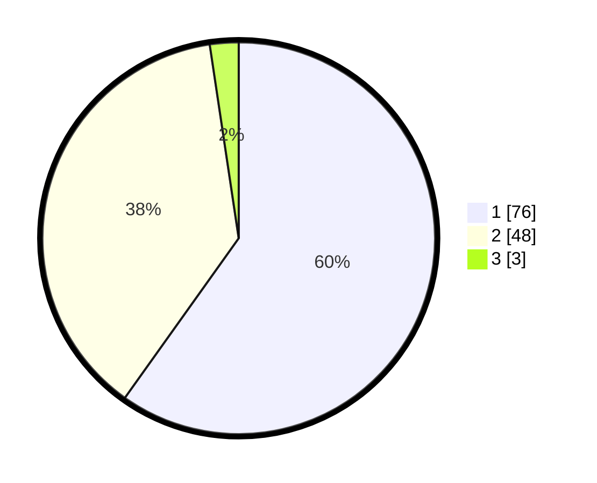

# Hasil

## Grafik

## Tabel

| No. | Nama Paslon    | Suara | Suara (raw) | Persentase |
|:--- |:-------------- | -----:| -----------:| ----------:|
| 1   | ANIES MUHAIMIN | 76    | [76][p-1]   | 59,84      |
| 2   | PRABOWO GIBRAN | 48    | [48][p-2]   | 37,80      |
| 3   | GANJAR MAHFUD  | 3     | [3][p-3]    | 2,36       |

[p-1]: https://github.com/gigit-pemilu/pemilu-2024/blob/main/pilpres/hitung-suara/sub/12-sumatera-utara/sub/10-labuhanbatu/sub/02-rantau-selatan/sub/1007-pardamean/sub/003-tps/sub/paslon-1.txt
[p-2]: https://github.com/gigit-pemilu/pemilu-2024/blob/main/pilpres/hitung-suara/sub/12-sumatera-utara/sub/10-labuhanbatu/sub/02-rantau-selatan/sub/1007-pardamean/sub/003-tps/sub/paslon-2.txt
[p-3]: https://github.com/gigit-pemilu/pemilu-2024/blob/main/pilpres/hitung-suara/sub/12-sumatera-utara/sub/10-labuhanbatu/sub/02-rantau-selatan/sub/1007-pardamean/sub/003-tps/sub/paslon-3.txt

## Foto C Plano

https://sirekap-obj-formc.kpu.go.id/c2f3/pemilu/ppwp/12/10/02/10/07/1210021007003-20240214-212826--801ffa87-b223-45c2-84f0-d62990ad97df.jpg

https://sirekap-obj-formc.kpu.go.id/c2f3/pemilu/ppwp/12/10/02/10/07/1210021007003-20240214-212832--014eac40-10fb-4c1a-a5fc-0c2817001989.jpg

https://sirekap-obj-formc.kpu.go.id/c2f3/pemilu/ppwp/12/10/02/10/07/1210021007003-20240214-212838--2dd2349d-ff1a-4d7a-b91f-7a8988b5ed24.jpg

## Metadata

| Key        | Value               |
| ---------- | ------------------- |
| Time Stamp | 2024-02-15 22:30:27 |

