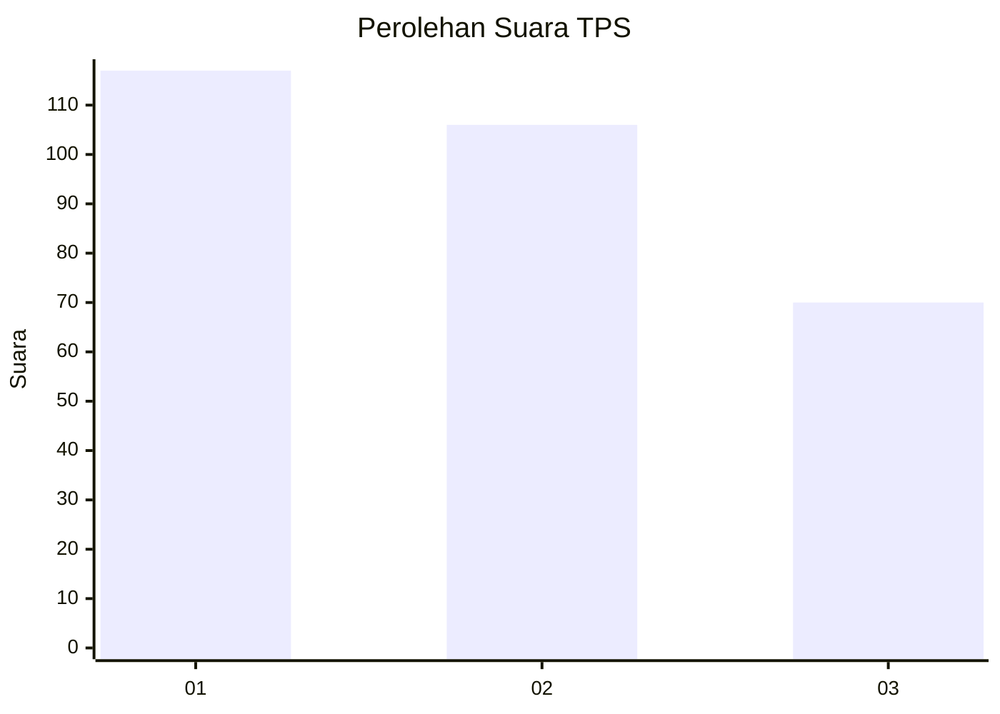
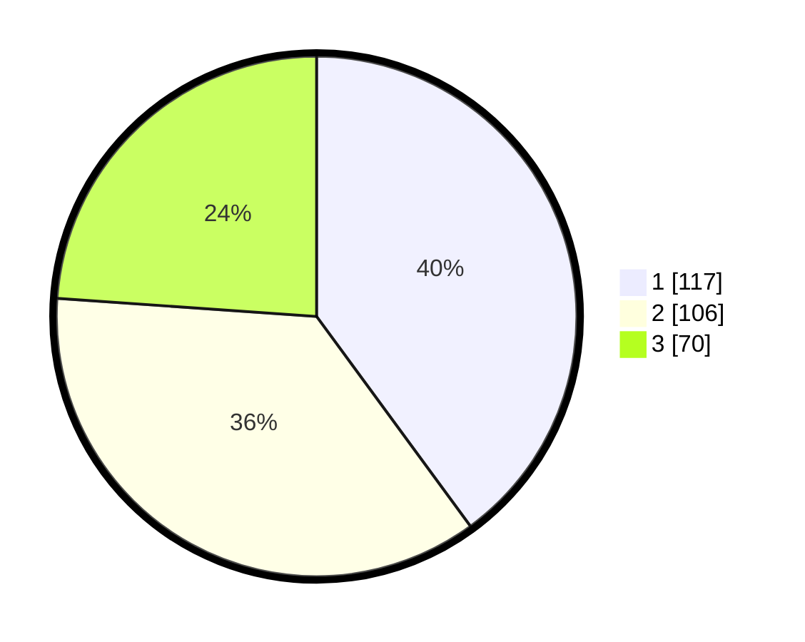

# Hasil

## Grafik

## Tabel

| No. | Nama Paslon    | Suara | Suara (raw) | Persentase |
|:--- |:-------------- | -----:| -----------:| ----------:|
| 1   | ANIES MUHAIMIN | 117   | [117][p-1]  | 39,93      |
| 2   | PRABOWO GIBRAN | 106   | [106][p-2]  | 36,18      |
| 3   | GANJAR MAHFUD  | 70    | [70][p-3]   | 23,89      |

[p-1]: https://github.com/gigit-pemilu/pemilu-2024-12-sumatera-utara/blob/main/pilpres/hitung-suara/sub/12-sumatera-utara/sub/10-labuhanbatu/sub/02-rantau-selatan/sub/1007-pardamean/sub/027-tps/sub/paslon-1.txt
[p-2]: https://github.com/gigit-pemilu/pemilu-2024-12-sumatera-utara/blob/main/pilpres/hitung-suara/sub/12-sumatera-utara/sub/10-labuhanbatu/sub/02-rantau-selatan/sub/1007-pardamean/sub/027-tps/sub/paslon-2.txt
[p-3]: https://github.com/gigit-pemilu/pemilu-2024-12-sumatera-utara/blob/main/pilpres/hitung-suara/sub/12-sumatera-utara/sub/10-labuhanbatu/sub/02-rantau-selatan/sub/1007-pardamean/sub/027-tps/sub/paslon-3.txt

## Foto C Plano

https://sirekap-obj-formc.kpu.go.id/3c5d/pemilu/ppwp/12/10/02/10/07/1210021007027-20240214-221819--bd916dd5-bc2b-4397-aa70-13c113fe38a3.jpg

https://sirekap-obj-formc.kpu.go.id/3c5d/pemilu/ppwp/12/10/02/10/07/1210021007027-20240215-002817--9650c1d6-e404-4034-b3bd-988e8137057d.jpg

https://sirekap-obj-formc.kpu.go.id/3c5d/pemilu/ppwp/12/10/02/10/07/1210021007027-20240215-002935--70ed2fd3-8c08-470d-800e-baf2e1527006.jpg

## Metadata

| Key        | Value               |
| ---------- | ------------------- |
| Time Stamp | 2024-02-15 22:30:27 |

