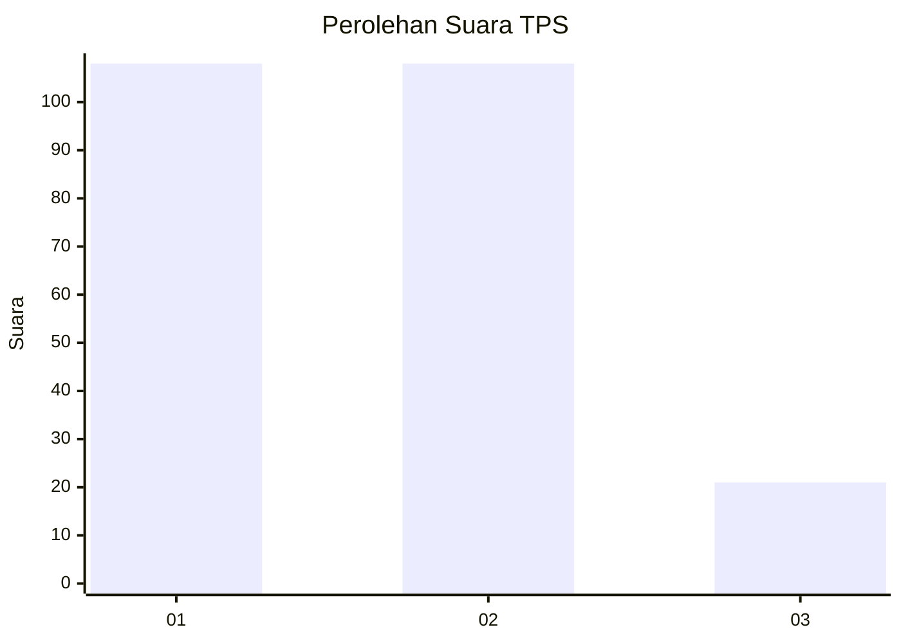
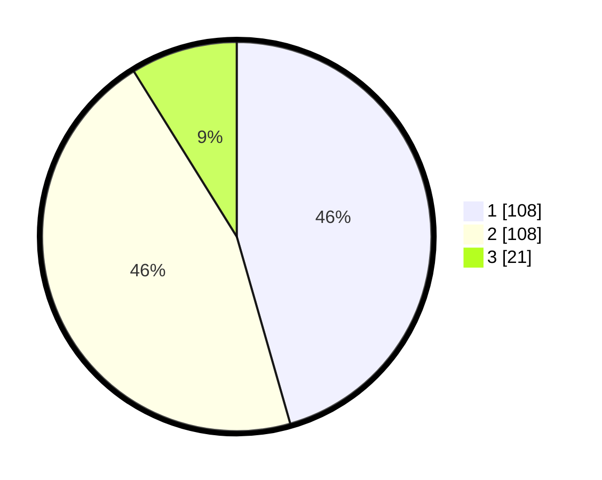

# Hasil

## Grafik

## Tabel

| No. | Nama Paslon    | Suara | Suara (raw) | Persentase |
|:--- |:-------------- | -----:| -----------:| ----------:|
| 1   | ANIES MUHAIMIN | 108   | [108][p-1]  | 45,57      |
| 2   | PRABOWO GIBRAN | 108   | [108][p-2]  | 45,57      |
| 3   | GANJAR MAHFUD  | 21    | [21][p-3]   | 8,86       |

[p-1]: https://github.com/gigit-pemilu/pemilu-2024/blob/main/pilpres/hitung-suara/sub/12-sumatera-utara/sub/10-labuhanbatu/sub/07-bilah-barat/sub/2001-sibargot/sub/001-tps/sub/paslon-1.txt
[p-2]: https://github.com/gigit-pemilu/pemilu-2024/blob/main/pilpres/hitung-suara/sub/12-sumatera-utara/sub/10-labuhanbatu/sub/07-bilah-barat/sub/2001-sibargot/sub/001-tps/sub/paslon-2.txt
[p-3]: https://github.com/gigit-pemilu/pemilu-2024/blob/main/pilpres/hitung-suara/sub/12-sumatera-utara/sub/10-labuhanbatu/sub/07-bilah-barat/sub/2001-sibargot/sub/001-tps/sub/paslon-3.txt

## Foto C Plano

https://sirekap-obj-formc.kpu.go.id/4eda/pemilu/ppwp/12/10/07/20/01/1210072001001-20240215-222027--1bed1181-44e3-40e0-ba22-bdb3945e9d75.jpg

https://sirekap-obj-formc.kpu.go.id/4eda/pemilu/ppwp/12/10/07/20/01/1210072001001-20240216-145156--13c28629-6f71-4148-a218-2f569bb7f7ae.jpg

https://sirekap-obj-formc.kpu.go.id/4eda/pemilu/ppwp/12/10/07/20/01/1210072001001-20240214-195430--afbc7e2e-4ce2-4e05-8b53-e8977e0eff9b.jpg

## Metadata

| Key        | Value               |
| ---------- | ------------------- |
| Time Stamp | 2024-02-25 13:00:00 |

