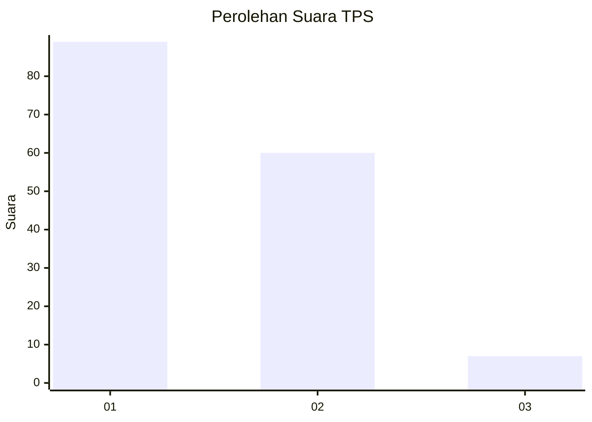
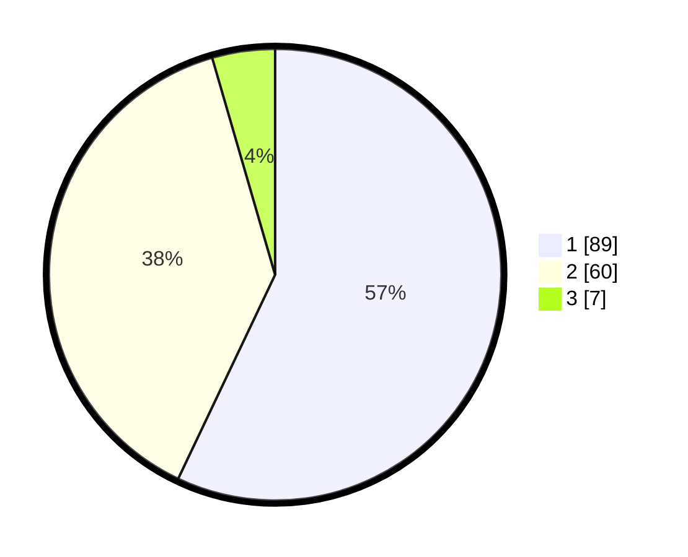

# Hasil

## Grafik

## Tabel

| No. | Nama Paslon    | Suara | Suara (raw) | Persentase |
|:--- |:-------------- | -----:| -----------:| ----------:|
| 1   | ANIES MUHAIMIN | 89    | [89][p-1]   | 57,05      |
| 2   | PRABOWO GIBRAN | 60    | [60][p-2]   | 38,46      |
| 3   | GANJAR MAHFUD  | 7     | [7][p-3]    | 4,49       |

[p-1]: https://github.com/gigit-pemilu/pemilu-2024/blob/main/pilpres/hitung-suara/sub/12-sumatera-utara/sub/10-labuhanbatu/sub/07-bilah-barat/sub/2001-sibargot/sub/007-tps/sub/paslon-1.txt
[p-2]: https://github.com/gigit-pemilu/pemilu-2024/blob/main/pilpres/hitung-suara/sub/12-sumatera-utara/sub/10-labuhanbatu/sub/07-bilah-barat/sub/2001-sibargot/sub/007-tps/sub/paslon-2.txt
[p-3]: https://github.com/gigit-pemilu/pemilu-2024/blob/main/pilpres/hitung-suara/sub/12-sumatera-utara/sub/10-labuhanbatu/sub/07-bilah-barat/sub/2001-sibargot/sub/007-tps/sub/paslon-3.txt

## Foto C Plano

https://sirekap-obj-formc.kpu.go.id/b5c4/pemilu/ppwp/12/10/07/20/01/1210072001007-20240215-015444--522a1f87-1235-4d60-b65e-c0f0d920df17.jpg

https://sirekap-obj-formc.kpu.go.id/b5c4/pemilu/ppwp/12/10/07/20/01/1210072001007-20240215-015848--6bfe1ac7-e8da-4d26-abeb-c75480c523a4.jpg

https://sirekap-obj-formc.kpu.go.id/b5c4/pemilu/ppwp/12/10/07/20/01/1210072001007-20240215-015744--5555879f-3801-4f6a-89bb-6d62bc09e5cc.jpg

## Metadata

| Key        | Value               |
| ---------- | ------------------- |
| Time Stamp | 2024-02-25 15:00:00 |

