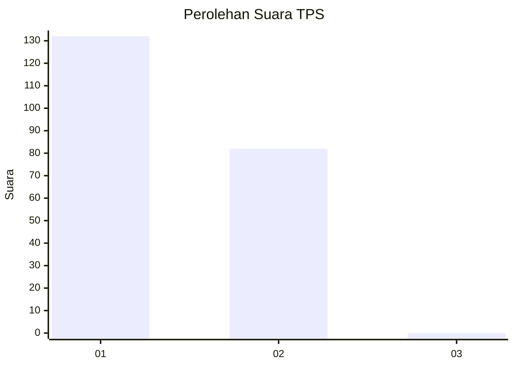
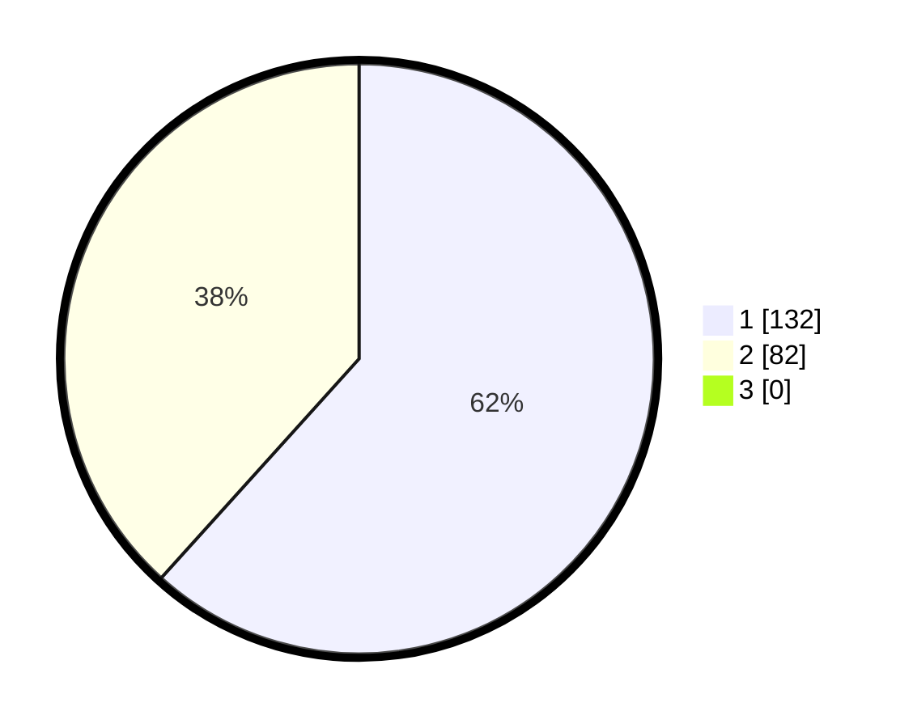

# Hasil

## Grafik

## Tabel

| No. | Nama Paslon    | Suara | Suara (raw) | Persentase |
|:--- |:-------------- | -----:| -----------:| ----------:|
| 1   | ANIES MUHAIMIN | 132   | [132][p-1]  | 61,68      |
| 2   | PRABOWO GIBRAN | 82    | [82][p-2]   | 38,32      |
| 3   | GANJAR MAHFUD  | 0     | [0][p-3]    | 0,00       |

[p-1]: https://github.com/gigit-pemilu/pemilu-2024-12-sumatera-utara/blob/main/pilpres/hitung-suara/sub/12-sumatera-utara/sub/10-labuhanbatu/sub/07-bilah-barat/sub/2002-bandar-kumbul/sub/002-tps/sub/paslon-1.txt
[p-2]: https://github.com/gigit-pemilu/pemilu-2024-12-sumatera-utara/blob/main/pilpres/hitung-suara/sub/12-sumatera-utara/sub/10-labuhanbatu/sub/07-bilah-barat/sub/2002-bandar-kumbul/sub/002-tps/sub/paslon-2.txt
[p-3]: https://github.com/gigit-pemilu/pemilu-2024-12-sumatera-utara/blob/main/pilpres/hitung-suara/sub/12-sumatera-utara/sub/10-labuhanbatu/sub/07-bilah-barat/sub/2002-bandar-kumbul/sub/002-tps/sub/paslon-3.txt

## Foto C Plano

https://sirekap-obj-formc.kpu.go.id/bbe8/pemilu/ppwp/12/10/07/20/02/1210072002002-20240216-162137--cda59054-11a4-404b-b092-d8836fc5e228.jpg

https://sirekap-obj-formc.kpu.go.id/bbe8/pemilu/ppwp/12/10/07/20/02/1210072002002-20240216-162144--0e236264-f81a-43a0-a7cd-14c2bf50160d.jpg

https://sirekap-obj-formc.kpu.go.id/bbe8/pemilu/ppwp/12/10/07/20/02/1210072002002-20240216-162147--5df11563-8c86-48f0-aa71-35bed0e2c53d.jpg

## Metadata

| Key        | Value               |
| ---------- | ------------------- |
| Time Stamp | 2024-02-25 16:00:00 |

