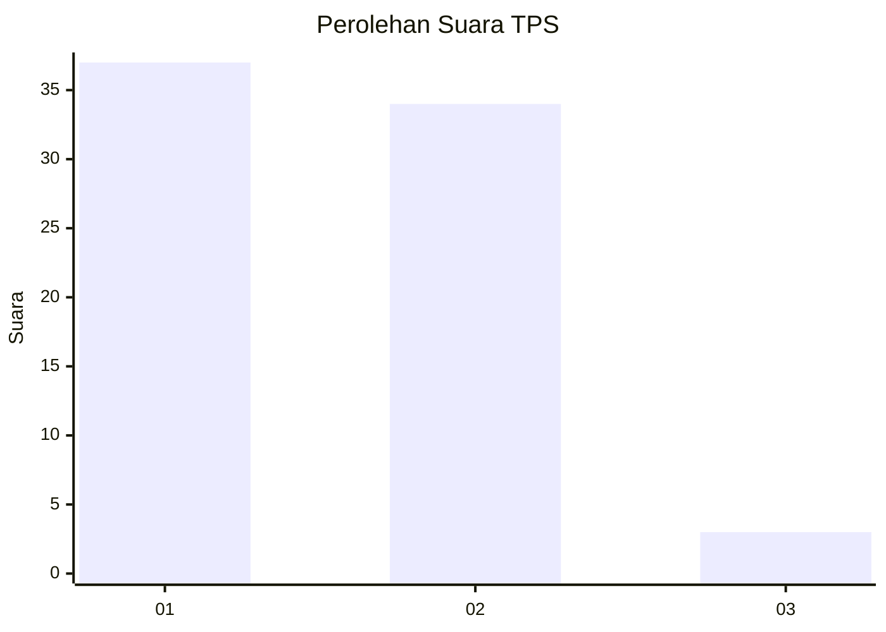
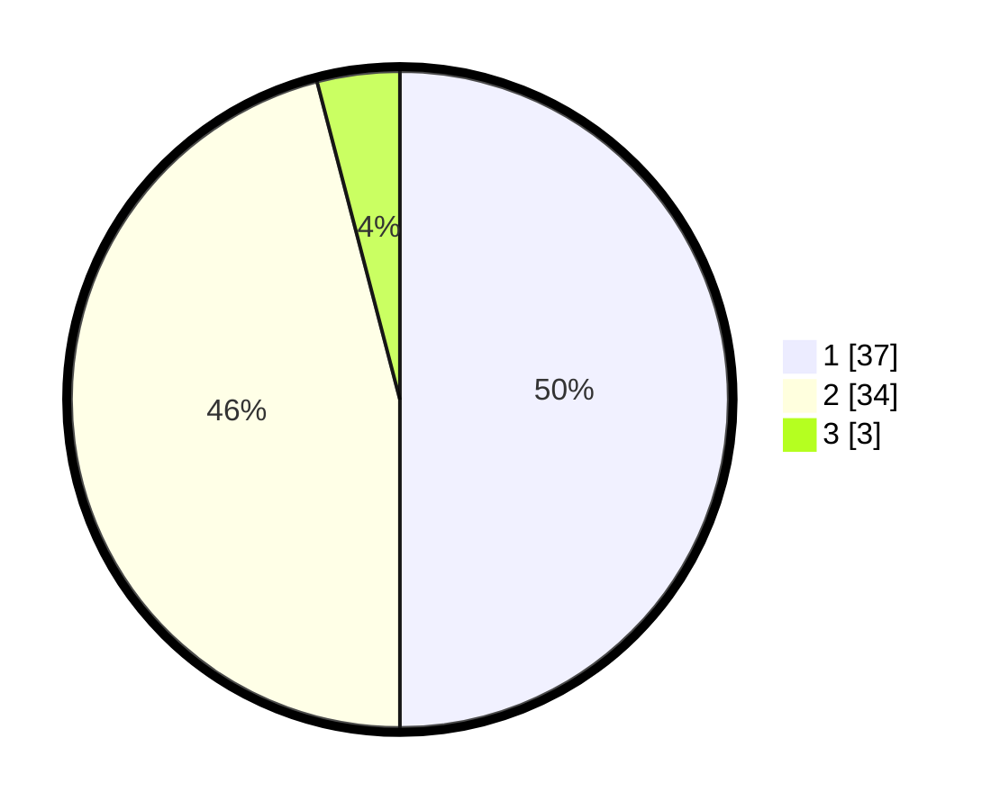

# Hasil

## Grafik

## Tabel

| No. | Nama Paslon    | Suara | Suara (raw) | Persentase |
|:--- |:-------------- | -----:| -----------:| ----------:|
| 1   | ANIES MUHAIMIN | 37    | [37][p-1]   | 50,00      |
| 2   | PRABOWO GIBRAN | 34    | [34][p-2]   | 45,95      |
| 3   | GANJAR MAHFUD  | 3     | [3][p-3]    | 4,05       |

[p-1]: https://github.com/gigit-pemilu/pemilu-2024/blob/main/pilpres/hitung-suara/sub/12-sumatera-utara/sub/10-labuhanbatu/sub/08-bilah-hilir/sub/1001-negeri-lama/sub/002-tps/sub/paslon-1.txt
[p-2]: https://github.com/gigit-pemilu/pemilu-2024/blob/main/pilpres/hitung-suara/sub/12-sumatera-utara/sub/10-labuhanbatu/sub/08-bilah-hilir/sub/1001-negeri-lama/sub/002-tps/sub/paslon-2.txt
[p-3]: https://github.com/gigit-pemilu/pemilu-2024/blob/main/pilpres/hitung-suara/sub/12-sumatera-utara/sub/10-labuhanbatu/sub/08-bilah-hilir/sub/1001-negeri-lama/sub/002-tps/sub/paslon-3.txt

## Foto C Plano

https://sirekap-obj-formc.kpu.go.id/b271/pemilu/ppwp/12/10/08/10/01/1210081001002-20240219-080234--fc8b4cd1-f69b-4eb8-a876-7348b2601b75.jpg

https://sirekap-obj-formc.kpu.go.id/b271/pemilu/ppwp/12/10/08/10/01/1210081001002-20240219-082319--a259da39-3070-492b-988f-ac730eca016d.jpg

https://sirekap-obj-formc.kpu.go.id/b271/pemilu/ppwp/12/10/08/10/01/1210081001002-20240219-081232--eca89bc1-b2bb-4261-8db2-a2c159e56d32.jpg

## Metadata

| Key        | Value               |
| ---------- | ------------------- |
| Time Stamp | 2024-02-21 23:00:00 |

## DATA PEMILIH TETAP

Jumlah pemilih dalam DPT: **106**.
 * L: **55**.
 * P: **51**.

## DATA PENGGUNA HAK PILIH

Jumlah pengguna hak pilih dalam DPT: **73**.
 * L: **35**.
 * P: **38**.

Jumlah pengguna hak pilih dalam DPTb: **0**.
 * L: **0**.
 * P: **0**.

Jumlah pengguna hak pilih dalam DPK: **1**.
 * L: **1**.
 * P: **0**.

Jumlah pengguna hak pilih: **74**.
 * L: **36**.
 * P: **38**.

## JUMLAH SUARA SAH DAN TIDAK SAH

JUMLAH SELURUH SUARA SAH: **74**.

JUMLAH SUARA TIDAK SAH: **0**.

JUMLAH SELURUH SUARA SAH DAN SUARA TIDAK SAH: **74**.

