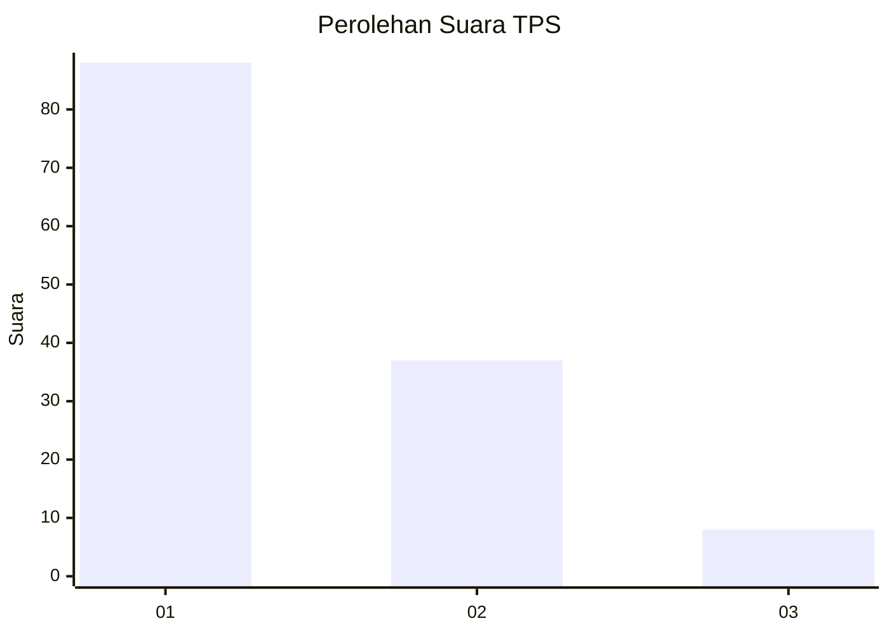
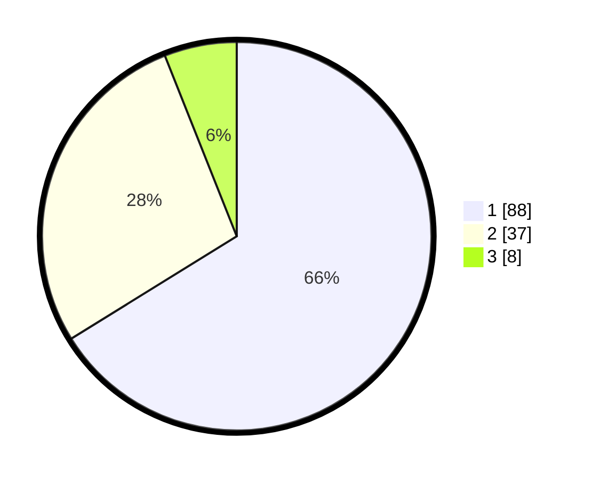

# Hasil

## Grafik

## Tabel

| No. | Nama Paslon    | Suara | Suara (raw) | Persentase |
|:--- |:-------------- | -----:| -----------:| ----------:|
| 1   | ANIES MUHAIMIN | 88    | [88][p-1]   | 66,17      |
| 2   | PRABOWO GIBRAN | 37    | [37][p-2]   | 27,82      |
| 3   | GANJAR MAHFUD  | 8     | [8][p-3]    | 6,02       |

[p-1]: https://github.com/gigit-pemilu/pemilu-2024/blob/main/pilpres/hitung-suara/sub/12-sumatera-utara/sub/10-labuhanbatu/sub/08-bilah-hilir/sub/1001-negeri-lama/sub/014-tps/sub/paslon-1.txt
[p-2]: https://github.com/gigit-pemilu/pemilu-2024/blob/main/pilpres/hitung-suara/sub/12-sumatera-utara/sub/10-labuhanbatu/sub/08-bilah-hilir/sub/1001-negeri-lama/sub/014-tps/sub/paslon-2.txt
[p-3]: https://github.com/gigit-pemilu/pemilu-2024/blob/main/pilpres/hitung-suara/sub/12-sumatera-utara/sub/10-labuhanbatu/sub/08-bilah-hilir/sub/1001-negeri-lama/sub/014-tps/sub/paslon-3.txt

## Foto C Plano

https://sirekap-obj-formc.kpu.go.id/0df6/pemilu/ppwp/12/10/08/10/01/1210081001014-20240215-075249--133dd15d-35b9-46ca-9b43-57e71677c33e.jpg

https://sirekap-obj-formc.kpu.go.id/0df6/pemilu/ppwp/12/10/08/10/01/1210081001014-20240215-055712--f0f41562-0b24-49a5-962d-9c7669d2541d.jpg

https://sirekap-obj-formc.kpu.go.id/0df6/pemilu/ppwp/12/10/08/10/01/1210081001014-20240215-055945--cde31086-0849-4e1a-abd6-982dc2b8650e.jpg

## Metadata

| Key        | Value               |
| ---------- | ------------------- |
| Time Stamp | 2024-02-15 22:30:27 |

