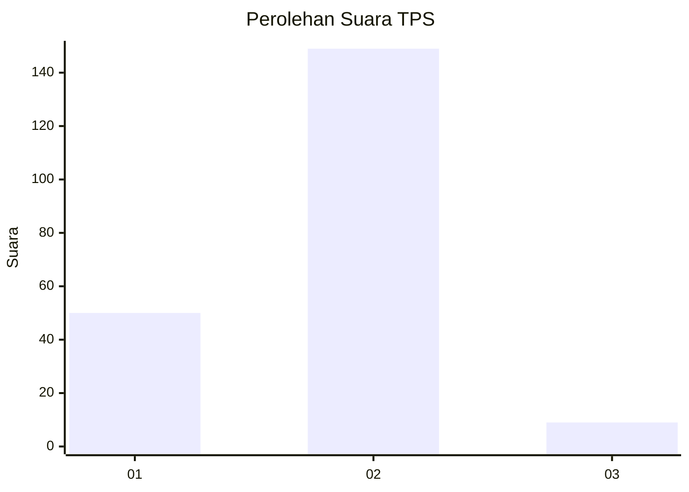
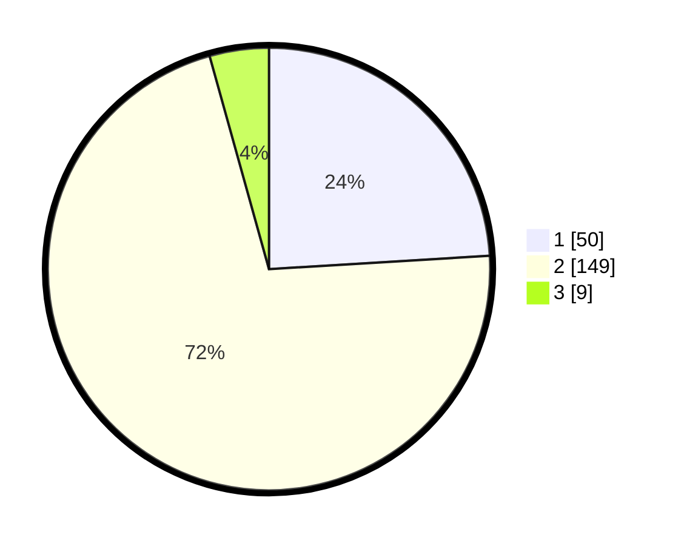

# Hasil

## Grafik

## Tabel

| No. | Nama Paslon    | Suara | Suara (raw) | Persentase |
|:--- |:-------------- | -----:| -----------:| ----------:|
| 1   | ANIES MUHAIMIN | 50    | [50][p-1]   | 24,04      |
| 2   | PRABOWO GIBRAN | 149   | [149][p-2]  | 71,63      |
| 3   | GANJAR MAHFUD  | 9     | [9][p-3]    | 4,33       |

[p-1]: https://github.com/gigit-pemilu/pemilu-2024-12-sumatera-utara/blob/main/pilpres/hitung-suara/sub/12-sumatera-utara/sub/10-labuhanbatu/sub/09-bilah-hulu/sub/2001-lingga-tiga/sub/002-tps/sub/paslon-1.txt
[p-2]: https://github.com/gigit-pemilu/pemilu-2024-12-sumatera-utara/blob/main/pilpres/hitung-suara/sub/12-sumatera-utara/sub/10-labuhanbatu/sub/09-bilah-hulu/sub/2001-lingga-tiga/sub/002-tps/sub/paslon-2.txt
[p-3]: https://github.com/gigit-pemilu/pemilu-2024-12-sumatera-utara/blob/main/pilpres/hitung-suara/sub/12-sumatera-utara/sub/10-labuhanbatu/sub/09-bilah-hulu/sub/2001-lingga-tiga/sub/002-tps/sub/paslon-3.txt

## Foto C Plano

https://sirekap-obj-formc.kpu.go.id/7bfe/pemilu/ppwp/12/10/09/20/01/1210092001002-20240214-225026--5cb33348-43af-4439-928f-8e739068c26d.jpg

https://sirekap-obj-formc.kpu.go.id/7bfe/pemilu/ppwp/12/10/09/20/01/1210092001002-20240214-225357--109857c7-6058-4c11-8c79-4b7da1eab4a5.jpg

https://sirekap-obj-formc.kpu.go.id/7bfe/pemilu/ppwp/12/10/09/20/01/1210092001002-20240214-225259--2db134e0-192f-464f-8804-cb0f9a5e7042.jpg

## Metadata

| Key        | Value               |
| ---------- | ------------------- |
| Time Stamp | 2024-02-15 22:40:13 |

