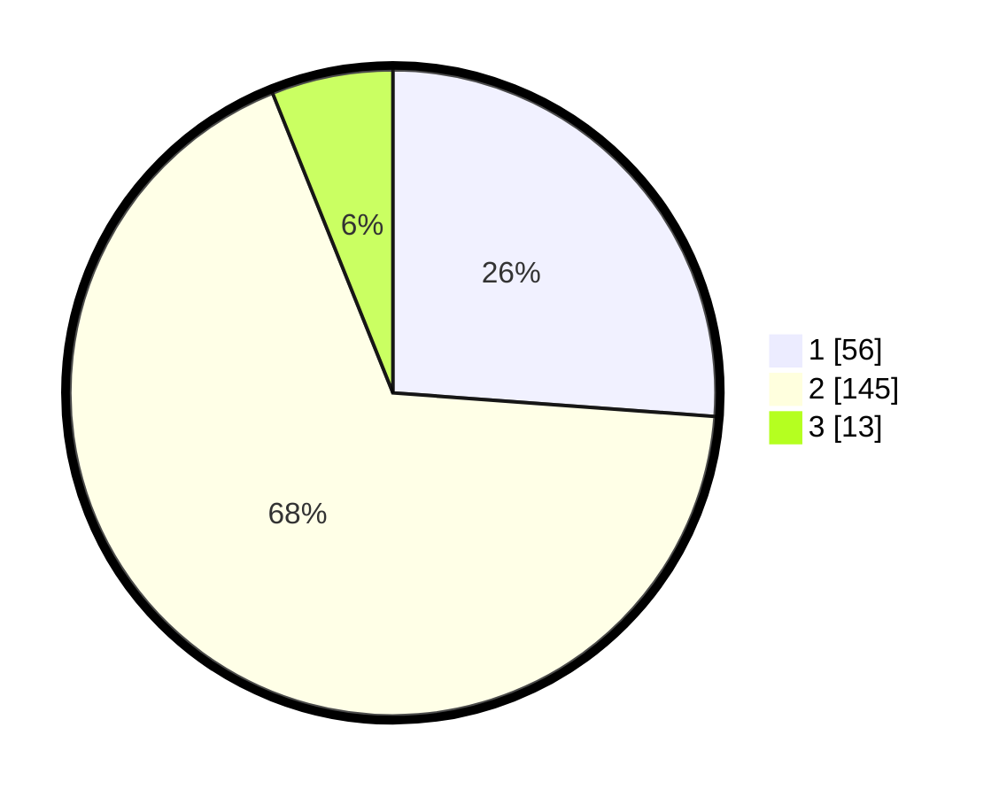

# Hasil

## Grafik

## Tabel

| No. | Nama Paslon    | Suara | Suara (raw) | Persentase |
|:--- |:-------------- | -----:| -----------:| ----------:|
| 1   | ANIES MUHAIMIN | 56    | [56][p-1]   | 26,17      |
| 2   | PRABOWO GIBRAN | 145   | [145][p-2]  | 67,76      |
| 3   | GANJAR MAHFUD  | 13    | [13][p-3]   | 6,07       |

[p-1]: https://github.com/gigit-pemilu/pemilu-2024-12-sumatera-utara/blob/main/pilpres/hitung-suara/sub/12-sumatera-utara/sub/10-labuhanbatu/sub/09-bilah-hulu/sub/2001-lingga-tiga/sub/010-tps/sub/paslon-1.txt
[p-2]: https://github.com/gigit-pemilu/pemilu-2024-12-sumatera-utara/blob/main/pilpres/hitung-suara/sub/12-sumatera-utara/sub/10-labuhanbatu/sub/09-bilah-hulu/sub/2001-lingga-tiga/sub/010-tps/sub/paslon-2.txt
[p-3]: https://github.com/gigit-pemilu/pemilu-2024-12-sumatera-utara/blob/main/pilpres/hitung-suara/sub/12-sumatera-utara/sub/10-labuhanbatu/sub/09-bilah-hulu/sub/2001-lingga-tiga/sub/010-tps/sub/paslon-3.txt

## Foto C Plano

https://sirekap-obj-formc.kpu.go.id/3c2e/pemilu/ppwp/12/10/09/20/01/1210092001010-20240215-064946--572583d0-e4ec-44aa-b91f-ad530c4c011b.jpg

https://sirekap-obj-formc.kpu.go.id/3c2e/pemilu/ppwp/12/10/09/20/01/1210092001010-20240215-030641--51a943b1-2546-4cbc-9a46-474415c1bccc.jpg

https://sirekap-obj-formc.kpu.go.id/3c2e/pemilu/ppwp/12/10/09/20/01/1210092001010-20240215-030809--633c1a39-9716-4aea-b299-ff0a1ee9e13d.jpg

## Metadata

| Key        | Value               |
| ---------- | ------------------- |
| Time Stamp | 2024-02-15 22:40:13 |

