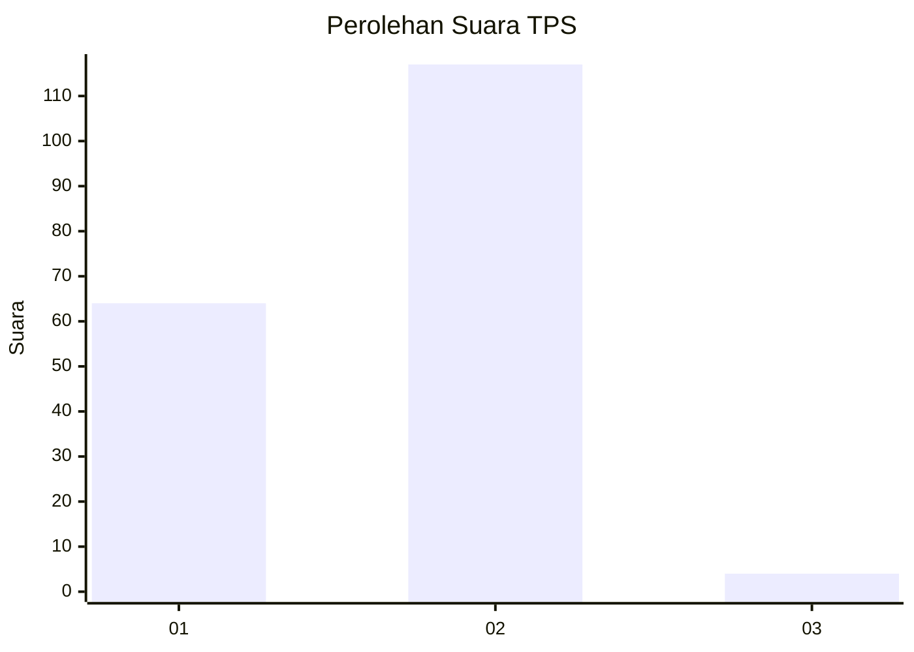
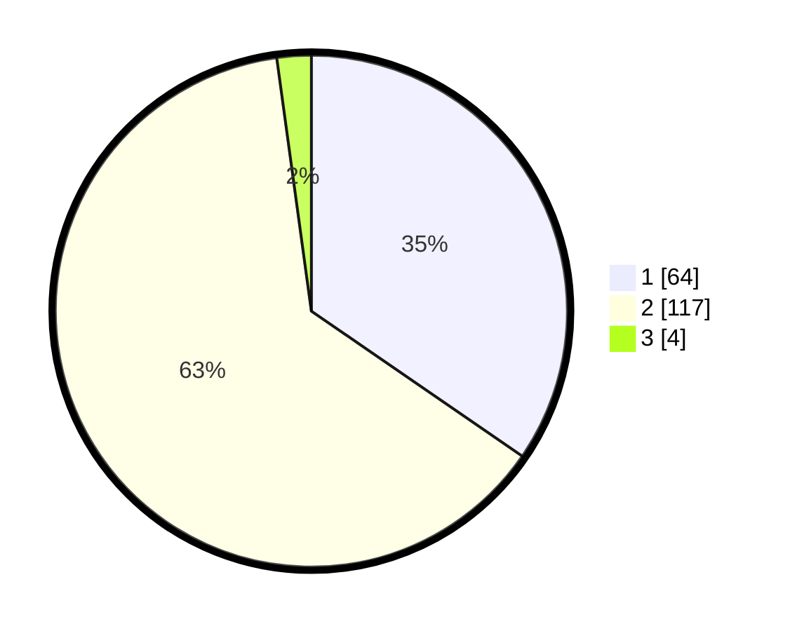

# Hasil

## Grafik

## Tabel

| No. | Nama Paslon    | Suara | Suara (raw) | Persentase |
|:--- |:-------------- | -----:| -----------:| ----------:|
| 1   | ANIES MUHAIMIN | 64    | [64][p-1]   | 34,59      |
| 2   | PRABOWO GIBRAN | 117   | [117][p-2]  | 63,24      |
| 3   | GANJAR MAHFUD  | 4     | [4][p-3]    | 2,16       |

[p-1]: https://github.com/gigit-pemilu/pemilu-2024-12-sumatera-utara/blob/main/pilpres/hitung-suara/sub/12-sumatera-utara/sub/10-labuhanbatu/sub/09-bilah-hulu/sub/2001-lingga-tiga/sub/014-tps/sub/paslon-1.txt
[p-2]: https://github.com/gigit-pemilu/pemilu-2024-12-sumatera-utara/blob/main/pilpres/hitung-suara/sub/12-sumatera-utara/sub/10-labuhanbatu/sub/09-bilah-hulu/sub/2001-lingga-tiga/sub/014-tps/sub/paslon-2.txt
[p-3]: https://github.com/gigit-pemilu/pemilu-2024-12-sumatera-utara/blob/main/pilpres/hitung-suara/sub/12-sumatera-utara/sub/10-labuhanbatu/sub/09-bilah-hulu/sub/2001-lingga-tiga/sub/014-tps/sub/paslon-3.txt

## Foto C Plano

https://sirekap-obj-formc.kpu.go.id/0ab3/pemilu/ppwp/12/10/09/20/01/1210092001014-20240215-194849--06b00335-8a0a-41fb-a5f5-1b1e79b39b69.jpg

https://sirekap-obj-formc.kpu.go.id/0ab3/pemilu/ppwp/12/10/09/20/01/1210092001014-20240215-194901--9162e400-67ce-4b0a-bc15-0a2281971b82.jpg

https://sirekap-obj-formc.kpu.go.id/0ab3/pemilu/ppwp/12/10/09/20/01/1210092001014-20240215-194911--8d1d4c07-8b31-4a1e-8651-de48f36e8590.jpg

## Metadata

| Key        | Value               |
| ---------- | ------------------- |
| Time Stamp | 2024-02-15 22:40:13 |

