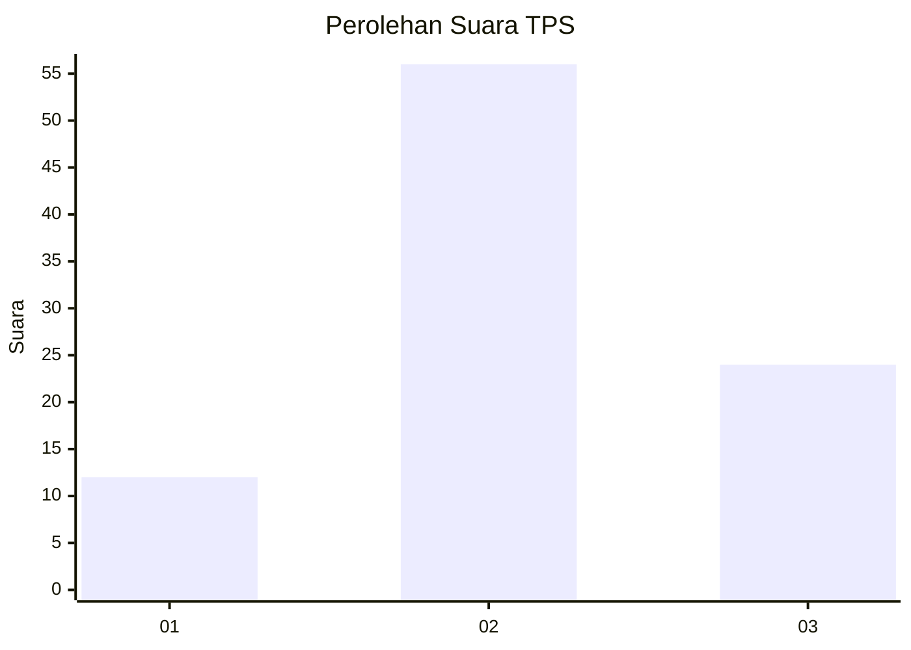
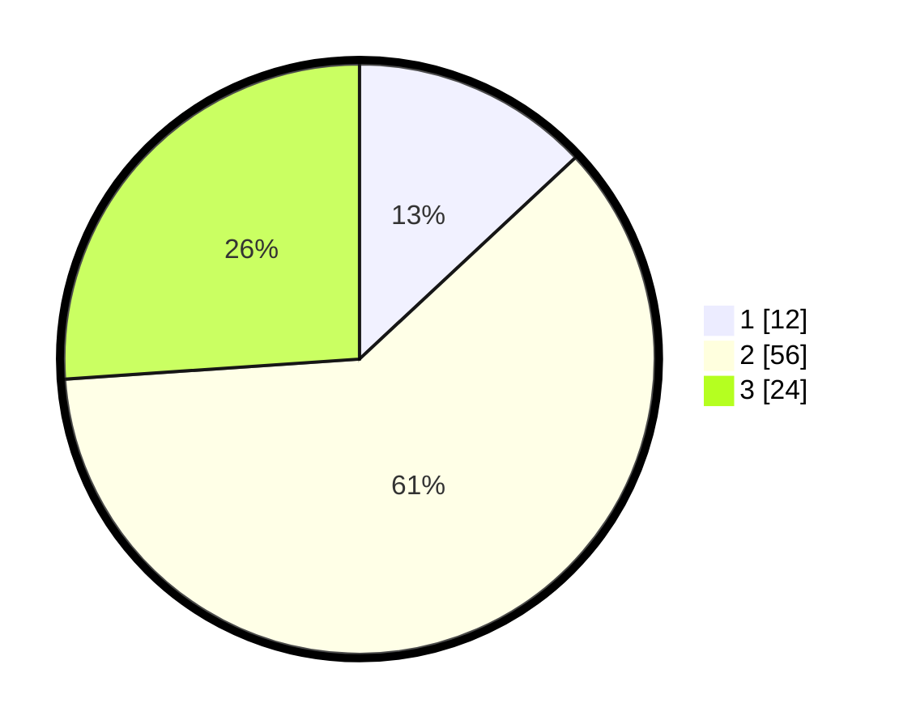

# Hasil

## Grafik

## Tabel

| No. | Nama Paslon    | Suara | Suara (raw) | Persentase |
|:--- |:-------------- | -----:| -----------:| ----------:|
| 1   | ANIES MUHAIMIN | 12    | [12][p-1]   | 13,04      |
| 2   | PRABOWO GIBRAN | 56    | [56][p-2]   | 60,87      |
| 3   | GANJAR MAHFUD  | 24    | [24][p-3]   | 26,09      |

[p-1]: https://github.com/gigit-pemilu/pemilu-2024-12-sumatera-utara/blob/main/pilpres/hitung-suara/sub/12-sumatera-utara/sub/10-labuhanbatu/sub/09-bilah-hulu/sub/2003-pematang-seleng/sub/019-tps/sub/paslon-1.txt
[p-2]: https://github.com/gigit-pemilu/pemilu-2024-12-sumatera-utara/blob/main/pilpres/hitung-suara/sub/12-sumatera-utara/sub/10-labuhanbatu/sub/09-bilah-hulu/sub/2003-pematang-seleng/sub/019-tps/sub/paslon-2.txt
[p-3]: https://github.com/gigit-pemilu/pemilu-2024-12-sumatera-utara/blob/main/pilpres/hitung-suara/sub/12-sumatera-utara/sub/10-labuhanbatu/sub/09-bilah-hulu/sub/2003-pematang-seleng/sub/019-tps/sub/paslon-3.txt

## Foto C Plano

https://sirekap-obj-formc.kpu.go.id/9195/pemilu/ppwp/12/10/09/20/03/1210092003019-20240214-214619--97a93e14-092c-4948-8c0d-d3cd3a6fd9b5.jpg

https://sirekap-obj-formc.kpu.go.id/9195/pemilu/ppwp/12/10/09/20/03/1210092003019-20240214-222116--7648fcc9-3df1-41de-b2a0-b39b4a0be0c9.jpg

https://sirekap-obj-formc.kpu.go.id/9195/pemilu/ppwp/12/10/09/20/03/1210092003019-20240214-222856--e3b6fe1a-0d84-4fff-bc7f-eee541982ea0.jpg

## Metadata

| Key        | Value               |
| ---------- | ------------------- |
| Time Stamp | 2024-02-15 23:29:50 |

