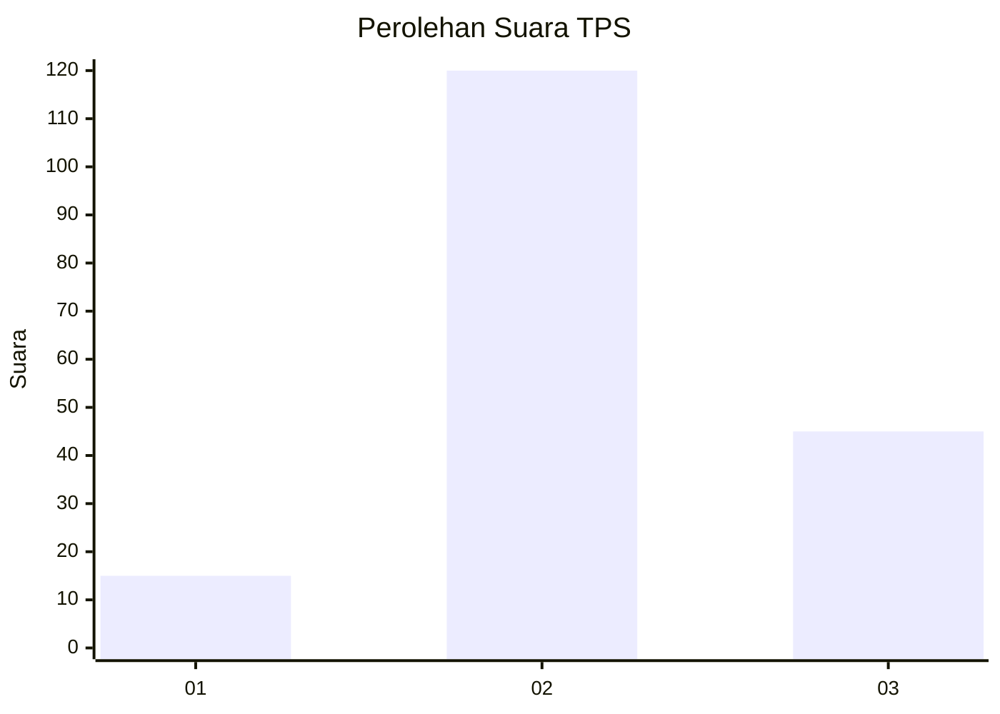
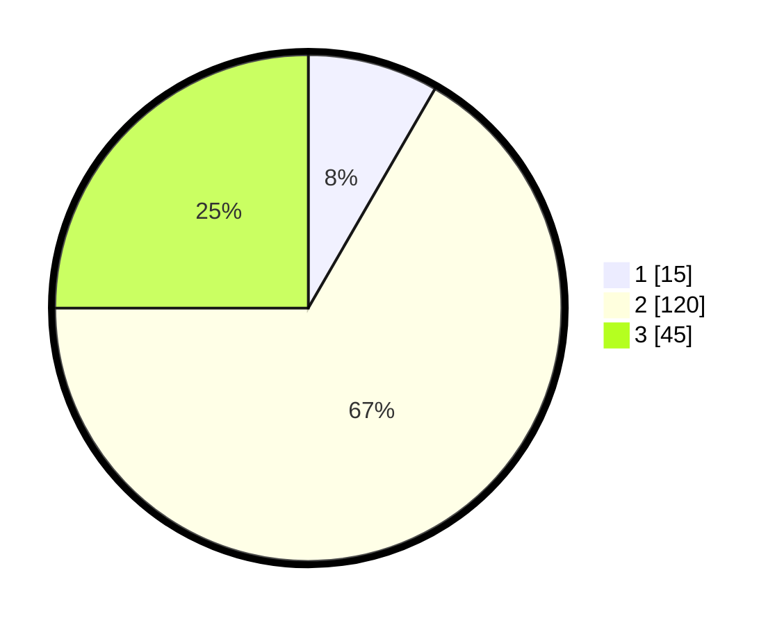

# Hasil

## Grafik

## Tabel

| No. | Nama Paslon    | Suara | Suara (raw) | Persentase |
|:--- |:-------------- | -----:| -----------:| ----------:|
| 1   | ANIES MUHAIMIN | 15    | [15][p-1]   | 8,33       |
| 2   | PRABOWO GIBRAN | 120   | [120][p-2]  | 66,67      |
| 3   | GANJAR MAHFUD  | 45    | [45][p-3]   | 25,00      |

[p-1]: https://github.com/gigit-pemilu/pemilu-2024-12-sumatera-utara/blob/main/pilpres/hitung-suara/sub/12-sumatera-utara/sub/10-labuhanbatu/sub/09-bilah-hulu/sub/2006-emplasemen-aek-nabara/sub/003-tps/sub/paslon-1.txt
[p-2]: https://github.com/gigit-pemilu/pemilu-2024-12-sumatera-utara/blob/main/pilpres/hitung-suara/sub/12-sumatera-utara/sub/10-labuhanbatu/sub/09-bilah-hulu/sub/2006-emplasemen-aek-nabara/sub/003-tps/sub/paslon-2.txt
[p-3]: https://github.com/gigit-pemilu/pemilu-2024-12-sumatera-utara/blob/main/pilpres/hitung-suara/sub/12-sumatera-utara/sub/10-labuhanbatu/sub/09-bilah-hulu/sub/2006-emplasemen-aek-nabara/sub/003-tps/sub/paslon-3.txt

## Foto C Plano

https://sirekap-obj-formc.kpu.go.id/8efd/pemilu/ppwp/12/10/09/20/06/1210092006003-20240215-024125--d260afcf-522b-4004-ba12-fb835ebc4e83.jpg

https://sirekap-obj-formc.kpu.go.id/8efd/pemilu/ppwp/12/10/09/20/06/1210092006003-20240215-024138--eaea9cd8-1f6d-4d17-8d11-9b333c21ac7f.jpg

https://sirekap-obj-formc.kpu.go.id/8efd/pemilu/ppwp/12/10/09/20/06/1210092006003-20240215-024143--03970276-8a1f-42fe-a4a9-5e8215655706.jpg

## Metadata

| Key        | Value               |
| ---------- | ------------------- |
| Time Stamp | 2024-02-15 23:29:50 |

