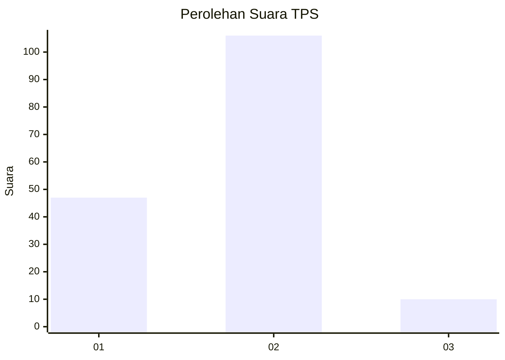
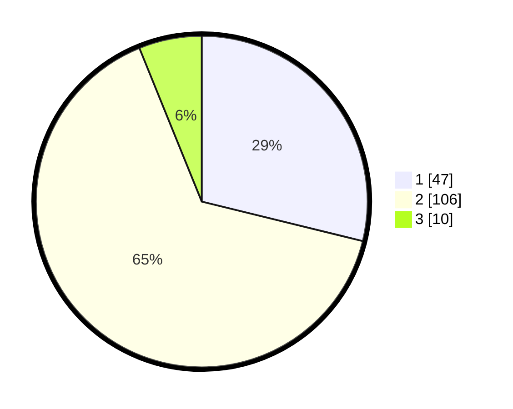

# Hasil

## Grafik

## Tabel

| No. | Nama Paslon    | Suara | Suara (raw) | Persentase |
|:--- |:-------------- | -----:| -----------:| ----------:|
| 1   | ANIES MUHAIMIN | 47    | [47][p-1]   | 28,83      |
| 2   | PRABOWO GIBRAN | 106   | [106][p-2]  | 65,03      |
| 3   | GANJAR MAHFUD  | 10    | [10][p-3]   | 6,13       |

[p-1]: https://github.com/gigit-pemilu/pemilu-2024/blob/main/pilpres/hitung-suara/sub/12-sumatera-utara/sub/10-labuhanbatu/sub/09-bilah-hulu/sub/2014-n-4-aek-nabara/sub/002-tps/sub/paslon-1.txt
[p-2]: https://github.com/gigit-pemilu/pemilu-2024/blob/main/pilpres/hitung-suara/sub/12-sumatera-utara/sub/10-labuhanbatu/sub/09-bilah-hulu/sub/2014-n-4-aek-nabara/sub/002-tps/sub/paslon-2.txt
[p-3]: https://github.com/gigit-pemilu/pemilu-2024/blob/main/pilpres/hitung-suara/sub/12-sumatera-utara/sub/10-labuhanbatu/sub/09-bilah-hulu/sub/2014-n-4-aek-nabara/sub/002-tps/sub/paslon-3.txt

## Foto C Plano

https://sirekap-obj-formc.kpu.go.id/0534/pemilu/ppwp/12/10/09/20/14/1210092014002-20240215-015917--e300aebf-c44f-4dab-8e9c-33c001c86253.jpg

https://sirekap-obj-formc.kpu.go.id/0534/pemilu/ppwp/12/10/09/20/14/1210092014002-20240215-020009--63232806-9d51-4f4f-b42a-6bb6ba2008c8.jpg

https://sirekap-obj-formc.kpu.go.id/0534/pemilu/ppwp/12/10/09/20/14/1210092014002-20240215-020111--fb980e17-9829-4a82-816f-03bcfcdd8909.jpg

## Metadata

| Key        | Value               |
| ---------- | ------------------- |
| Time Stamp | 2024-02-15 23:29:50 |

