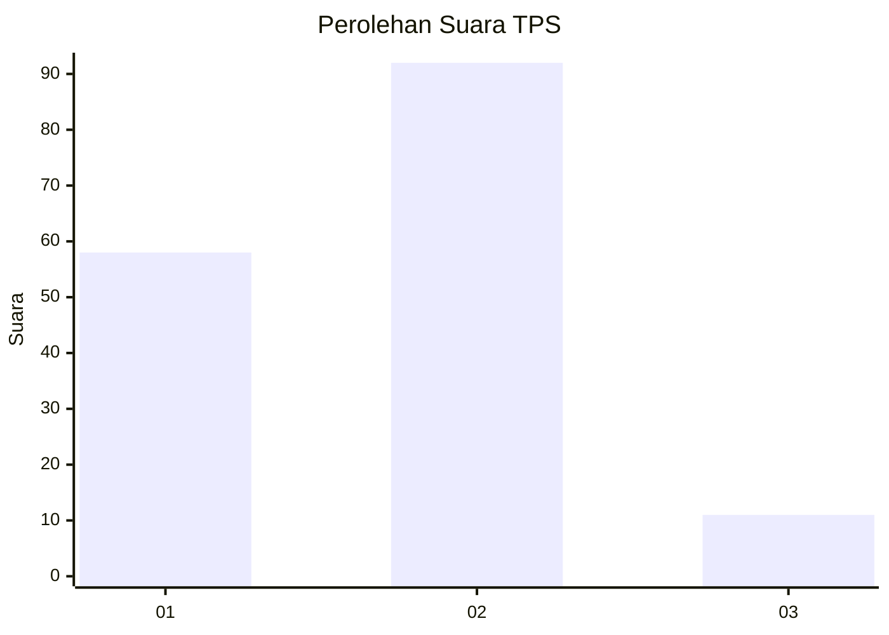
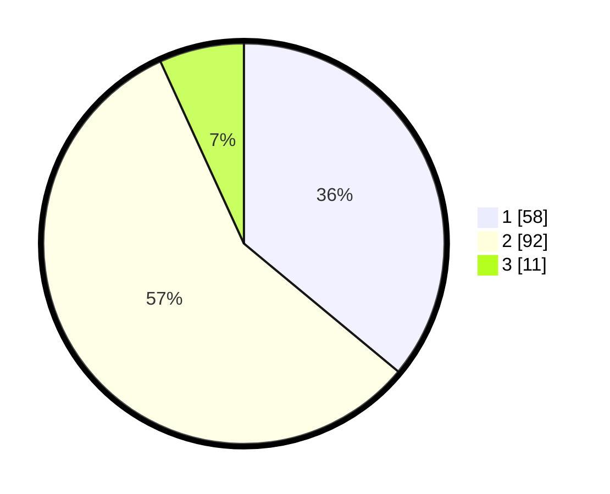

# Hasil

## Grafik

## Tabel

| No. | Nama Paslon    | Suara | Suara (raw) | Persentase |
|:--- |:-------------- | -----:| -----------:| ----------:|
| 1   | ANIES MUHAIMIN | 58    | [58][p-1]   | 36,02      |
| 2   | PRABOWO GIBRAN | 92    | [92][p-2]   | 57,14      |
| 3   | GANJAR MAHFUD  | 11    | [11][p-3]   | 6,83       |

[p-1]: https://github.com/gigit-pemilu/pemilu-2024/blob/main/pilpres/hitung-suara/sub/12-sumatera-utara/sub/10-labuhanbatu/sub/09-bilah-hulu/sub/2014-n-4-aek-nabara/sub/003-tps/sub/paslon-1.txt
[p-2]: https://github.com/gigit-pemilu/pemilu-2024/blob/main/pilpres/hitung-suara/sub/12-sumatera-utara/sub/10-labuhanbatu/sub/09-bilah-hulu/sub/2014-n-4-aek-nabara/sub/003-tps/sub/paslon-2.txt
[p-3]: https://github.com/gigit-pemilu/pemilu-2024/blob/main/pilpres/hitung-suara/sub/12-sumatera-utara/sub/10-labuhanbatu/sub/09-bilah-hulu/sub/2014-n-4-aek-nabara/sub/003-tps/sub/paslon-3.txt

## Foto C Plano

https://sirekap-obj-formc.kpu.go.id/73fa/pemilu/ppwp/12/10/09/20/14/1210092014003-20240215-032803--0af9e298-39f5-4978-b532-6ba5b02c5feb.jpg

https://sirekap-obj-formc.kpu.go.id/73fa/pemilu/ppwp/12/10/09/20/14/1210092014003-20240215-032823--9c76e4c3-83aa-48ed-9469-89e4a8758b80.jpg

https://sirekap-obj-formc.kpu.go.id/73fa/pemilu/ppwp/12/10/09/20/14/1210092014003-20240215-032855--c2922e4d-1beb-42bd-9a3e-7723d45e7f49.jpg

## Metadata

| Key        | Value               |
| ---------- | ------------------- |
| Time Stamp | 2024-02-15 23:29:50 |

