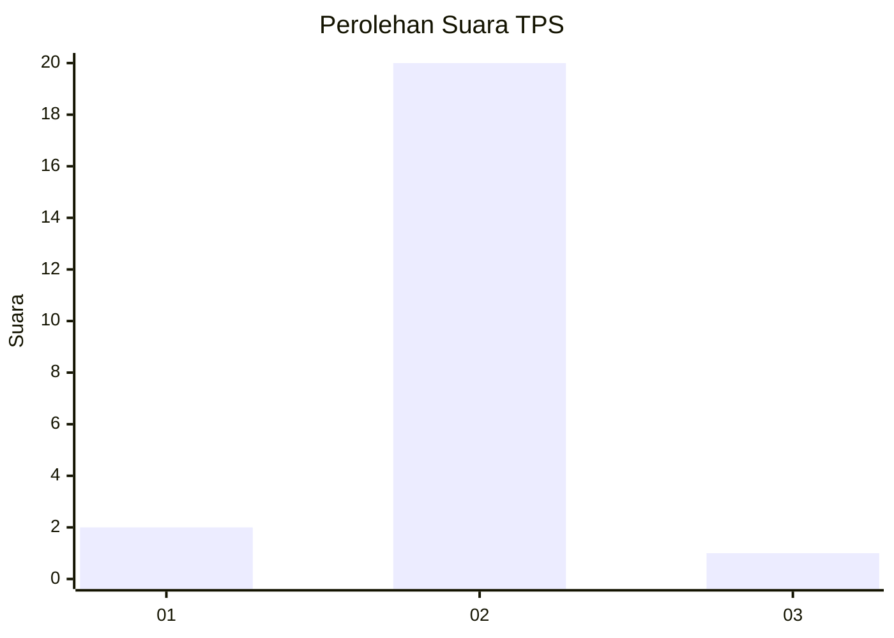
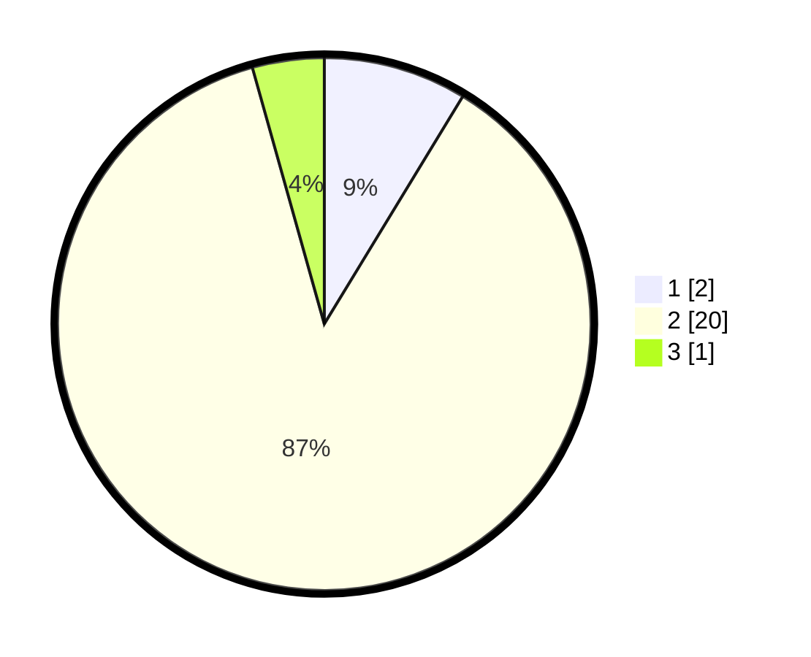

# Hasil

## Grafik

## Tabel

| No. | Nama Paslon    | Suara | Suara (raw) | Persentase |
|:--- |:-------------- | -----:| -----------:| ----------:|
| 1   | ANIES MUHAIMIN | 2     | [2][p-1]    | 8,70       |
| 2   | PRABOWO GIBRAN | 20    | [20][p-2]   | 86,96      |
| 3   | GANJAR MAHFUD  | 1     | [1][p-3]    | 4,35       |

[p-1]: https://github.com/gigit-pemilu/pemilu-2024/blob/main/pilpres/hitung-suara/sub/12-sumatera-utara/sub/10-labuhanbatu/sub/18-panai-tengah/sub/1001-labuhan-bilik/sub/901-tps/sub/paslon-1.txt
[p-2]: https://github.com/gigit-pemilu/pemilu-2024/blob/main/pilpres/hitung-suara/sub/12-sumatera-utara/sub/10-labuhanbatu/sub/18-panai-tengah/sub/1001-labuhan-bilik/sub/901-tps/sub/paslon-2.txt
[p-3]: https://github.com/gigit-pemilu/pemilu-2024/blob/main/pilpres/hitung-suara/sub/12-sumatera-utara/sub/10-labuhanbatu/sub/18-panai-tengah/sub/1001-labuhan-bilik/sub/901-tps/sub/paslon-3.txt

## Foto C Plano

https://sirekap-obj-formc.kpu.go.id/9de8/pemilu/ppwp/12/10/18/10/01/1210181001901-20240215-044122--04b0310c-d84b-46bd-bd8a-42ecd9551678.jpg

https://sirekap-obj-formc.kpu.go.id/9de8/pemilu/ppwp/12/10/18/10/01/1210181001901-20240215-042533--76308339-3f1a-4c46-aab7-f0f2b0ef71a3.jpg

## Metadata

| Key        | Value               |
| ---------- | ------------------- |
| Time Stamp | 2024-02-26 10:00:00 |

