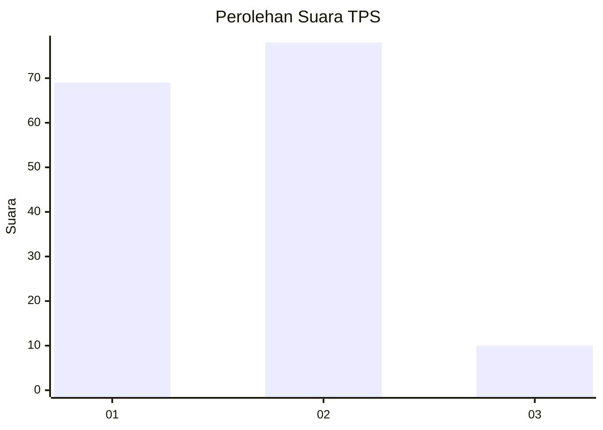
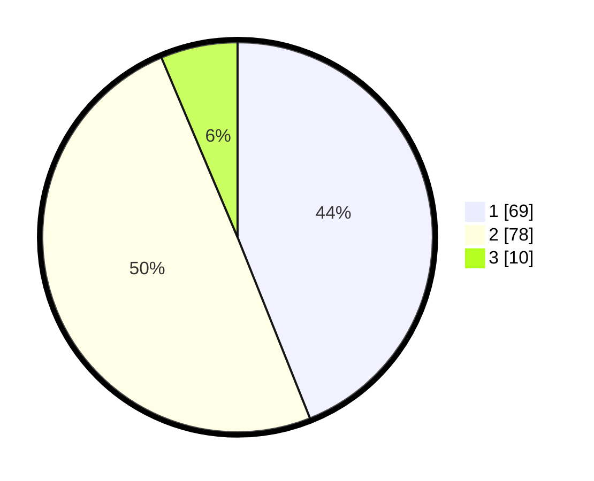

# Hasil

## Grafik

## Tabel

| No. | Nama Paslon    | Suara | Suara (raw) | Persentase |
|:--- |:-------------- | -----:| -----------:| ----------:|
| 1   | ANIES MUHAIMIN | 69    | [69][p-1]   | 43,95      |
| 2   | PRABOWO GIBRAN | 78    | [78][p-2]   | 49,68      |
| 3   | GANJAR MAHFUD  | 10    | [10][p-3]   | 6,37       |

[p-1]: https://github.com/gigit-pemilu/pemilu-2024/blob/main/pilpres/hitung-suara/sub/12-sumatera-utara/sub/10-labuhanbatu/sub/18-panai-tengah/sub/2002-sei-pelancang/sub/002-tps/sub/paslon-1.txt
[p-2]: https://github.com/gigit-pemilu/pemilu-2024/blob/main/pilpres/hitung-suara/sub/12-sumatera-utara/sub/10-labuhanbatu/sub/18-panai-tengah/sub/2002-sei-pelancang/sub/002-tps/sub/paslon-2.txt
[p-3]: https://github.com/gigit-pemilu/pemilu-2024/blob/main/pilpres/hitung-suara/sub/12-sumatera-utara/sub/10-labuhanbatu/sub/18-panai-tengah/sub/2002-sei-pelancang/sub/002-tps/sub/paslon-3.txt

## Foto C Plano

https://sirekap-obj-formc.kpu.go.id/bd5e/pemilu/ppwp/12/10/18/20/02/1210182002002-20240214-235219--2bb9e0f3-bd1e-4d0a-9c15-277eea0b38c3.jpg

https://sirekap-obj-formc.kpu.go.id/bd5e/pemilu/ppwp/12/10/18/20/02/1210182002002-20240214-203948--2e072ecd-24f9-4dea-b60f-5adbddcdfb5b.jpg

https://sirekap-obj-formc.kpu.go.id/bd5e/pemilu/ppwp/12/10/18/20/02/1210182002002-20240214-204139--9ce7b28b-3d81-45b8-b755-110513ff962a.jpg

## Metadata

| Key        | Value               |
| ---------- | ------------------- |
| Time Stamp | 2024-02-15 23:29:50 |

