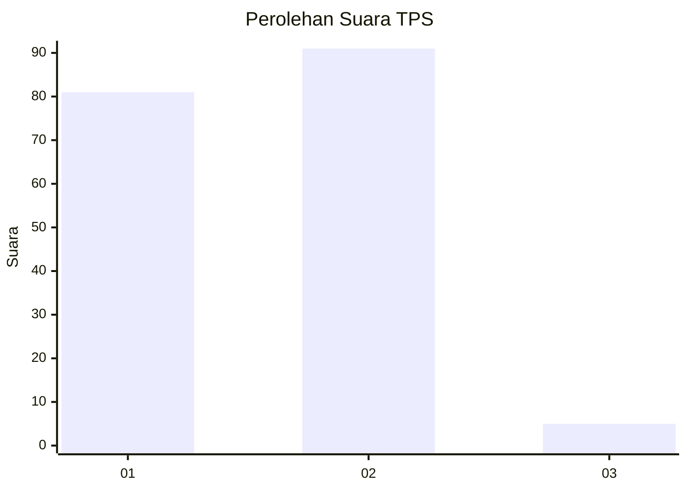
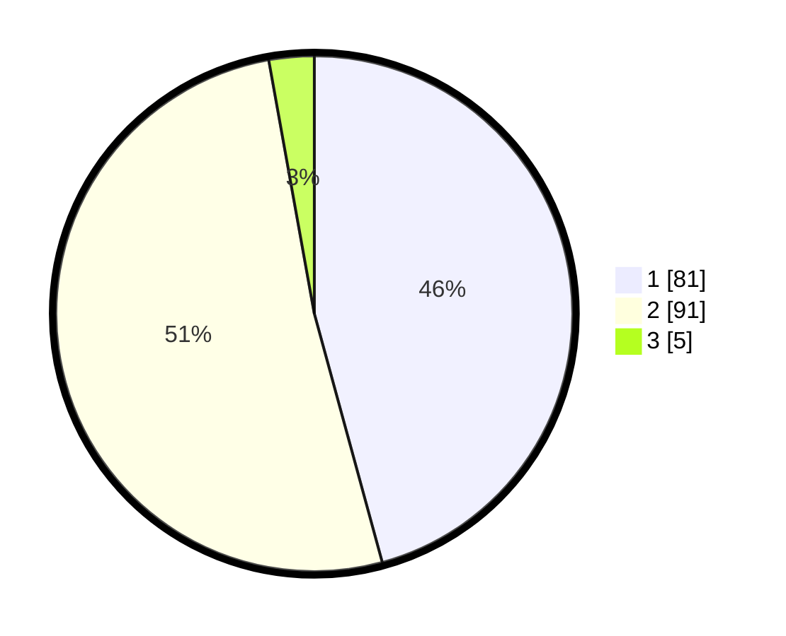

# Hasil

## Grafik

## Tabel

| No. | Nama Paslon    | Suara | Suara (raw) | Persentase |
|:--- |:-------------- | -----:| -----------:| ----------:|
| 1   | ANIES MUHAIMIN | 81    | [81][p-1]   | 45,76      |
| 2   | PRABOWO GIBRAN | 91    | [91][p-2]   | 51,41      |
| 3   | GANJAR MAHFUD  | 5     | [5][p-3]    | 2,82       |

[p-1]: https://github.com/gigit-pemilu/pemilu-2024/blob/main/pilpres/hitung-suara/sub/12-sumatera-utara/sub/10-labuhanbatu/sub/18-panai-tengah/sub/2003-sei-siarti/sub/001-tps/sub/paslon-1.txt
[p-2]: https://github.com/gigit-pemilu/pemilu-2024/blob/main/pilpres/hitung-suara/sub/12-sumatera-utara/sub/10-labuhanbatu/sub/18-panai-tengah/sub/2003-sei-siarti/sub/001-tps/sub/paslon-2.txt
[p-3]: https://github.com/gigit-pemilu/pemilu-2024/blob/main/pilpres/hitung-suara/sub/12-sumatera-utara/sub/10-labuhanbatu/sub/18-panai-tengah/sub/2003-sei-siarti/sub/001-tps/sub/paslon-3.txt

## Foto C Plano

https://sirekap-obj-formc.kpu.go.id/8a4d/pemilu/ppwp/12/10/18/20/03/1210182003001-20240214-230420--4c09522a-2051-48bc-84ba-f537b9efb086.jpg

https://sirekap-obj-formc.kpu.go.id/8a4d/pemilu/ppwp/12/10/18/20/03/1210182003001-20240214-230533--4a5bfa1c-9f9e-4bec-bd37-b6eca012e56c.jpg

https://sirekap-obj-formc.kpu.go.id/8a4d/pemilu/ppwp/12/10/18/20/03/1210182003001-20240216-161124--df218afe-aad3-403e-abdc-7d1a8118d929.jpg

## Metadata

| Key        | Value               |
| ---------- | ------------------- |
| Time Stamp | 2024-02-16 16:25:10 |

