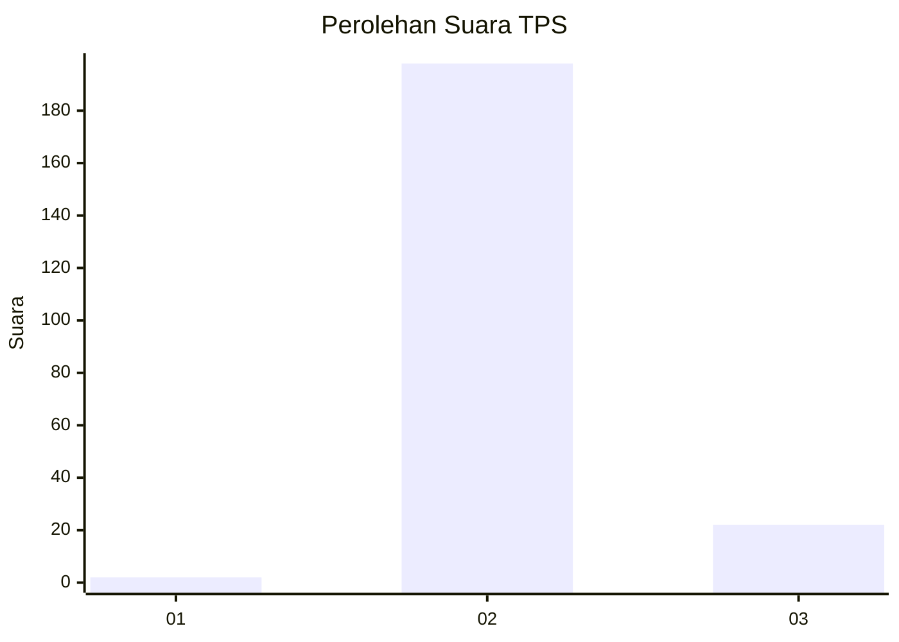
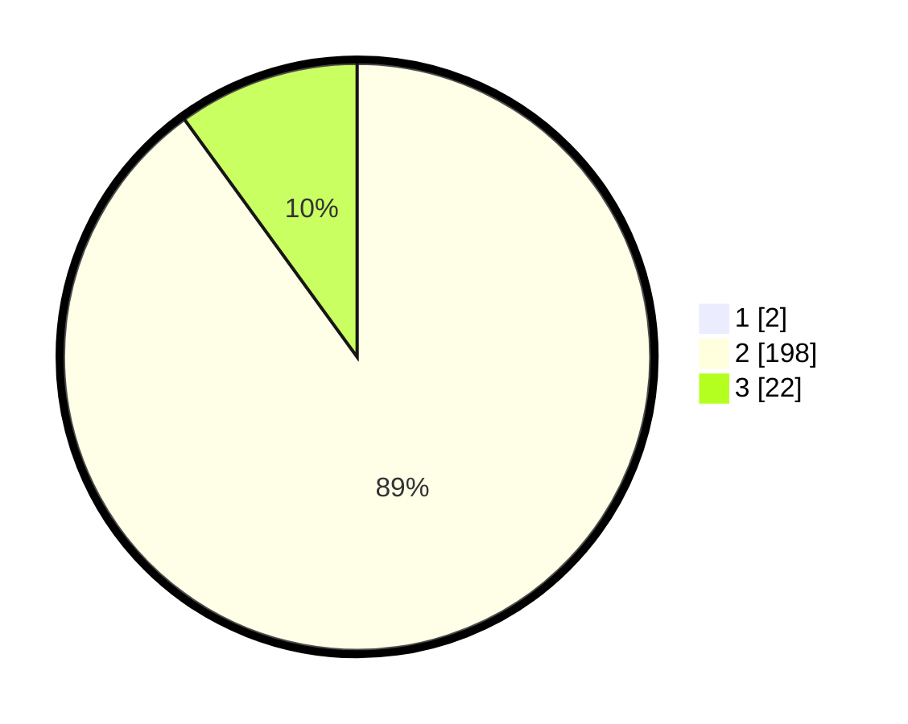

# Hasil

## Grafik

## Tabel

| No. | Nama Paslon    | Suara | Suara (raw) | Persentase |
|:--- |:-------------- | -----:| -----------:| ----------:|
| 1   | ANIES MUHAIMIN | 2     | [2][p-1]    | 0,90       |
| 2   | PRABOWO GIBRAN | 198   | [198][p-2]  | 89,19      |
| 3   | GANJAR MAHFUD  | 22    | [22][p-3]   | 9,91       |

[p-1]: https://github.com/gigit-pemilu/pemilu-2024/blob/main/pilpres/hitung-suara/sub/12-sumatera-utara/sub/10-labuhanbatu/sub/18-panai-tengah/sub/2003-sei-siarti/sub/009-tps/sub/paslon-1.txt
[p-2]: https://github.com/gigit-pemilu/pemilu-2024/blob/main/pilpres/hitung-suara/sub/12-sumatera-utara/sub/10-labuhanbatu/sub/18-panai-tengah/sub/2003-sei-siarti/sub/009-tps/sub/paslon-2.txt
[p-3]: https://github.com/gigit-pemilu/pemilu-2024/blob/main/pilpres/hitung-suara/sub/12-sumatera-utara/sub/10-labuhanbatu/sub/18-panai-tengah/sub/2003-sei-siarti/sub/009-tps/sub/paslon-3.txt

## Foto C Plano

https://sirekap-obj-formc.kpu.go.id/e18c/pemilu/ppwp/12/10/18/20/03/1210182003009-20240215-180020--94ad037d-8b1a-4b32-8a43-3d39ccd58188.jpg

https://sirekap-obj-formc.kpu.go.id/e18c/pemilu/ppwp/12/10/18/20/03/1210182003009-20240215-180047--dab73b38-b810-4575-a5ce-1ad0f8dfb20a.jpg

https://sirekap-obj-formc.kpu.go.id/e18c/pemilu/ppwp/12/10/18/20/03/1210182003009-20240215-180108--5b9c9a6c-4fca-4bdb-ba90-dfef90c87b95.jpg

## Metadata

| Key        | Value               |
| ---------- | ------------------- |
| Time Stamp | 2024-02-15 23:29:50 |

