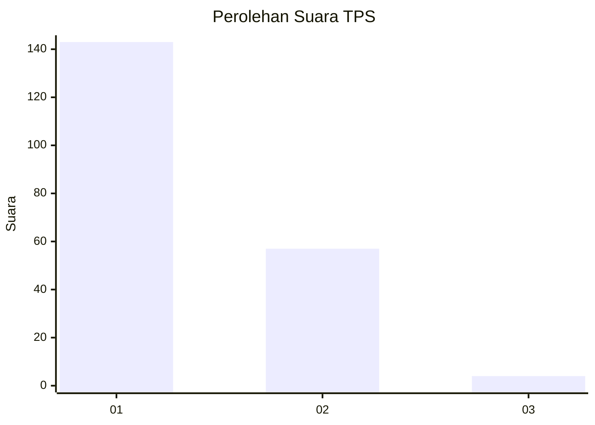
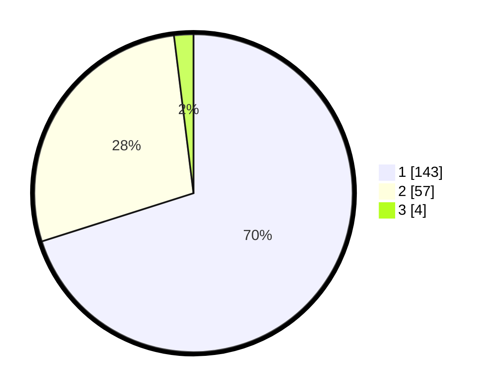

# Hasil

## Grafik

## Tabel

| No. | Nama Paslon    | Suara | Suara (raw) | Persentase |
|:--- |:-------------- | -----:| -----------:| ----------:|
| 1   | ANIES MUHAIMIN | 143   | [143][p-1]  | 70,10      |
| 2   | PRABOWO GIBRAN | 57    | [57][p-2]   | 27,94      |
| 3   | GANJAR MAHFUD  | 4     | [4][p-3]    | 1,96       |

[p-1]: https://github.com/gigit-pemilu/pemilu-2024/blob/main/pilpres/hitung-suara/sub/12-sumatera-utara/sub/10-labuhanbatu/sub/18-panai-tengah/sub/2005-sei-merdeka/sub/005-tps/sub/paslon-1.txt
[p-2]: https://github.com/gigit-pemilu/pemilu-2024/blob/main/pilpres/hitung-suara/sub/12-sumatera-utara/sub/10-labuhanbatu/sub/18-panai-tengah/sub/2005-sei-merdeka/sub/005-tps/sub/paslon-2.txt
[p-3]: https://github.com/gigit-pemilu/pemilu-2024/blob/main/pilpres/hitung-suara/sub/12-sumatera-utara/sub/10-labuhanbatu/sub/18-panai-tengah/sub/2005-sei-merdeka/sub/005-tps/sub/paslon-3.txt

## Foto C Plano

https://sirekap-obj-formc.kpu.go.id/409c/pemilu/ppwp/12/10/18/20/05/1210182005005-20240214-233821--e69fedb8-a4ee-4933-9f9d-d5d0addb1c00.jpg

https://sirekap-obj-formc.kpu.go.id/409c/pemilu/ppwp/12/10/18/20/05/1210182005005-20240214-234839--1f130ed1-6b18-4ea6-8589-25fdb25bbaf0.jpg

https://sirekap-obj-formc.kpu.go.id/409c/pemilu/ppwp/12/10/18/20/05/1210182005005-20240214-234923--690afb1e-7f1b-4dc7-8831-d39a9fa406bf.jpg

## Metadata

| Key        | Value               |
| ---------- | ------------------- |
| Time Stamp | 2024-02-15 23:29:50 |

