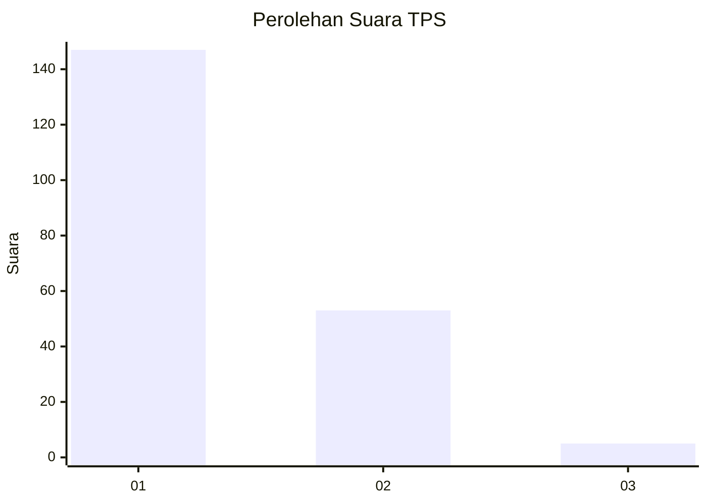
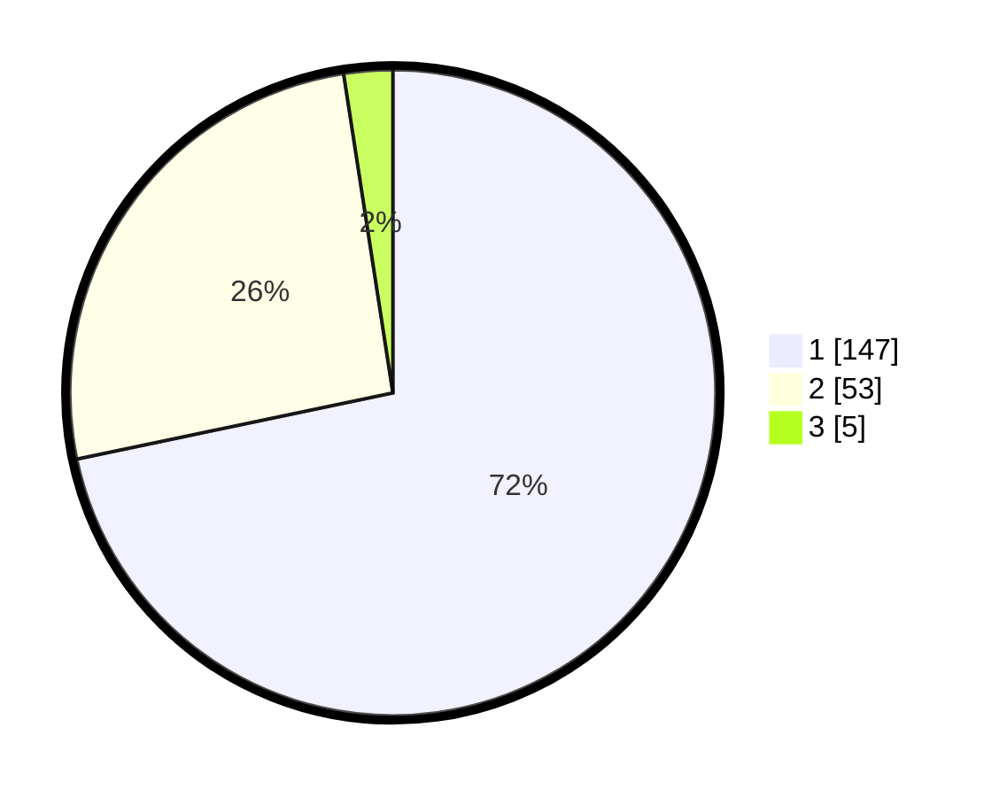

# Hasil

## Grafik

## Tabel

| No. | Nama Paslon    | Suara | Suara (raw) | Persentase |
|:--- |:-------------- | -----:| -----------:| ----------:|
| 1   | ANIES MUHAIMIN | 147   | [147][p-1]  | 71,71      |
| 2   | PRABOWO GIBRAN | 53    | [53][p-2]   | 25,85      |
| 3   | GANJAR MAHFUD  | 5     | [5][p-3]    | 2,44       |

[p-1]: https://github.com/gigit-pemilu/pemilu-2024-12-sumatera-utara/blob/main/pilpres/hitung-suara/sub/12-sumatera-utara/sub/10-labuhanbatu/sub/18-panai-tengah/sub/2010-pasar-tiga/sub/002-tps/sub/paslon-1.txt
[p-2]: https://github.com/gigit-pemilu/pemilu-2024-12-sumatera-utara/blob/main/pilpres/hitung-suara/sub/12-sumatera-utara/sub/10-labuhanbatu/sub/18-panai-tengah/sub/2010-pasar-tiga/sub/002-tps/sub/paslon-2.txt
[p-3]: https://github.com/gigit-pemilu/pemilu-2024-12-sumatera-utara/blob/main/pilpres/hitung-suara/sub/12-sumatera-utara/sub/10-labuhanbatu/sub/18-panai-tengah/sub/2010-pasar-tiga/sub/002-tps/sub/paslon-3.txt

## Foto C Plano

https://sirekap-obj-formc.kpu.go.id/6b3e/pemilu/ppwp/12/10/18/20/10/1210182010002-20240215-033401--13e39329-1770-4b8a-8e66-9f3e1c421a90.jpg

https://sirekap-obj-formc.kpu.go.id/6b3e/pemilu/ppwp/12/10/18/20/10/1210182010002-20240215-033324--f6fdad95-7fc2-485d-8833-d842bb33af5a.jpg

https://sirekap-obj-formc.kpu.go.id/6b3e/pemilu/ppwp/12/10/18/20/10/1210182010002-20240215-033835--6ee86c4b-7bfe-4a57-8f0d-7a52ca923291.jpg

## Metadata

| Key        | Value               |
| ---------- | ------------------- |
| Time Stamp | 2024-02-15 23:29:50 |

