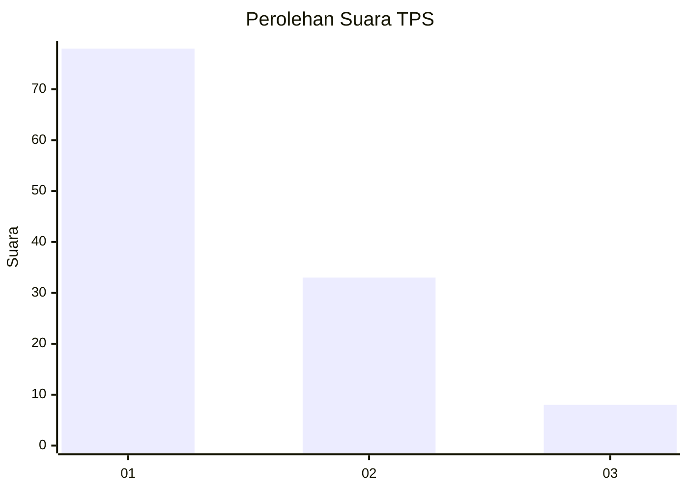
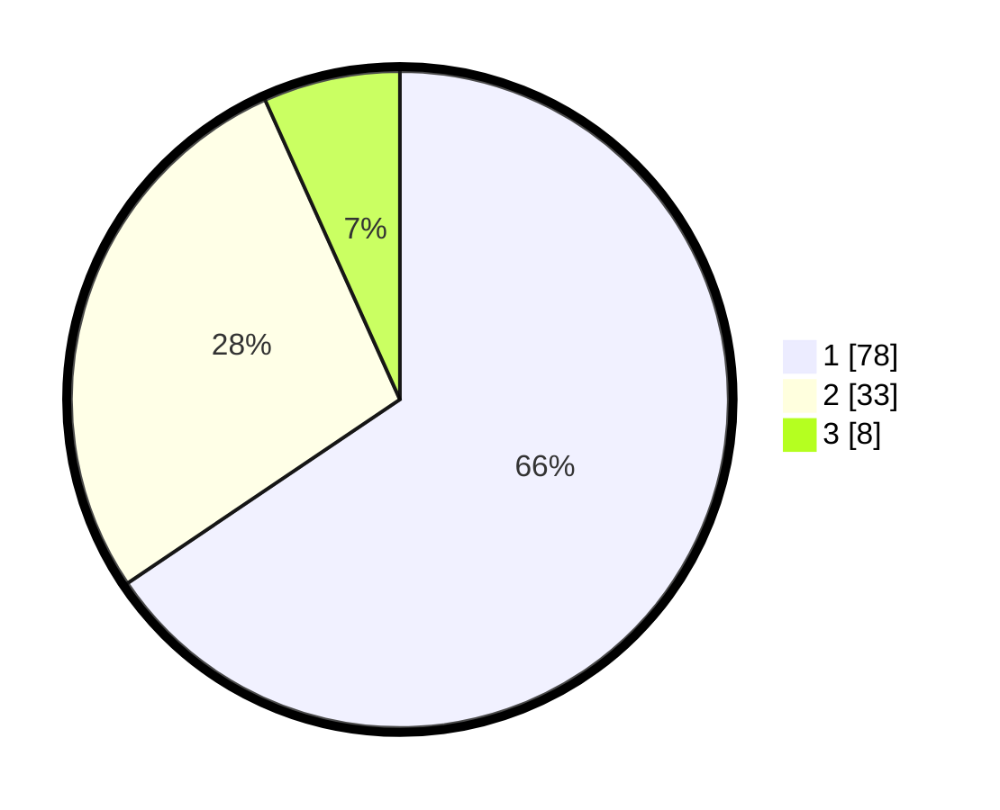

# Hasil

## Grafik

## Tabel

| No. | Nama Paslon    | Suara | Suara (raw) | Persentase |
|:--- |:-------------- | -----:| -----------:| ----------:|
| 1   | ANIES MUHAIMIN | 78    | [78][p-1]   | 65,55      |
| 2   | PRABOWO GIBRAN | 33    | [33][p-2]   | 27,73      |
| 3   | GANJAR MAHFUD  | 8     | [8][p-3]    | 6,72       |

[p-1]: https://github.com/gigit-pemilu/pemilu-2024/blob/main/pilpres/hitung-suara/sub/12-sumatera-utara/sub/10-labuhanbatu/sub/18-panai-tengah/sub/2010-pasar-tiga/sub/005-tps/sub/paslon-1.txt
[p-2]: https://github.com/gigit-pemilu/pemilu-2024/blob/main/pilpres/hitung-suara/sub/12-sumatera-utara/sub/10-labuhanbatu/sub/18-panai-tengah/sub/2010-pasar-tiga/sub/005-tps/sub/paslon-2.txt
[p-3]: https://github.com/gigit-pemilu/pemilu-2024/blob/main/pilpres/hitung-suara/sub/12-sumatera-utara/sub/10-labuhanbatu/sub/18-panai-tengah/sub/2010-pasar-tiga/sub/005-tps/sub/paslon-3.txt

## Foto C Plano

https://sirekap-obj-formc.kpu.go.id/304d/pemilu/ppwp/12/10/18/20/10/1210182010005-20240214-223905--6c4ee912-03dc-4da5-911a-8cddc830c61c.jpg

https://sirekap-obj-formc.kpu.go.id/304d/pemilu/ppwp/12/10/18/20/10/1210182010005-20240214-223637--578bf760-0d73-444b-b765-1757d632c5b1.jpg

https://sirekap-obj-formc.kpu.go.id/304d/pemilu/ppwp/12/10/18/20/10/1210182010005-20240214-223826--c47e02e9-3e01-4ac3-9957-5c34af2c2143.jpg

## Metadata

| Key        | Value               |
| ---------- | ------------------- |
| Time Stamp | 2024-02-15 23:29:50 |

