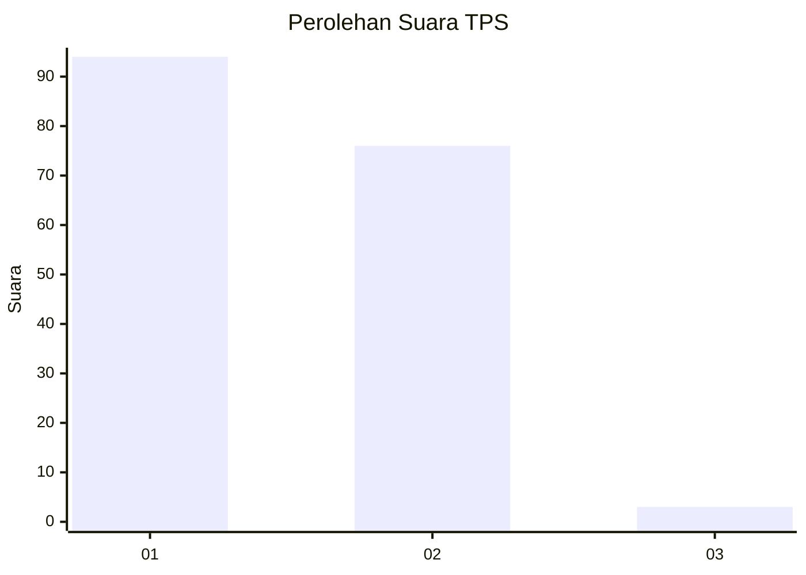
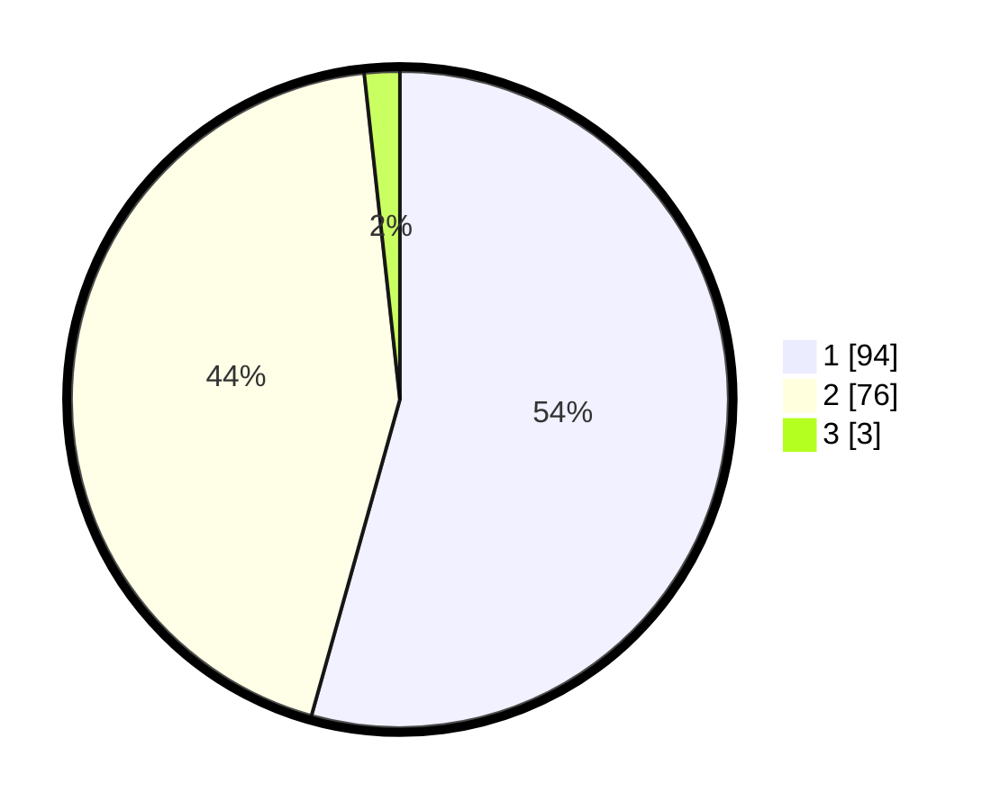

# Hasil

## Grafik

## Tabel

| No. | Nama Paslon    | Suara | Suara (raw) | Persentase |
|:--- |:-------------- | -----:| -----------:| ----------:|
| 1   | ANIES MUHAIMIN | 94    | [94][p-1]   | 54,34      |
| 2   | PRABOWO GIBRAN | 76    | [76][p-2]   | 43,93      |
| 3   | GANJAR MAHFUD  | 3     | [3][p-3]    | 1,73       |

[p-1]: https://github.com/gigit-pemilu/pemilu-2024-12-sumatera-utara/blob/main/pilpres/hitung-suara/sub/12-sumatera-utara/sub/10-labuhanbatu/sub/19-panai-hilir/sub/1001-sei-berombang/sub/001-tps/sub/paslon-1.txt
[p-2]: https://github.com/gigit-pemilu/pemilu-2024-12-sumatera-utara/blob/main/pilpres/hitung-suara/sub/12-sumatera-utara/sub/10-labuhanbatu/sub/19-panai-hilir/sub/1001-sei-berombang/sub/001-tps/sub/paslon-2.txt
[p-3]: https://github.com/gigit-pemilu/pemilu-2024-12-sumatera-utara/blob/main/pilpres/hitung-suara/sub/12-sumatera-utara/sub/10-labuhanbatu/sub/19-panai-hilir/sub/1001-sei-berombang/sub/001-tps/sub/paslon-3.txt

## Foto C Plano

https://sirekap-obj-formc.kpu.go.id/95a0/pemilu/ppwp/12/10/19/10/01/1210191001001-20240218-113042--99204af9-d854-4b97-9ca3-4fb08fc2c6d2.jpg

https://sirekap-obj-formc.kpu.go.id/95a0/pemilu/ppwp/12/10/19/10/01/1210191001001-20240218-113141--1b6f8c41-fa72-4d90-bf88-07d330156308.jpg

https://sirekap-obj-formc.kpu.go.id/95a0/pemilu/ppwp/12/10/19/10/01/1210191001001-20240218-112742--4a9ba8ce-1930-4e19-b96c-e473fbb063aa.jpg

## Metadata

| Key        | Value               |
| ---------- | ------------------- |
| Time Stamp | 2024-02-25 14:00:00 |

