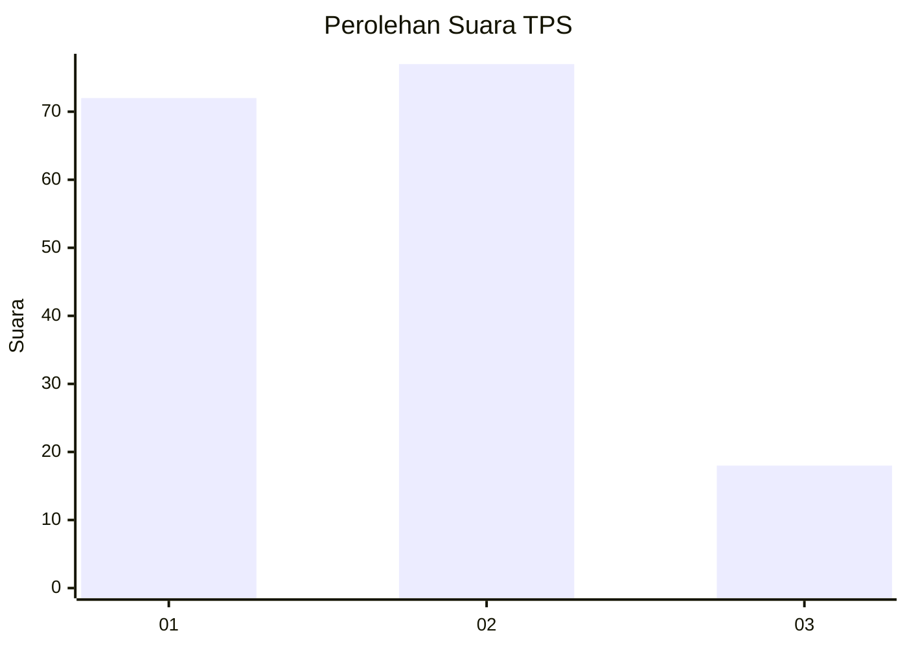
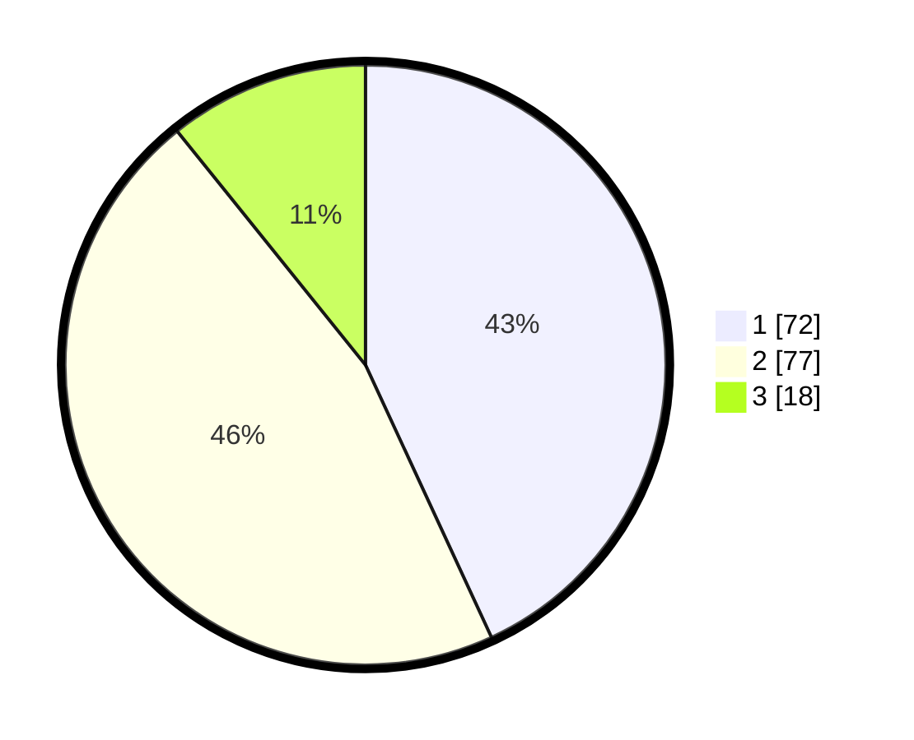

# Hasil

## Grafik

## Tabel

| No. | Nama Paslon    | Suara | Suara (raw) | Persentase |
|:--- |:-------------- | -----:| -----------:| ----------:|
| 1   | ANIES MUHAIMIN | 72    | [72][p-1]   | 43,11      |
| 2   | PRABOWO GIBRAN | 77    | [77][p-2]   | 46,11      |
| 3   | GANJAR MAHFUD  | 18    | [18][p-3]   | 10,78      |

[p-1]: https://github.com/gigit-pemilu/pemilu-2024/blob/main/pilpres/hitung-suara/sub/12-sumatera-utara/sub/10-labuhanbatu/sub/19-panai-hilir/sub/1001-sei-berombang/sub/023-tps/sub/paslon-1.txt
[p-2]: https://github.com/gigit-pemilu/pemilu-2024/blob/main/pilpres/hitung-suara/sub/12-sumatera-utara/sub/10-labuhanbatu/sub/19-panai-hilir/sub/1001-sei-berombang/sub/023-tps/sub/paslon-2.txt
[p-3]: https://github.com/gigit-pemilu/pemilu-2024/blob/main/pilpres/hitung-suara/sub/12-sumatera-utara/sub/10-labuhanbatu/sub/19-panai-hilir/sub/1001-sei-berombang/sub/023-tps/sub/paslon-3.txt

## Foto C Plano

https://sirekap-obj-formc.kpu.go.id/8ea5/pemilu/ppwp/12/10/19/10/01/1210191001023-20240214-202453--b98c22b5-4b45-4043-9144-4046239d18af.jpg

https://sirekap-obj-formc.kpu.go.id/8ea5/pemilu/ppwp/12/10/19/10/01/1210191001023-20240214-202732--c58781ed-dc8e-41ec-afbd-529a87333a51.jpg

https://sirekap-obj-formc.kpu.go.id/8ea5/pemilu/ppwp/12/10/19/10/01/1210191001023-20240214-202947--536d6682-cb4e-496b-8e65-62657b4af813.jpg

## Metadata

| Key        | Value               |
| ---------- | ------------------- |
| Time Stamp | 2024-02-15 23:29:50 |

