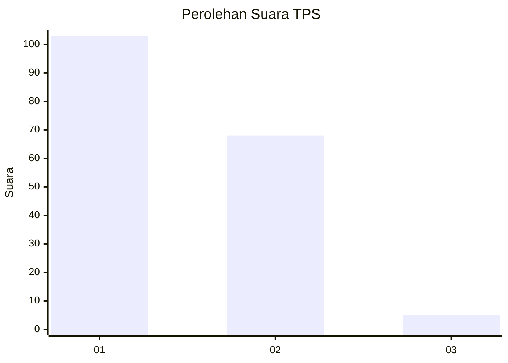
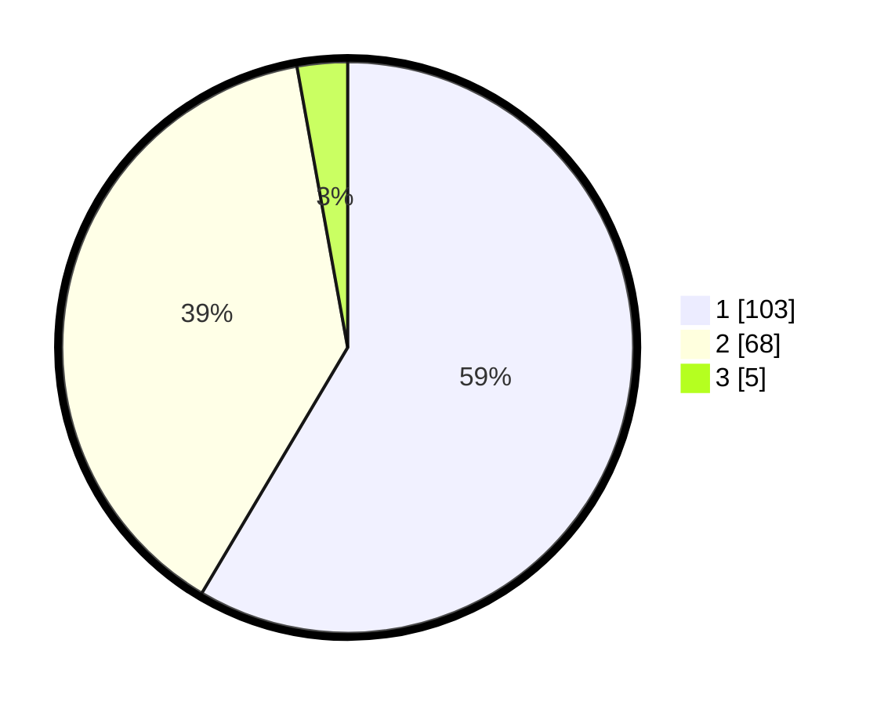

# Hasil

## Grafik

## Tabel

| No. | Nama Paslon    | Suara | Suara (raw) | Persentase |
|:--- |:-------------- | -----:| -----------:| ----------:|
| 1   | ANIES MUHAIMIN | 103   | [103][p-1]  | 58,52      |
| 2   | PRABOWO GIBRAN | 68    | [68][p-2]   | 38,64      |
| 3   | GANJAR MAHFUD  | 5     | [5][p-3]    | 2,84       |

[p-1]: https://github.com/gigit-pemilu/pemilu-2024/blob/main/pilpres/hitung-suara/sub/12-sumatera-utara/sub/10-labuhanbatu/sub/19-panai-hilir/sub/1001-sei-berombang/sub/030-tps/sub/paslon-1.txt
[p-2]: https://github.com/gigit-pemilu/pemilu-2024/blob/main/pilpres/hitung-suara/sub/12-sumatera-utara/sub/10-labuhanbatu/sub/19-panai-hilir/sub/1001-sei-berombang/sub/030-tps/sub/paslon-2.txt
[p-3]: https://github.com/gigit-pemilu/pemilu-2024/blob/main/pilpres/hitung-suara/sub/12-sumatera-utara/sub/10-labuhanbatu/sub/19-panai-hilir/sub/1001-sei-berombang/sub/030-tps/sub/paslon-3.txt

## Foto C Plano

https://sirekap-obj-formc.kpu.go.id/8627/pemilu/ppwp/12/10/19/10/01/1210191001030-20240215-094457--724e9951-4fa1-4cf0-89eb-3ece71bb0a9f.jpg

https://sirekap-obj-formc.kpu.go.id/8627/pemilu/ppwp/12/10/19/10/01/1210191001030-20240215-094716--958c1948-5b87-4c2c-8985-4550cb3714f1.jpg

https://sirekap-obj-formc.kpu.go.id/8627/pemilu/ppwp/12/10/19/10/01/1210191001030-20240215-094921--188118a3-d2b7-4181-bec2-5786de806ce8.jpg

## Metadata

| Key        | Value               |
| ---------- | ------------------- |
| Time Stamp | 2024-02-15 23:29:50 |

