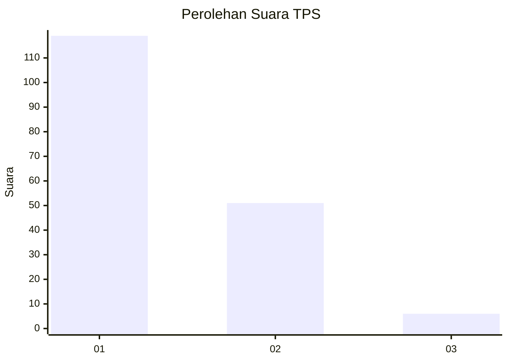
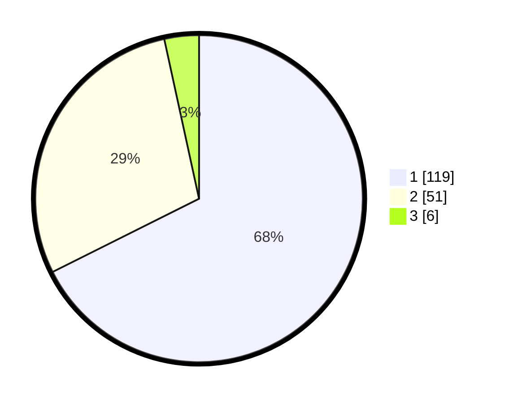

# Hasil

## Grafik

## Tabel

| No. | Nama Paslon    | Suara | Suara (raw) | Persentase |
|:--- |:-------------- | -----:| -----------:| ----------:|
| 1   | ANIES MUHAIMIN | 119   | [119][p-1]  | 67,61      |
| 2   | PRABOWO GIBRAN | 51    | [51][p-2]   | 28,98      |
| 3   | GANJAR MAHFUD  | 6     | [6][p-3]    | 3,41       |

[p-1]: https://github.com/gigit-pemilu/pemilu-2024/blob/main/pilpres/hitung-suara/sub/12-sumatera-utara/sub/10-labuhanbatu/sub/19-panai-hilir/sub/2005-sei-sanggul/sub/005-tps/sub/paslon-1.txt
[p-2]: https://github.com/gigit-pemilu/pemilu-2024/blob/main/pilpres/hitung-suara/sub/12-sumatera-utara/sub/10-labuhanbatu/sub/19-panai-hilir/sub/2005-sei-sanggul/sub/005-tps/sub/paslon-2.txt
[p-3]: https://github.com/gigit-pemilu/pemilu-2024/blob/main/pilpres/hitung-suara/sub/12-sumatera-utara/sub/10-labuhanbatu/sub/19-panai-hilir/sub/2005-sei-sanggul/sub/005-tps/sub/paslon-3.txt

## Foto C Plano

https://sirekap-obj-formc.kpu.go.id/c84d/pemilu/ppwp/12/10/19/20/05/1210192005005-20240214-234548--d01f4fd5-03e6-49ac-865c-71476361e448.jpg

https://sirekap-obj-formc.kpu.go.id/c84d/pemilu/ppwp/12/10/19/20/05/1210192005005-20240214-234758--38db089f-6cee-4f0a-b5f0-9705c9a0e648.jpg

https://sirekap-obj-formc.kpu.go.id/c84d/pemilu/ppwp/12/10/19/20/05/1210192005005-20240214-235004--5c0e4b93-fd20-46bb-9358-a00af025c282.jpg

## Metadata

| Key        | Value               |
| ---------- | ------------------- |
| Time Stamp | 2024-02-25 11:00:00 |

