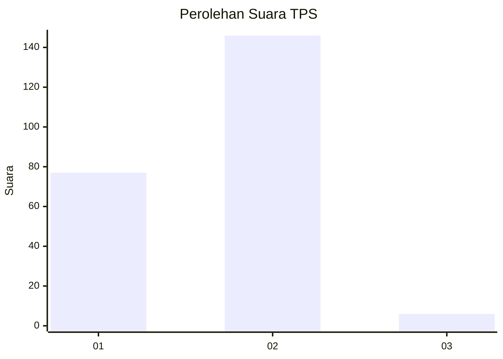
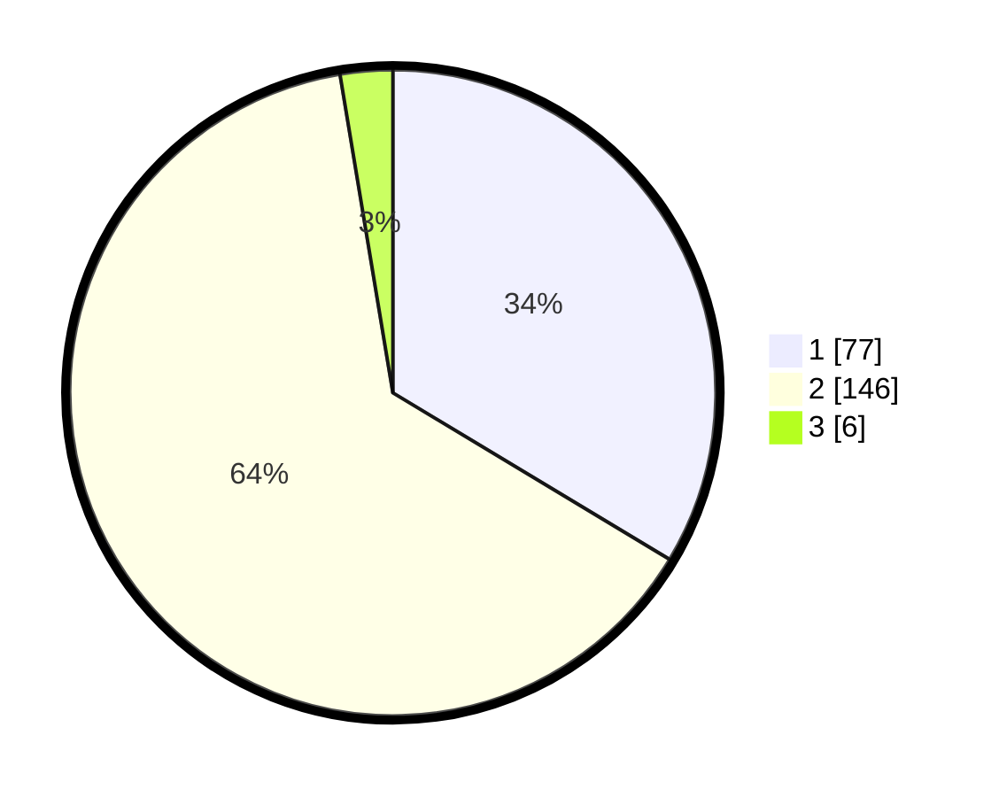

# Hasil

## Grafik

## Tabel

| No. | Nama Paslon    | Suara | Suara (raw) | Persentase |
|:--- |:-------------- | -----:| -----------:| ----------:|
| 1   | ANIES MUHAIMIN | 77    | [77][p-1]   | 33,62      |
| 2   | PRABOWO GIBRAN | 146   | [146][p-2]  | 63,76      |
| 3   | GANJAR MAHFUD  | 6     | [6][p-3]    | 2,62       |

[p-1]: https://github.com/gigit-pemilu/pemilu-2024/blob/main/pilpres/hitung-suara/sub/12-sumatera-utara/sub/10-labuhanbatu/sub/20-panai-hulu/sub/2001-tanjung-sarang-elang/sub/004-tps/sub/paslon-1.txt
[p-2]: https://github.com/gigit-pemilu/pemilu-2024/blob/main/pilpres/hitung-suara/sub/12-sumatera-utara/sub/10-labuhanbatu/sub/20-panai-hulu/sub/2001-tanjung-sarang-elang/sub/004-tps/sub/paslon-2.txt
[p-3]: https://github.com/gigit-pemilu/pemilu-2024/blob/main/pilpres/hitung-suara/sub/12-sumatera-utara/sub/10-labuhanbatu/sub/20-panai-hulu/sub/2001-tanjung-sarang-elang/sub/004-tps/sub/paslon-3.txt

## Foto C Plano

https://sirekap-obj-formc.kpu.go.id/adf8/pemilu/ppwp/12/10/20/20/01/1210202001004-20240215-053922--51184d2f-522e-4526-bc59-1e3bd1dd8ed8.jpg

https://sirekap-obj-formc.kpu.go.id/adf8/pemilu/ppwp/12/10/20/20/01/1210202001004-20240215-054027--023da7e7-9544-4e49-918b-d94998fbac3e.jpg

https://sirekap-obj-formc.kpu.go.id/adf8/pemilu/ppwp/12/10/20/20/01/1210202001004-20240215-054132--f91822db-173c-4701-bc45-e0dcccd702a9.jpg

## Metadata

| Key        | Value               |
| ---------- | ------------------- |
| Time Stamp | 2024-02-15 22:30:27 |

