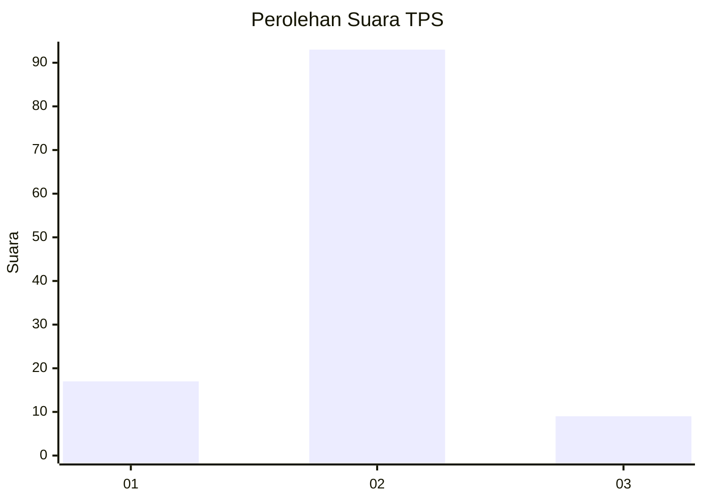
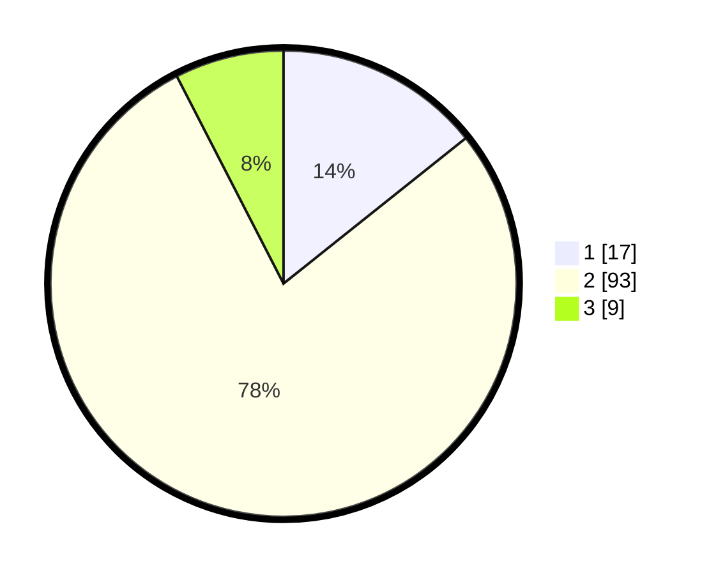

# Hasil

## Grafik

## Tabel

| No. | Nama Paslon    | Suara | Suara (raw) | Persentase |
|:--- |:-------------- | -----:| -----------:| ----------:|
| 1   | ANIES MUHAIMIN | 17    | [17][p-1]   | 14,29      |
| 2   | PRABOWO GIBRAN | 93    | [93][p-2]   | 78,15      |
| 3   | GANJAR MAHFUD  | 9     | [9][p-3]    | 7,56       |

[p-1]: https://github.com/gigit-pemilu/pemilu-2024/blob/main/pilpres/hitung-suara/sub/12-sumatera-utara/sub/10-labuhanbatu/sub/20-panai-hulu/sub/2006-meranti-paham/sub/002-tps/sub/paslon-1.txt
[p-2]: https://github.com/gigit-pemilu/pemilu-2024/blob/main/pilpres/hitung-suara/sub/12-sumatera-utara/sub/10-labuhanbatu/sub/20-panai-hulu/sub/2006-meranti-paham/sub/002-tps/sub/paslon-2.txt
[p-3]: https://github.com/gigit-pemilu/pemilu-2024/blob/main/pilpres/hitung-suara/sub/12-sumatera-utara/sub/10-labuhanbatu/sub/20-panai-hulu/sub/2006-meranti-paham/sub/002-tps/sub/paslon-3.txt

## Foto C Plano

https://sirekap-obj-formc.kpu.go.id/e31c/pemilu/ppwp/12/10/20/20/06/1210202006002-20240215-090036--c0228b94-bb30-4353-b98a-9400b04d2e09.jpg

https://sirekap-obj-formc.kpu.go.id/e31c/pemilu/ppwp/12/10/20/20/06/1210202006002-20240215-034355--7e7a1529-2a3c-4257-b06c-eed0e8e98ce2.jpg

https://sirekap-obj-formc.kpu.go.id/e31c/pemilu/ppwp/12/10/20/20/06/1210202006002-20240215-034449--fc86b8c6-9e16-4969-8b99-aa8a93bce339.jpg

## Metadata

| Key        | Value               |
| ---------- | ------------------- |
| Time Stamp | 2024-02-16 00:00:26 |

