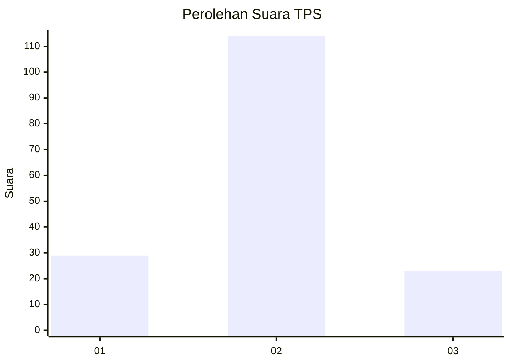
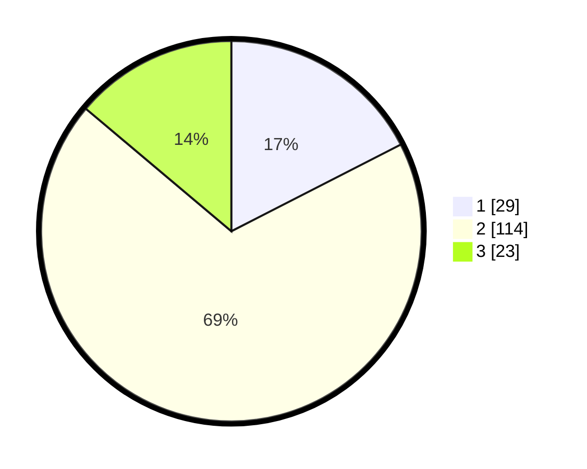

# Hasil

## Grafik

## Tabel

| No. | Nama Paslon    | Suara | Suara (raw) | Persentase |
|:--- |:-------------- | -----:| -----------:| ----------:|
| 1   | ANIES MUHAIMIN | 29    | [29][p-1]   | 17,47      |
| 2   | PRABOWO GIBRAN | 114   | [114][p-2]  | 68,67      |
| 3   | GANJAR MAHFUD  | 23    | [23][p-3]   | 13,86      |

[p-1]: https://github.com/gigit-pemilu/pemilu-2024/blob/main/pilpres/hitung-suara/sub/12-sumatera-utara/sub/11-dairi/sub/01-sidikalang/sub/1005-kuta-gambir/sub/006-tps/sub/paslon-1.txt
[p-2]: https://github.com/gigit-pemilu/pemilu-2024/blob/main/pilpres/hitung-suara/sub/12-sumatera-utara/sub/11-dairi/sub/01-sidikalang/sub/1005-kuta-gambir/sub/006-tps/sub/paslon-2.txt
[p-3]: https://github.com/gigit-pemilu/pemilu-2024/blob/main/pilpres/hitung-suara/sub/12-sumatera-utara/sub/11-dairi/sub/01-sidikalang/sub/1005-kuta-gambir/sub/006-tps/sub/paslon-3.txt

## Foto C Plano

https://sirekap-obj-formc.kpu.go.id/21b0/pemilu/ppwp/12/11/01/10/05/1211011005006-20240214-190320--fafbc6af-d401-4b42-af99-08d224c40f05.jpg

https://sirekap-obj-formc.kpu.go.id/21b0/pemilu/ppwp/12/11/01/10/05/1211011005006-20240214-220240--5239a1ff-67fa-4a8d-a936-9bd44110394c.jpg

## Metadata

| Key        | Value               |
| ---------- | ------------------- |
| Time Stamp | 2024-02-15 20:30:46 |

