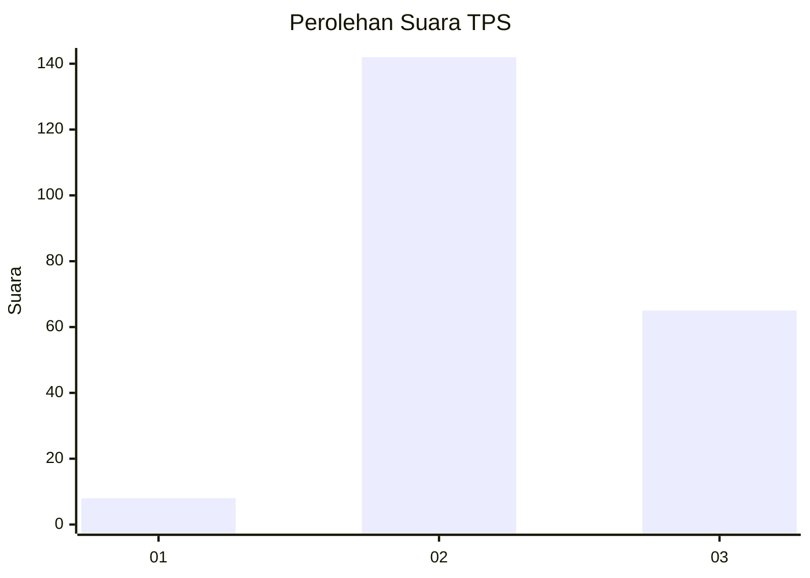

# Hasil

## Grafik

## Tabel

| No. | Nama Paslon    | Suara | Suara (raw) | Persentase |
|:--- |:-------------- | -----:| -----------:| ----------:|
| 1   | ANIES MUHAIMIN | 8     | [8][p-1]    | 3,72       |
| 2   | PRABOWO GIBRAN | 142   | [142][p-2]  | 66,05      |
| 3   | GANJAR MAHFUD  | 65    | [65][p-3]   | 30,23      |

[p-1]: https://github.com/gigit-pemilu/pemilu-2024-12-sumatera-utara/blob/main/pilpres/hitung-suara/sub/12-sumatera-utara/sub/11-dairi/sub/02-sumbul/sub/1007-pegagan-julu-i/sub/001-tps/sub/paslon-1.txt
[p-2]: https://github.com/gigit-pemilu/pemilu-2024-12-sumatera-utara/blob/main/pilpres/hitung-suara/sub/12-sumatera-utara/sub/11-dairi/sub/02-sumbul/sub/1007-pegagan-julu-i/sub/001-tps/sub/paslon-2.txt
[p-3]: https://github.com/gigit-pemilu/pemilu-2024-12-sumatera-utara/blob/main/pilpres/hitung-suara/sub/12-sumatera-utara/sub/11-dairi/sub/02-sumbul/sub/1007-pegagan-julu-i/sub/001-tps/sub/paslon-3.txt

## Foto C Plano

https://sirekap-obj-formc.kpu.go.id/fa38/pemilu/ppwp/12/11/02/10/07/1211021007001-20240214-214529--2a0428a8-ebd0-4c30-992e-05333069b17a.jpg

https://sirekap-obj-formc.kpu.go.id/fa38/pemilu/ppwp/12/11/02/10/07/1211021007001-20240214-214550--a77b1b7a-6060-4d21-ab21-d7c3132cd8ea.jpg

https://sirekap-obj-formc.kpu.go.id/fa38/pemilu/ppwp/12/11/02/10/07/1211021007001-20240214-214610--3ca3130d-6ee6-40b9-b358-e79e2da8537e.jpg

## Metadata

| Key        | Value               |
| ---------- | ------------------- |
| Time Stamp | 2024-02-15 18:30:25 |

