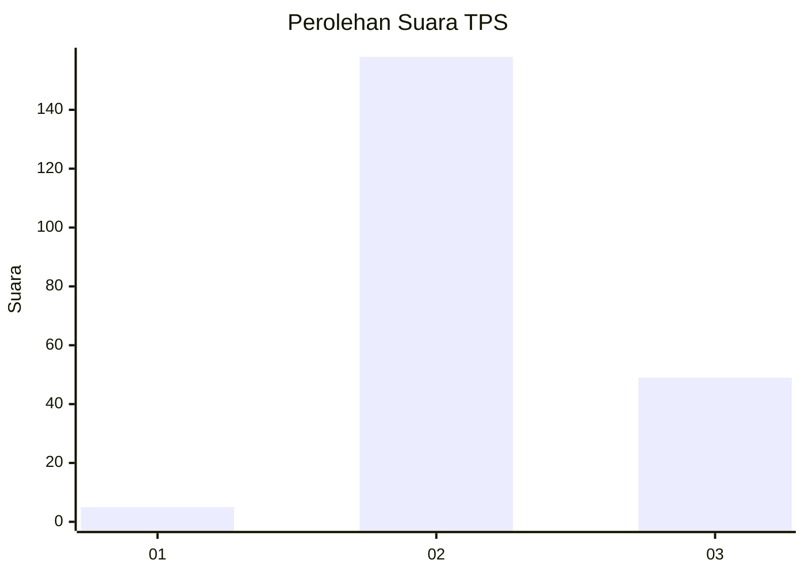
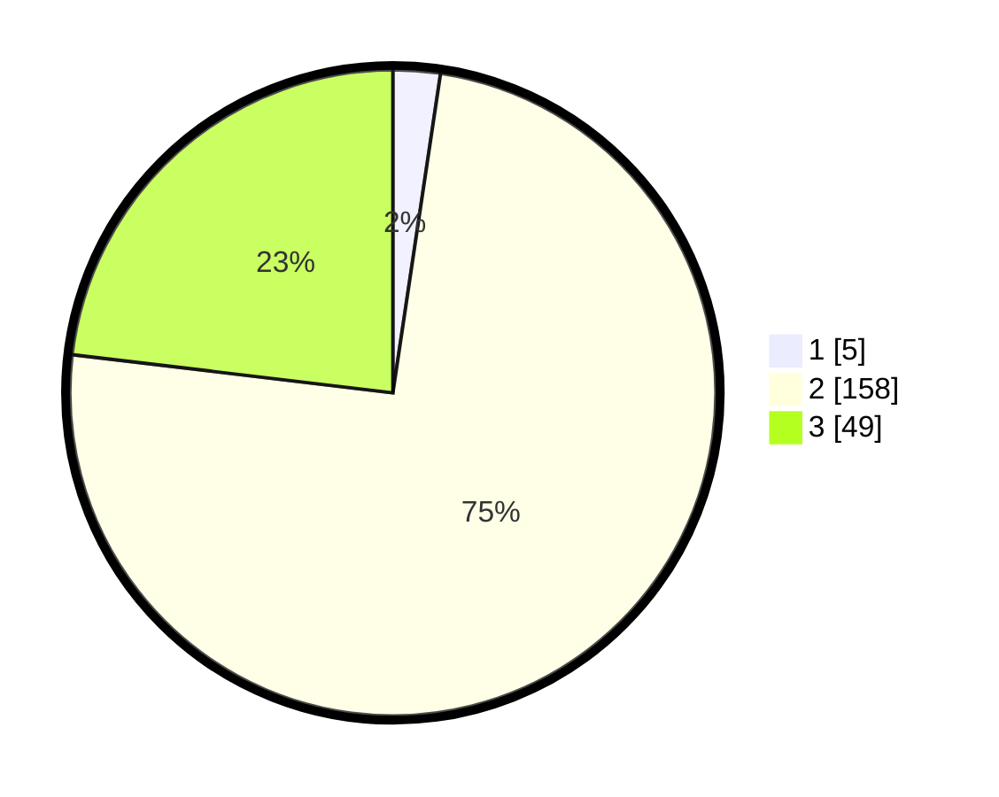

# Hasil

## Grafik

## Tabel

| No. | Nama Paslon    | Suara | Suara (raw) | Persentase |
|:--- |:-------------- | -----:| -----------:| ----------:|
| 1   | ANIES MUHAIMIN | 5     | [5][p-1]    | 2,36       |
| 2   | PRABOWO GIBRAN | 158   | [158][p-2]  | 74,53      |
| 3   | GANJAR MAHFUD  | 49    | [49][p-3]   | 23,11      |

[p-1]: https://github.com/gigit-pemilu/pemilu-2024-12-sumatera-utara/blob/main/pilpres/hitung-suara/sub/12-sumatera-utara/sub/11-dairi/sub/02-sumbul/sub/1007-pegagan-julu-i/sub/003-tps/sub/paslon-1.txt
[p-2]: https://github.com/gigit-pemilu/pemilu-2024-12-sumatera-utara/blob/main/pilpres/hitung-suara/sub/12-sumatera-utara/sub/11-dairi/sub/02-sumbul/sub/1007-pegagan-julu-i/sub/003-tps/sub/paslon-2.txt
[p-3]: https://github.com/gigit-pemilu/pemilu-2024-12-sumatera-utara/blob/main/pilpres/hitung-suara/sub/12-sumatera-utara/sub/11-dairi/sub/02-sumbul/sub/1007-pegagan-julu-i/sub/003-tps/sub/paslon-3.txt

## Foto C Plano

https://sirekap-obj-formc.kpu.go.id/2182/pemilu/ppwp/12/11/02/10/07/1211021007003-20240214-222724--5c52f1ba-8804-4bfe-862c-3c9b2717e683.jpg

https://sirekap-obj-formc.kpu.go.id/2182/pemilu/ppwp/12/11/02/10/07/1211021007003-20240215-002446--2cca68b6-5dc4-470d-a88e-9239f4e42767.jpg

https://sirekap-obj-formc.kpu.go.id/2182/pemilu/ppwp/12/11/02/10/07/1211021007003-20240214-224403--148ab025-e99a-4dfa-96f7-c61c2b880eef.jpg

## Metadata

| Key        | Value               |
| ---------- | ------------------- |
| Time Stamp | 2024-02-15 23:29:50 |

