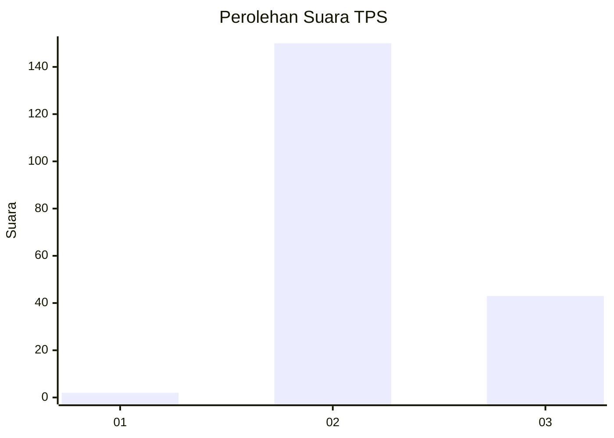
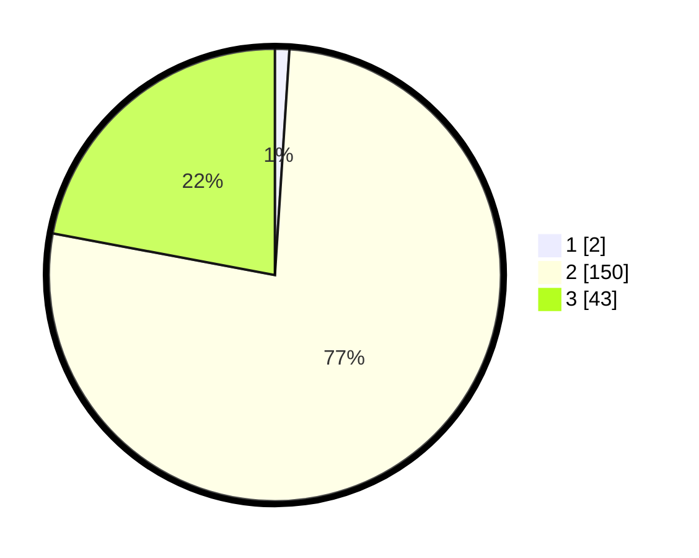

# Hasil

## Grafik

## Tabel

| No. | Nama Paslon    | Suara | Suara (raw) | Persentase |
|:--- |:-------------- | -----:| -----------:| ----------:|
| 1   | ANIES MUHAIMIN | 2     | [2][p-1]    | 1,03       |
| 2   | PRABOWO GIBRAN | 150   | [150][p-2]  | 76,92      |
| 3   | GANJAR MAHFUD  | 43    | [43][p-3]   | 22,05      |

[p-1]: https://github.com/gigit-pemilu/pemilu-2024-12-sumatera-utara/blob/main/pilpres/hitung-suara/sub/12-sumatera-utara/sub/11-dairi/sub/02-sumbul/sub/1007-pegagan-julu-i/sub/004-tps/sub/paslon-1.txt
[p-2]: https://github.com/gigit-pemilu/pemilu-2024-12-sumatera-utara/blob/main/pilpres/hitung-suara/sub/12-sumatera-utara/sub/11-dairi/sub/02-sumbul/sub/1007-pegagan-julu-i/sub/004-tps/sub/paslon-2.txt
[p-3]: https://github.com/gigit-pemilu/pemilu-2024-12-sumatera-utara/blob/main/pilpres/hitung-suara/sub/12-sumatera-utara/sub/11-dairi/sub/02-sumbul/sub/1007-pegagan-julu-i/sub/004-tps/sub/paslon-3.txt

## Foto C Plano

https://sirekap-obj-formc.kpu.go.id/45b6/pemilu/ppwp/12/11/02/10/07/1211021007004-20240214-224822--c24eaf49-7fb8-4f81-a89e-4523d8763cd1.jpg

https://sirekap-obj-formc.kpu.go.id/45b6/pemilu/ppwp/12/11/02/10/07/1211021007004-20240214-224849--50c4eda1-2aaf-4cc7-b4d4-e6eaeb140ebb.jpg

https://sirekap-obj-formc.kpu.go.id/45b6/pemilu/ppwp/12/11/02/10/07/1211021007004-20240214-224911--1690dd5f-0d2d-4202-acc1-9ac64adb7cef.jpg

## Metadata

| Key        | Value               |
| ---------- | ------------------- |
| Time Stamp | 2024-02-15 22:30:27 |

