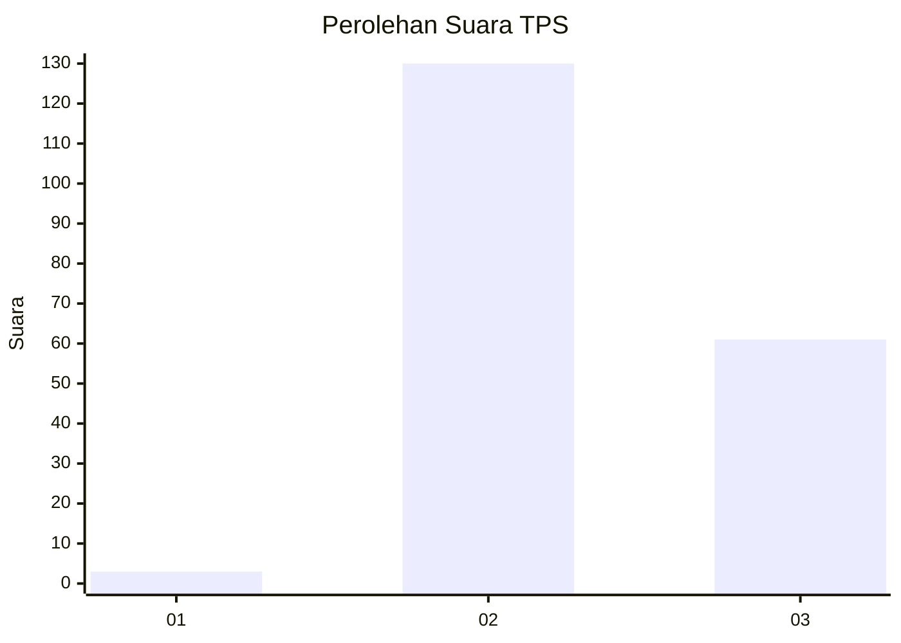
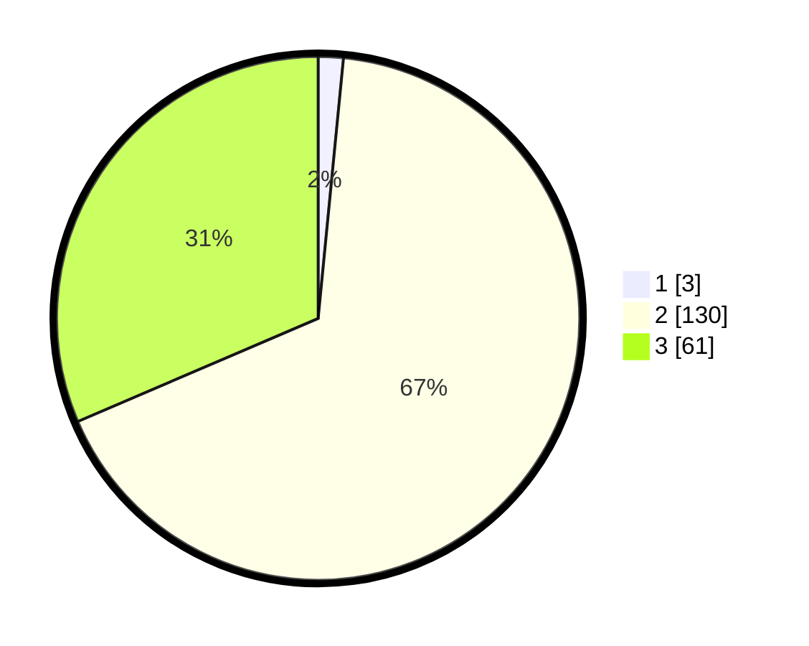

# Hasil

## Grafik

## Tabel

| No. | Nama Paslon    | Suara | Suara (raw) | Persentase |
|:--- |:-------------- | -----:| -----------:| ----------:|
| 1   | ANIES MUHAIMIN | 3     | [3][p-1]    | 1,55       |
| 2   | PRABOWO GIBRAN | 130   | [130][p-2]  | 67,01      |
| 3   | GANJAR MAHFUD  | 61    | [61][p-3]   | 31,44      |

[p-1]: https://github.com/gigit-pemilu/pemilu-2024/blob/main/pilpres/hitung-suara/sub/12-sumatera-utara/sub/11-dairi/sub/02-sumbul/sub/1007-pegagan-julu-i/sub/005-tps/sub/paslon-1.txt
[p-2]: https://github.com/gigit-pemilu/pemilu-2024/blob/main/pilpres/hitung-suara/sub/12-sumatera-utara/sub/11-dairi/sub/02-sumbul/sub/1007-pegagan-julu-i/sub/005-tps/sub/paslon-2.txt
[p-3]: https://github.com/gigit-pemilu/pemilu-2024/blob/main/pilpres/hitung-suara/sub/12-sumatera-utara/sub/11-dairi/sub/02-sumbul/sub/1007-pegagan-julu-i/sub/005-tps/sub/paslon-3.txt

## Foto C Plano

https://sirekap-obj-formc.kpu.go.id/253c/pemilu/ppwp/12/11/02/10/07/1211021007005-20240214-210401--67ef4f0f-cfc5-41bc-965a-b787a3879132.jpg

https://sirekap-obj-formc.kpu.go.id/253c/pemilu/ppwp/12/11/02/10/07/1211021007005-20240214-210630--109653fe-1acb-4f53-b7b0-d1dbbf99daa7.jpg

https://sirekap-obj-formc.kpu.go.id/253c/pemilu/ppwp/12/11/02/10/07/1211021007005-20240214-211004--c0ff416d-cc8e-495a-b51e-ba123914f579.jpg

## Metadata

| Key        | Value               |
| ---------- | ------------------- |
| Time Stamp | 2024-02-15 22:40:13 |

