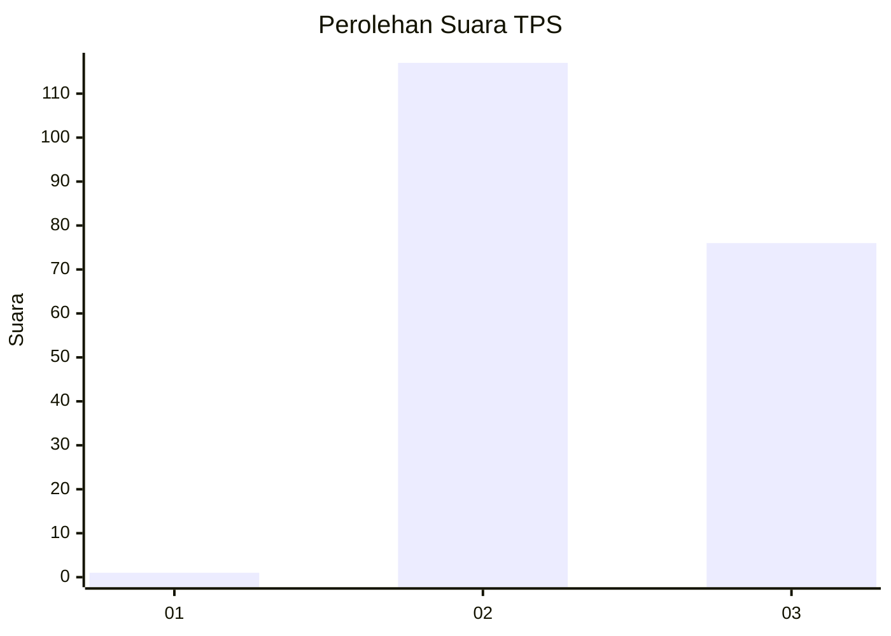
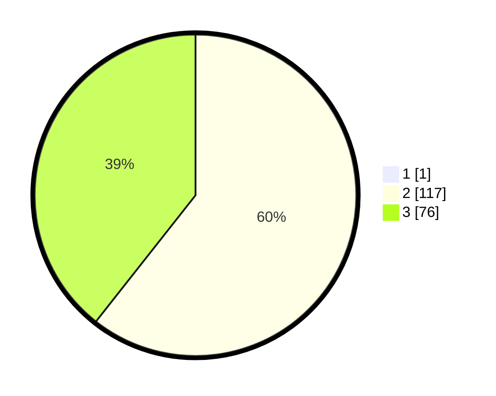

# Hasil

## Grafik

## Tabel

| No. | Nama Paslon    | Suara | Suara (raw) | Persentase |
|:--- |:-------------- | -----:| -----------:| ----------:|
| 1   | ANIES MUHAIMIN | 1     | [1][p-1]    | 0,52       |
| 2   | PRABOWO GIBRAN | 117   | [117][p-2]  | 60,31      |
| 3   | GANJAR MAHFUD  | 76    | [76][p-3]   | 39,18      |

[p-1]: https://github.com/gigit-pemilu/pemilu-2024/blob/main/pilpres/hitung-suara/sub/12-sumatera-utara/sub/11-dairi/sub/02-sumbul/sub/2006-pegagan-julu-v/sub/002-tps/sub/paslon-1.txt
[p-2]: https://github.com/gigit-pemilu/pemilu-2024/blob/main/pilpres/hitung-suara/sub/12-sumatera-utara/sub/11-dairi/sub/02-sumbul/sub/2006-pegagan-julu-v/sub/002-tps/sub/paslon-2.txt
[p-3]: https://github.com/gigit-pemilu/pemilu-2024/blob/main/pilpres/hitung-suara/sub/12-sumatera-utara/sub/11-dairi/sub/02-sumbul/sub/2006-pegagan-julu-v/sub/002-tps/sub/paslon-3.txt

## Foto C Plano

https://sirekap-obj-formc.kpu.go.id/b8da/pemilu/ppwp/12/11/02/20/06/1211022006002-20240214-220514--457e37ce-1012-4762-ad9a-a24b72e2118e.jpg

https://sirekap-obj-formc.kpu.go.id/b8da/pemilu/ppwp/12/11/02/20/06/1211022006002-20240214-220651--d740e1c1-a996-4e8c-a99b-0815fbcf05b8.jpg

https://sirekap-obj-formc.kpu.go.id/b8da/pemilu/ppwp/12/11/02/20/06/1211022006002-20240214-220755--63f3c8fc-f07f-4f6b-9a21-f1019ec18bfe.jpg

## Metadata

| Key        | Value               |
| ---------- | ------------------- |
| Time Stamp | 2024-02-15 23:29:50 |

