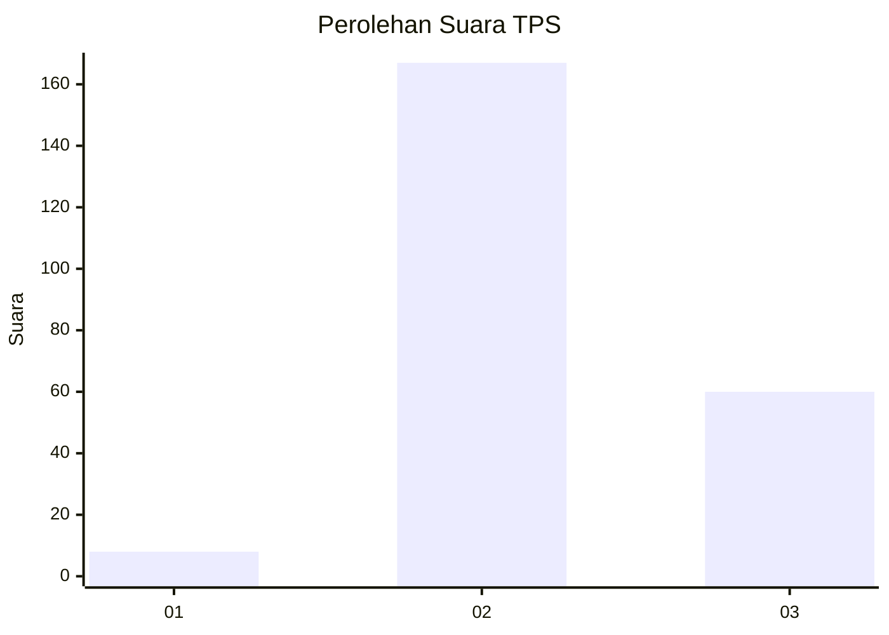
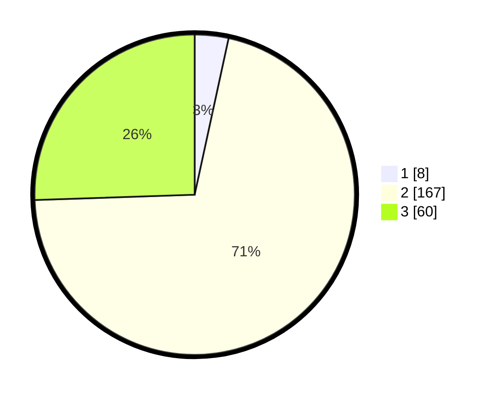

# Hasil

## Grafik

## Tabel

| No. | Nama Paslon    | Suara | Suara (raw) | Persentase |
|:--- |:-------------- | -----:| -----------:| ----------:|
| 1   | ANIES MUHAIMIN | 8     | [8][p-1]    | 3,40       |
| 2   | PRABOWO GIBRAN | 167   | [167][p-2]  | 71,06      |
| 3   | GANJAR MAHFUD  | 60    | [60][p-3]   | 25,53      |

[p-1]: https://github.com/gigit-pemilu/pemilu-2024/blob/main/pilpres/hitung-suara/sub/12-sumatera-utara/sub/11-dairi/sub/02-sumbul/sub/2008-pegagan-julu-iv/sub/004-tps/sub/paslon-1.txt
[p-2]: https://github.com/gigit-pemilu/pemilu-2024/blob/main/pilpres/hitung-suara/sub/12-sumatera-utara/sub/11-dairi/sub/02-sumbul/sub/2008-pegagan-julu-iv/sub/004-tps/sub/paslon-2.txt
[p-3]: https://github.com/gigit-pemilu/pemilu-2024/blob/main/pilpres/hitung-suara/sub/12-sumatera-utara/sub/11-dairi/sub/02-sumbul/sub/2008-pegagan-julu-iv/sub/004-tps/sub/paslon-3.txt

## Foto C Plano

https://sirekap-obj-formc.kpu.go.id/b399/pemilu/ppwp/12/11/02/20/08/1211022008004-20240215-040231--bf5de5ed-c782-44f5-8ed1-60bbc0eee80a.jpg

https://sirekap-obj-formc.kpu.go.id/b399/pemilu/ppwp/12/11/02/20/08/1211022008004-20240215-040503--01ebae2e-cfe5-4f52-ba30-b19d24430c50.jpg

https://sirekap-obj-formc.kpu.go.id/b399/pemilu/ppwp/12/11/02/20/08/1211022008004-20240215-040657--65fa0d30-21b5-4fb8-9bd1-10c71018e181.jpg

## Metadata

| Key        | Value               |
| ---------- | ------------------- |
| Time Stamp | 2024-02-15 21:01:18 |

