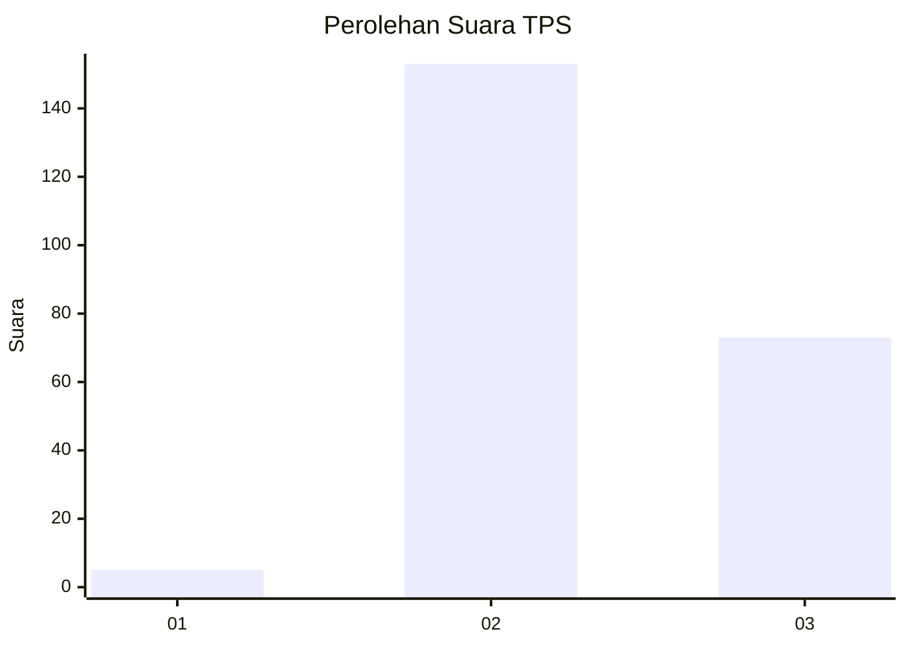
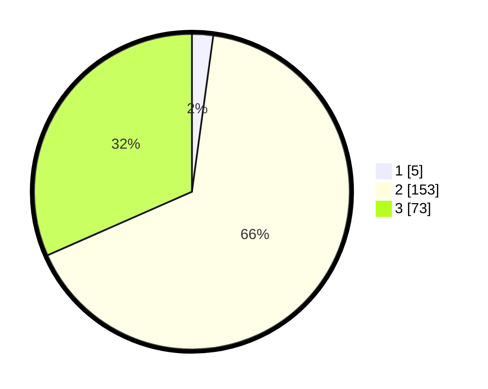

# Hasil

## Grafik

## Tabel

| No. | Nama Paslon    | Suara | Suara (raw) | Persentase |
|:--- |:-------------- | -----:| -----------:| ----------:|
| 1   | ANIES MUHAIMIN | 5     | [5][p-1]    | 2,16       |
| 2   | PRABOWO GIBRAN | 153   | [153][p-2]  | 66,23      |
| 3   | GANJAR MAHFUD  | 73    | [73][p-3]   | 31,60      |

[p-1]: https://github.com/gigit-pemilu/pemilu-2024/blob/main/pilpres/hitung-suara/sub/12-sumatera-utara/sub/11-dairi/sub/02-sumbul/sub/2024-sileuh-leuh-parsaoran/sub/003-tps/sub/paslon-1.txt
[p-2]: https://github.com/gigit-pemilu/pemilu-2024/blob/main/pilpres/hitung-suara/sub/12-sumatera-utara/sub/11-dairi/sub/02-sumbul/sub/2024-sileuh-leuh-parsaoran/sub/003-tps/sub/paslon-2.txt
[p-3]: https://github.com/gigit-pemilu/pemilu-2024/blob/main/pilpres/hitung-suara/sub/12-sumatera-utara/sub/11-dairi/sub/02-sumbul/sub/2024-sileuh-leuh-parsaoran/sub/003-tps/sub/paslon-3.txt

## Foto C Plano

https://sirekap-obj-formc.kpu.go.id/457d/pemilu/ppwp/12/11/02/20/24/1211022024003-20240215-023222--afc9bb52-a2c0-4b53-b684-eee2f52dc525.jpg

https://sirekap-obj-formc.kpu.go.id/457d/pemilu/ppwp/12/11/02/20/24/1211022024003-20240215-022533--8e8d0856-aaef-4130-9a10-0cf6fa4ba425.jpg

https://sirekap-obj-formc.kpu.go.id/457d/pemilu/ppwp/12/11/02/20/24/1211022024003-20240215-022902--1fa657e7-3c48-4f56-9473-d5859b0d634a.jpg

## Metadata

| Key        | Value               |
| ---------- | ------------------- |
| Time Stamp | 2024-02-15 23:29:50 |

