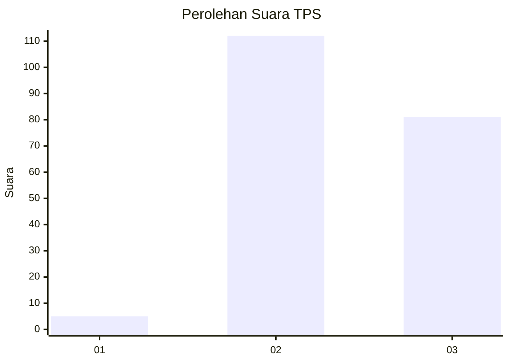
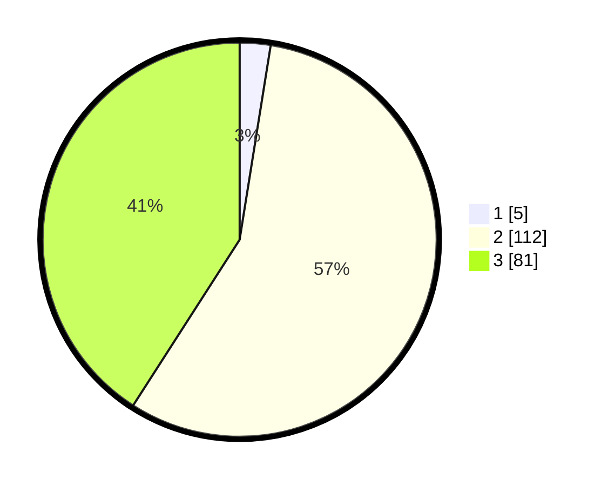

# Hasil

## Grafik

## Tabel

| No. | Nama Paslon    | Suara | Suara (raw) | Persentase |
|:--- |:-------------- | -----:| -----------:| ----------:|
| 1   | ANIES MUHAIMIN | 5     | [5][p-1]    | 2,53       |
| 2   | PRABOWO GIBRAN | 112   | [112][p-2]  | 56,57      |
| 3   | GANJAR MAHFUD  | 81    | [81][p-3]   | 40,91      |

[p-1]: https://github.com/gigit-pemilu/pemilu-2024/blob/main/pilpres/hitung-suara/sub/12-sumatera-utara/sub/11-dairi/sub/02-sumbul/sub/2024-sileuh-leuh-parsaoran/sub/004-tps/sub/paslon-1.txt
[p-2]: https://github.com/gigit-pemilu/pemilu-2024/blob/main/pilpres/hitung-suara/sub/12-sumatera-utara/sub/11-dairi/sub/02-sumbul/sub/2024-sileuh-leuh-parsaoran/sub/004-tps/sub/paslon-2.txt
[p-3]: https://github.com/gigit-pemilu/pemilu-2024/blob/main/pilpres/hitung-suara/sub/12-sumatera-utara/sub/11-dairi/sub/02-sumbul/sub/2024-sileuh-leuh-parsaoran/sub/004-tps/sub/paslon-3.txt

## Foto C Plano

https://sirekap-obj-formc.kpu.go.id/0eaa/pemilu/ppwp/12/11/02/20/24/1211022024004-20240214-214824--ff721cf3-d906-407c-88c4-3f653dd4406c.jpg

https://sirekap-obj-formc.kpu.go.id/0eaa/pemilu/ppwp/12/11/02/20/24/1211022024004-20240214-213336--5602ad6f-e04f-4885-a69f-36910c4f74aa.jpg

https://sirekap-obj-formc.kpu.go.id/0eaa/pemilu/ppwp/12/11/02/20/24/1211022024004-20240214-220512--afa261dc-8f45-49d1-81b2-2cb5cbc87ce7.jpg

## Metadata

| Key        | Value               |
| ---------- | ------------------- |
| Time Stamp | 2024-02-15 23:29:50 |

