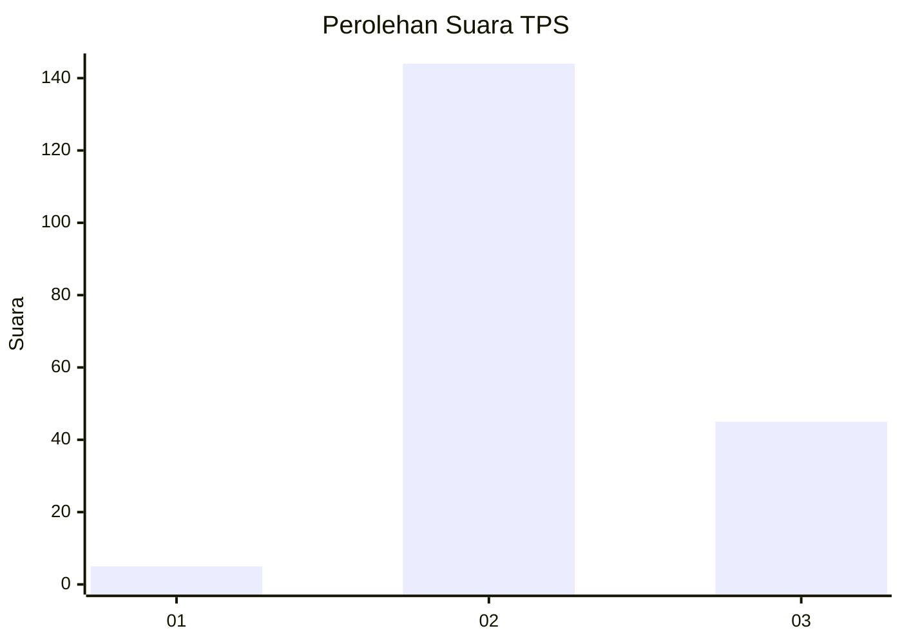
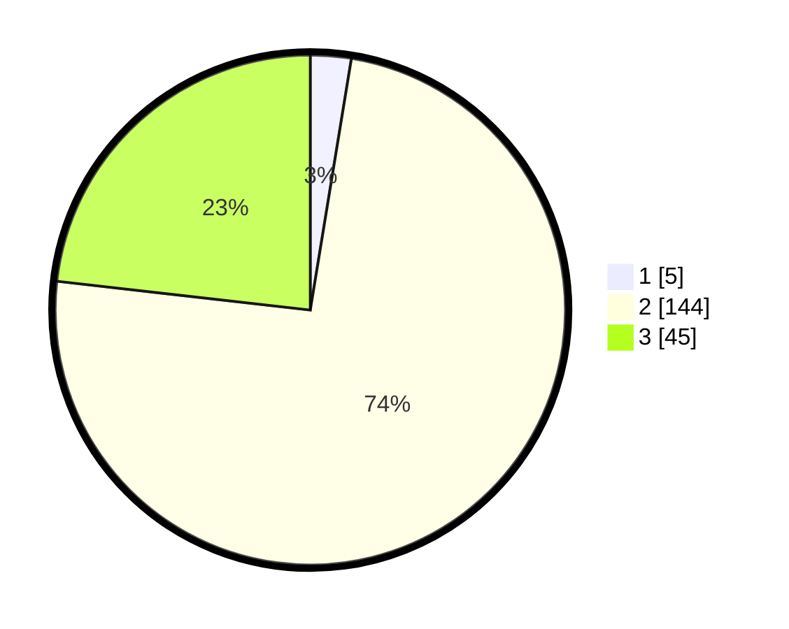

# Hasil

## Grafik

## Tabel

| No. | Nama Paslon    | Suara | Suara (raw) | Persentase |
|:--- |:-------------- | -----:| -----------:| ----------:|
| 1   | ANIES MUHAIMIN | 5     | [5][p-1]    | 2,58       |
| 2   | PRABOWO GIBRAN | 144   | [144][p-2]  | 74,23      |
| 3   | GANJAR MAHFUD  | 45    | [45][p-3]   | 23,20      |

[p-1]: https://github.com/gigit-pemilu/pemilu-2024-12-sumatera-utara/blob/main/pilpres/hitung-suara/sub/12-sumatera-utara/sub/11-dairi/sub/03-tigalingga/sub/2003-juma-gerat/sub/001-tps/sub/paslon-1.txt
[p-2]: https://github.com/gigit-pemilu/pemilu-2024-12-sumatera-utara/blob/main/pilpres/hitung-suara/sub/12-sumatera-utara/sub/11-dairi/sub/03-tigalingga/sub/2003-juma-gerat/sub/001-tps/sub/paslon-2.txt
[p-3]: https://github.com/gigit-pemilu/pemilu-2024-12-sumatera-utara/blob/main/pilpres/hitung-suara/sub/12-sumatera-utara/sub/11-dairi/sub/03-tigalingga/sub/2003-juma-gerat/sub/001-tps/sub/paslon-3.txt

## Foto C Plano

https://sirekap-obj-formc.kpu.go.id/873f/pemilu/ppwp/12/11/03/20/03/1211032003001-20240215-034712--6a7aeed8-b592-4793-be51-784422f6439f.jpg

https://sirekap-obj-formc.kpu.go.id/873f/pemilu/ppwp/12/11/03/20/03/1211032003001-20240215-102726--85d220fd-af79-4e3e-9191-e06fd5d83e08.jpg

https://sirekap-obj-formc.kpu.go.id/873f/pemilu/ppwp/12/11/03/20/03/1211032003001-20240215-102800--46c5127c-b10f-4c34-85b1-270ff6398180.jpg

## Metadata

| Key        | Value               |
| ---------- | ------------------- |
| Time Stamp | 2024-02-15 23:29:50 |

