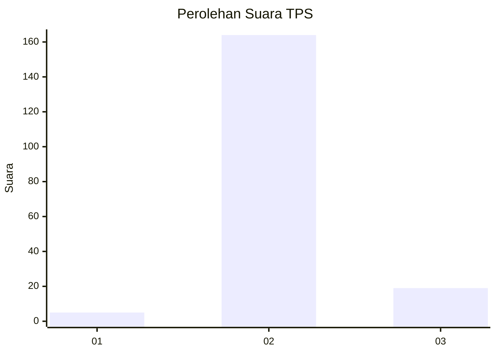
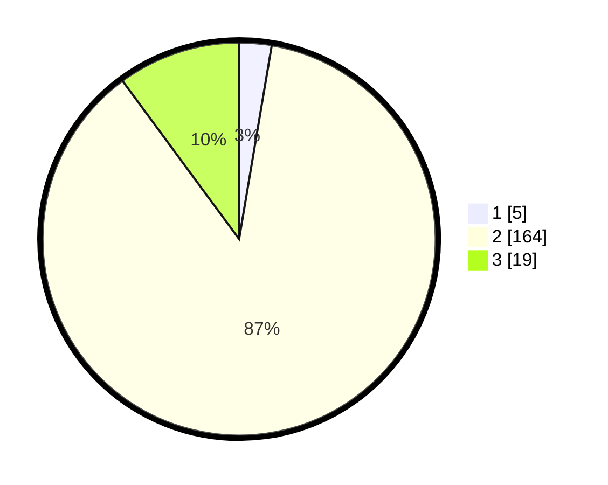

# Hasil

## Grafik

## Tabel

| No. | Nama Paslon    | Suara | Suara (raw) | Persentase |
|:--- |:-------------- | -----:| -----------:| ----------:|
| 1   | ANIES MUHAIMIN | 5     | [5][p-1]    | 2,66       |
| 2   | PRABOWO GIBRAN | 164   | [164][p-2]  | 87,23      |
| 3   | GANJAR MAHFUD  | 19    | [19][p-3]   | 10,11      |

[p-1]: https://github.com/gigit-pemilu/pemilu-2024/blob/main/pilpres/hitung-suara/sub/12-sumatera-utara/sub/11-dairi/sub/03-tigalingga/sub/2003-juma-gerat/sub/003-tps/sub/paslon-1.txt
[p-2]: https://github.com/gigit-pemilu/pemilu-2024/blob/main/pilpres/hitung-suara/sub/12-sumatera-utara/sub/11-dairi/sub/03-tigalingga/sub/2003-juma-gerat/sub/003-tps/sub/paslon-2.txt
[p-3]: https://github.com/gigit-pemilu/pemilu-2024/blob/main/pilpres/hitung-suara/sub/12-sumatera-utara/sub/11-dairi/sub/03-tigalingga/sub/2003-juma-gerat/sub/003-tps/sub/paslon-3.txt

## Foto C Plano

https://sirekap-obj-formc.kpu.go.id/032d/pemilu/ppwp/12/11/03/20/03/1211032003003-20240214-221252--c19af24d-9ec0-449b-8657-ba08a8d7bbca.jpg

https://sirekap-obj-formc.kpu.go.id/032d/pemilu/ppwp/12/11/03/20/03/1211032003003-20240214-230910--97b2b342-00fd-4d94-9bda-d2e46d10aa28.jpg

https://sirekap-obj-formc.kpu.go.id/032d/pemilu/ppwp/12/11/03/20/03/1211032003003-20240214-223638--63bf5dea-2ef1-4467-bdff-dc1688358eb3.jpg

## Metadata

| Key        | Value               |
| ---------- | ------------------- |
| Time Stamp | 2024-02-15 23:29:50 |

