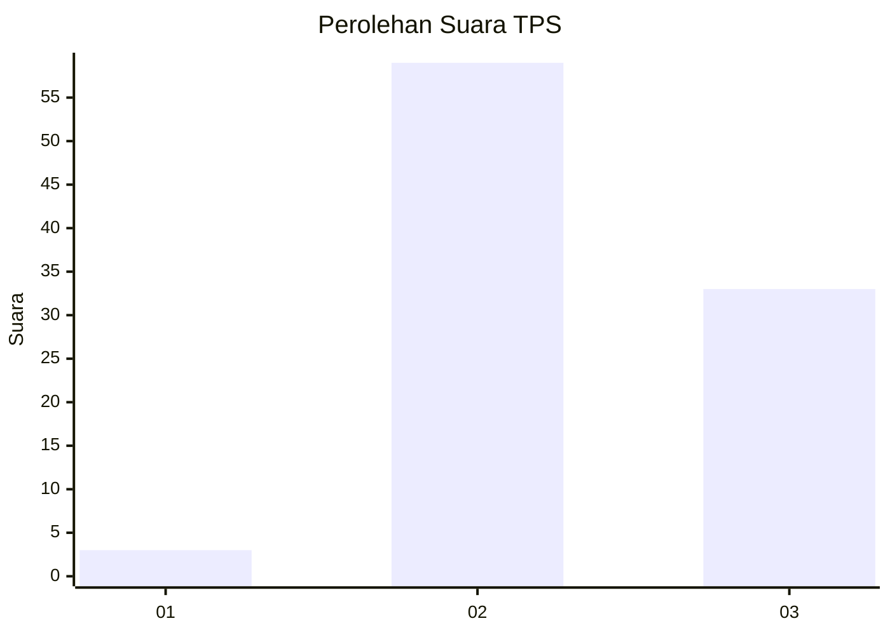
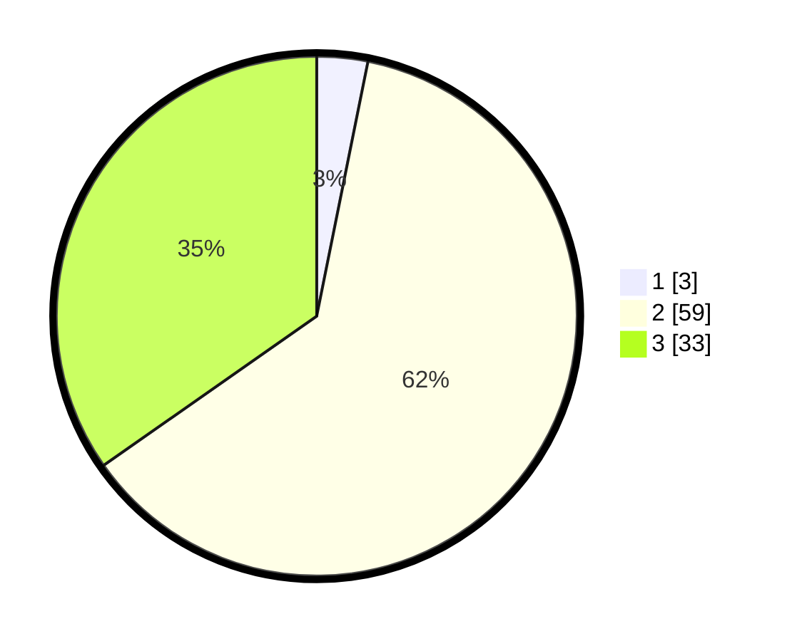

# Hasil

## Grafik

## Tabel

| No. | Nama Paslon    | Suara | Suara (raw) | Persentase |
|:--- |:-------------- | -----:| -----------:| ----------:|
| 1   | ANIES MUHAIMIN | 3     | [3][p-1]    | 3,16       |
| 2   | PRABOWO GIBRAN | 59    | [59][p-2]   | 62,11      |
| 3   | GANJAR MAHFUD  | 33    | [33][p-3]   | 34,74      |

[p-1]: https://github.com/gigit-pemilu/pemilu-2024/blob/main/pilpres/hitung-suara/sub/12-sumatera-utara/sub/11-dairi/sub/03-tigalingga/sub/2006-palding/sub/004-tps/sub/paslon-1.txt
[p-2]: https://github.com/gigit-pemilu/pemilu-2024/blob/main/pilpres/hitung-suara/sub/12-sumatera-utara/sub/11-dairi/sub/03-tigalingga/sub/2006-palding/sub/004-tps/sub/paslon-2.txt
[p-3]: https://github.com/gigit-pemilu/pemilu-2024/blob/main/pilpres/hitung-suara/sub/12-sumatera-utara/sub/11-dairi/sub/03-tigalingga/sub/2006-palding/sub/004-tps/sub/paslon-3.txt

## Foto C Plano

https://sirekap-obj-formc.kpu.go.id/6a0c/pemilu/ppwp/12/11/03/20/06/1211032006004-20240214-210510--ba32b8d9-a866-47a5-8df9-b20a170ee7f7.jpg

https://sirekap-obj-formc.kpu.go.id/6a0c/pemilu/ppwp/12/11/03/20/06/1211032006004-20240214-210922--5076f389-8fdf-43b8-a67a-b80c9822ef25.jpg

https://sirekap-obj-formc.kpu.go.id/6a0c/pemilu/ppwp/12/11/03/20/06/1211032006004-20240214-211120--7bdbf503-c15d-4941-9bbc-84f4cd2d85f2.jpg

## Metadata

| Key        | Value               |
| ---------- | ------------------- |
| Time Stamp | 2024-02-15 23:29:50 |

