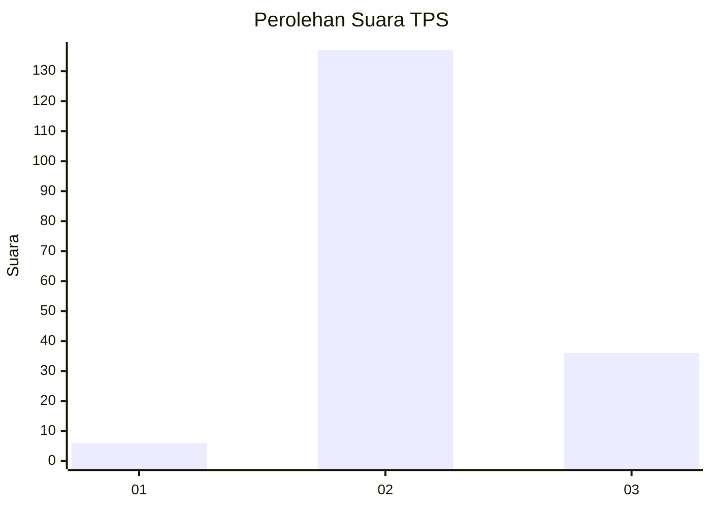

# Hasil

## Grafik

## Tabel

| No. | Nama Paslon    | Suara | Suara (raw) | Persentase |
|:--- |:-------------- | -----:| -----------:| ----------:|
| 1   | ANIES MUHAIMIN | 6     | [6][p-1]    | 3,35       |
| 2   | PRABOWO GIBRAN | 137   | [137][p-2]  | 76,54      |
| 3   | GANJAR MAHFUD  | 36    | [36][p-3]   | 20,11      |

[p-1]: https://github.com/gigit-pemilu/pemilu-2024/blob/main/pilpres/hitung-suara/sub/12-sumatera-utara/sub/11-dairi/sub/03-tigalingga/sub/2007-lau-bagot/sub/003-tps/sub/paslon-1.txt
[p-2]: https://github.com/gigit-pemilu/pemilu-2024/blob/main/pilpres/hitung-suara/sub/12-sumatera-utara/sub/11-dairi/sub/03-tigalingga/sub/2007-lau-bagot/sub/003-tps/sub/paslon-2.txt
[p-3]: https://github.com/gigit-pemilu/pemilu-2024/blob/main/pilpres/hitung-suara/sub/12-sumatera-utara/sub/11-dairi/sub/03-tigalingga/sub/2007-lau-bagot/sub/003-tps/sub/paslon-3.txt

## Foto C Plano

https://sirekap-obj-formc.kpu.go.id/876e/pemilu/ppwp/12/11/03/20/07/1211032007003-20240214-201845--d2d2516f-8849-4ee1-aa34-47b5e12eb732.jpg

https://sirekap-obj-formc.kpu.go.id/876e/pemilu/ppwp/12/11/03/20/07/1211032007003-20240214-201129--5f9fec62-0406-471c-95db-774dfa53c77f.jpg

https://sirekap-obj-formc.kpu.go.id/876e/pemilu/ppwp/12/11/03/20/07/1211032007003-20240214-201300--5fa74a6f-8ee7-4630-b53a-da131ee9b93b.jpg

## Metadata

| Key        | Value               |
| ---------- | ------------------- |
| Time Stamp | 2024-02-15 23:29:50 |

