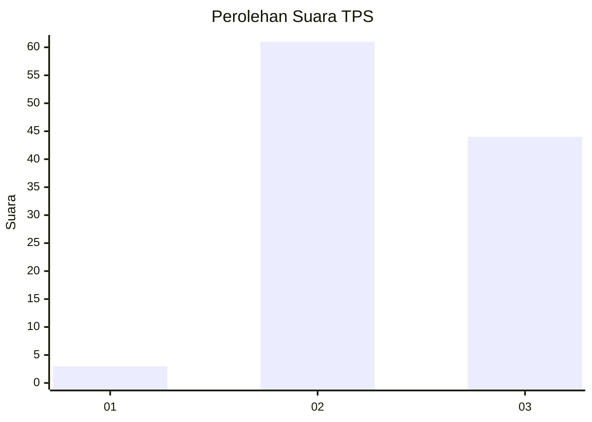
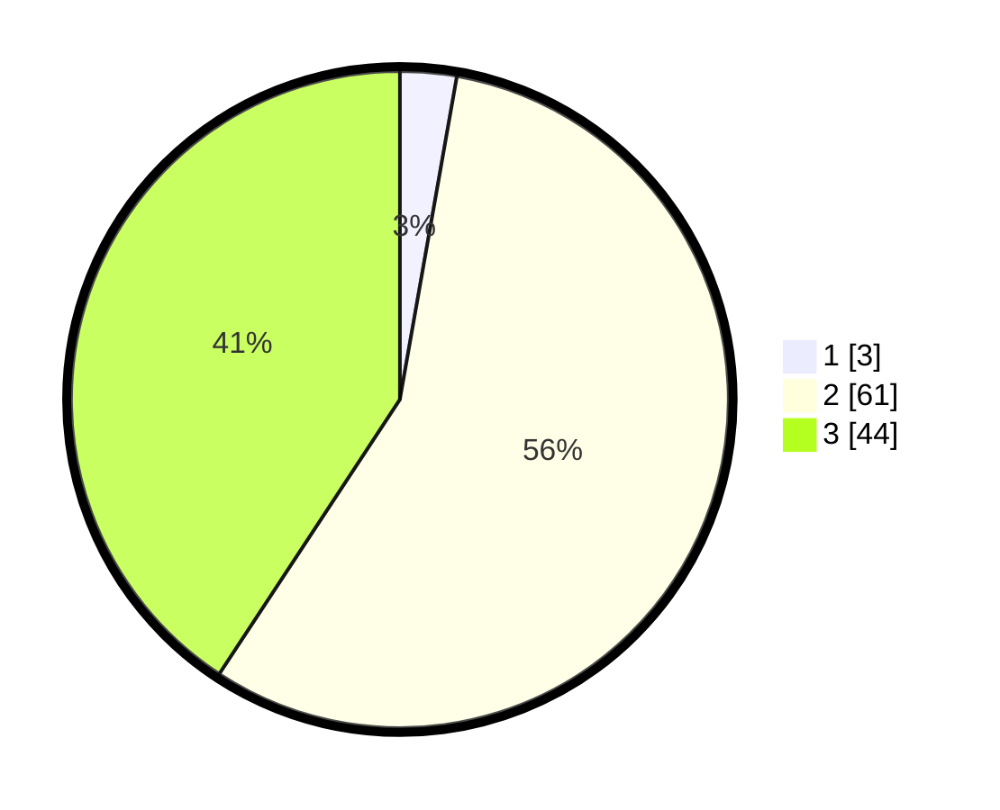

# Hasil

## Grafik

## Tabel

| No. | Nama Paslon    | Suara | Suara (raw) | Persentase |
|:--- |:-------------- | -----:| -----------:| ----------:|
| 1   | ANIES MUHAIMIN | 3     | [3][p-1]    | 2,78       |
| 2   | PRABOWO GIBRAN | 61    | [61][p-2]   | 56,48      |
| 3   | GANJAR MAHFUD  | 44    | [44][p-3]   | 40,74      |

[p-1]: https://github.com/gigit-pemilu/pemilu-2024-12-sumatera-utara/blob/main/pilpres/hitung-suara/sub/12-sumatera-utara/sub/11-dairi/sub/03-tigalingga/sub/2007-lau-bagot/sub/005-tps/sub/paslon-1.txt
[p-2]: https://github.com/gigit-pemilu/pemilu-2024-12-sumatera-utara/blob/main/pilpres/hitung-suara/sub/12-sumatera-utara/sub/11-dairi/sub/03-tigalingga/sub/2007-lau-bagot/sub/005-tps/sub/paslon-2.txt
[p-3]: https://github.com/gigit-pemilu/pemilu-2024-12-sumatera-utara/blob/main/pilpres/hitung-suara/sub/12-sumatera-utara/sub/11-dairi/sub/03-tigalingga/sub/2007-lau-bagot/sub/005-tps/sub/paslon-3.txt

## Foto C Plano

https://sirekap-obj-formc.kpu.go.id/8f83/pemilu/ppwp/12/11/03/20/07/1211032007005-20240215-073616--88a0df04-e10f-4efc-9302-d1b3de5a8840.jpg

https://sirekap-obj-formc.kpu.go.id/8f83/pemilu/ppwp/12/11/03/20/07/1211032007005-20240215-073632--f102593b-2e45-4f29-bb32-a85d5ddd1a59.jpg

https://sirekap-obj-formc.kpu.go.id/8f83/pemilu/ppwp/12/11/03/20/07/1211032007005-20240215-073642--b4ee16aa-1299-4bd9-aef0-a9d87f6d1805.jpg

## Metadata

| Key        | Value               |
| ---------- | ------------------- |
| Time Stamp | 2024-02-15 23:29:50 |

