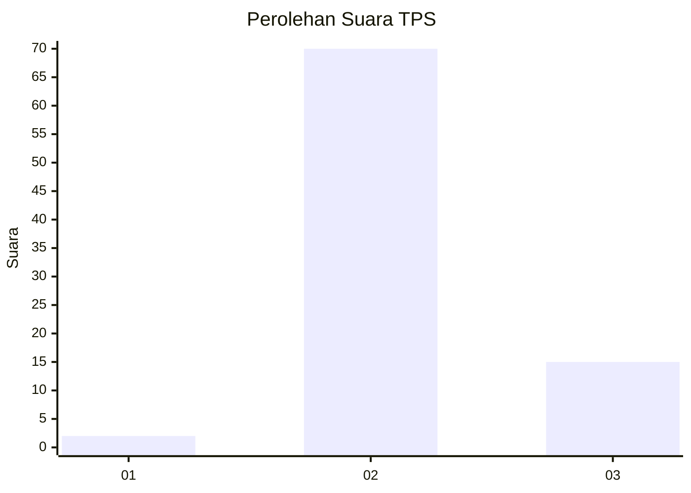
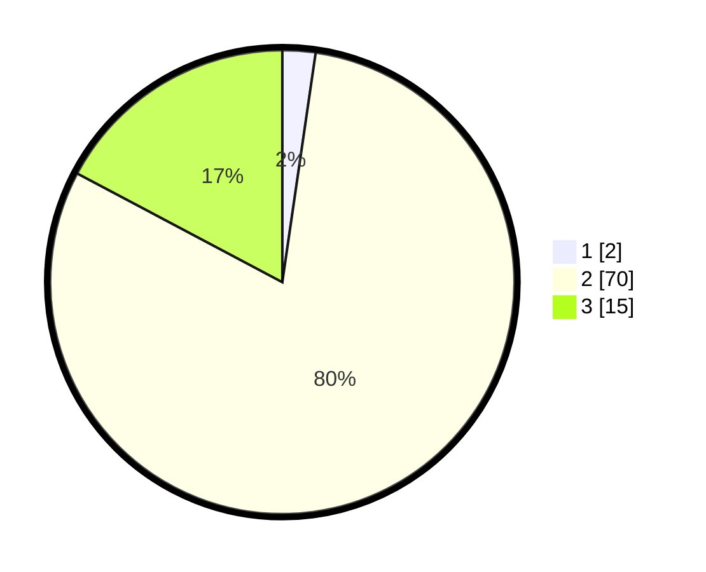

# Hasil

## Grafik

## Tabel

| No. | Nama Paslon    | Suara | Suara (raw) | Persentase |
|:--- |:-------------- | -----:| -----------:| ----------:|
| 1   | ANIES MUHAIMIN | 2     | [2][p-1]    | 2,30       |
| 2   | PRABOWO GIBRAN | 70    | [70][p-2]   | 80,46      |
| 3   | GANJAR MAHFUD  | 15    | [15][p-3]   | 17,24      |

[p-1]: https://github.com/gigit-pemilu/pemilu-2024/blob/main/pilpres/hitung-suara/sub/12-sumatera-utara/sub/11-dairi/sub/03-tigalingga/sub/2013-lau-mil/sub/002-tps/sub/paslon-1.txt
[p-2]: https://github.com/gigit-pemilu/pemilu-2024/blob/main/pilpres/hitung-suara/sub/12-sumatera-utara/sub/11-dairi/sub/03-tigalingga/sub/2013-lau-mil/sub/002-tps/sub/paslon-2.txt
[p-3]: https://github.com/gigit-pemilu/pemilu-2024/blob/main/pilpres/hitung-suara/sub/12-sumatera-utara/sub/11-dairi/sub/03-tigalingga/sub/2013-lau-mil/sub/002-tps/sub/paslon-3.txt

## Foto C Plano

https://sirekap-obj-formc.kpu.go.id/8135/pemilu/ppwp/12/11/03/20/13/1211032013002-20240214-232703--a0b3ab88-66f6-4561-9f25-846c4f56327e.jpg

https://sirekap-obj-formc.kpu.go.id/8135/pemilu/ppwp/12/11/03/20/13/1211032013002-20240214-232840--e75c36df-f477-47c7-b70f-ef6349248dc7.jpg

## Metadata

| Key        | Value               |
| ---------- | ------------------- |
| Time Stamp | 2024-02-15 23:29:50 |

