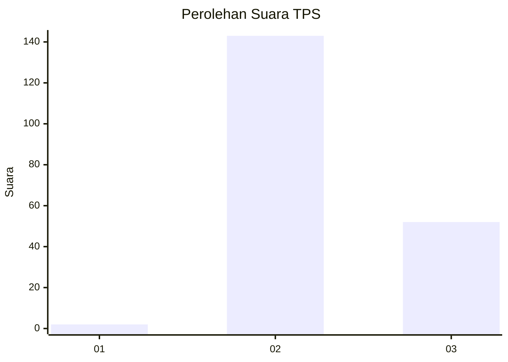
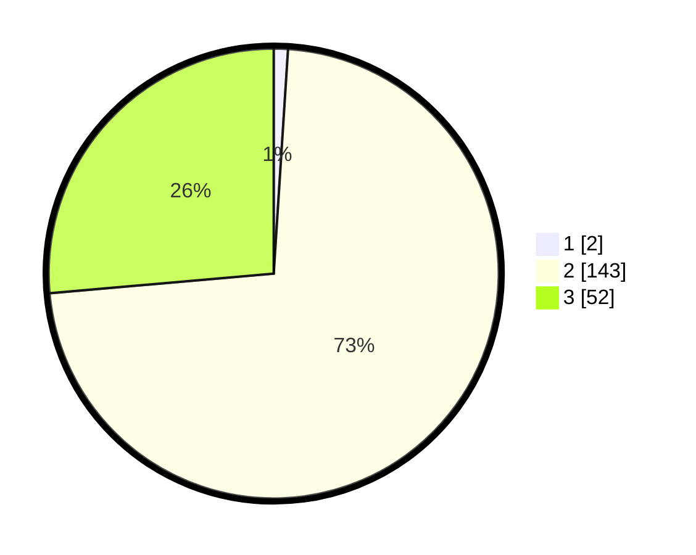

# Hasil

## Grafik

## Tabel

| No. | Nama Paslon    | Suara | Suara (raw) | Persentase |
|:--- |:-------------- | -----:| -----------:| ----------:|
| 1   | ANIES MUHAIMIN | 2     | [2][p-1]    | 1,02       |
| 2   | PRABOWO GIBRAN | 143   | [143][p-2]  | 72,59      |
| 3   | GANJAR MAHFUD  | 52    | [52][p-3]   | 26,40      |

[p-1]: https://github.com/gigit-pemilu/pemilu-2024/blob/main/pilpres/hitung-suara/sub/12-sumatera-utara/sub/11-dairi/sub/03-tigalingga/sub/2013-lau-mil/sub/004-tps/sub/paslon-1.txt
[p-2]: https://github.com/gigit-pemilu/pemilu-2024/blob/main/pilpres/hitung-suara/sub/12-sumatera-utara/sub/11-dairi/sub/03-tigalingga/sub/2013-lau-mil/sub/004-tps/sub/paslon-2.txt
[p-3]: https://github.com/gigit-pemilu/pemilu-2024/blob/main/pilpres/hitung-suara/sub/12-sumatera-utara/sub/11-dairi/sub/03-tigalingga/sub/2013-lau-mil/sub/004-tps/sub/paslon-3.txt

## Foto C Plano

https://sirekap-obj-formc.kpu.go.id/9ac4/pemilu/ppwp/12/11/03/20/13/1211032013004-20240215-032154--1c4759f9-cf03-4a5a-ab4e-4b7b7f9efe06.jpg

https://sirekap-obj-formc.kpu.go.id/9ac4/pemilu/ppwp/12/11/03/20/13/1211032013004-20240215-032251--4c21f95a-a265-4a61-a70f-83f2f03d4c6d.jpg

https://sirekap-obj-formc.kpu.go.id/9ac4/pemilu/ppwp/12/11/03/20/13/1211032013004-20240215-032347--f75b0788-2ee4-44a2-9962-541aa3ee2b93.jpg

## Metadata

| Key        | Value               |
| ---------- | ------------------- |
| Time Stamp | 2024-02-15 23:29:50 |

