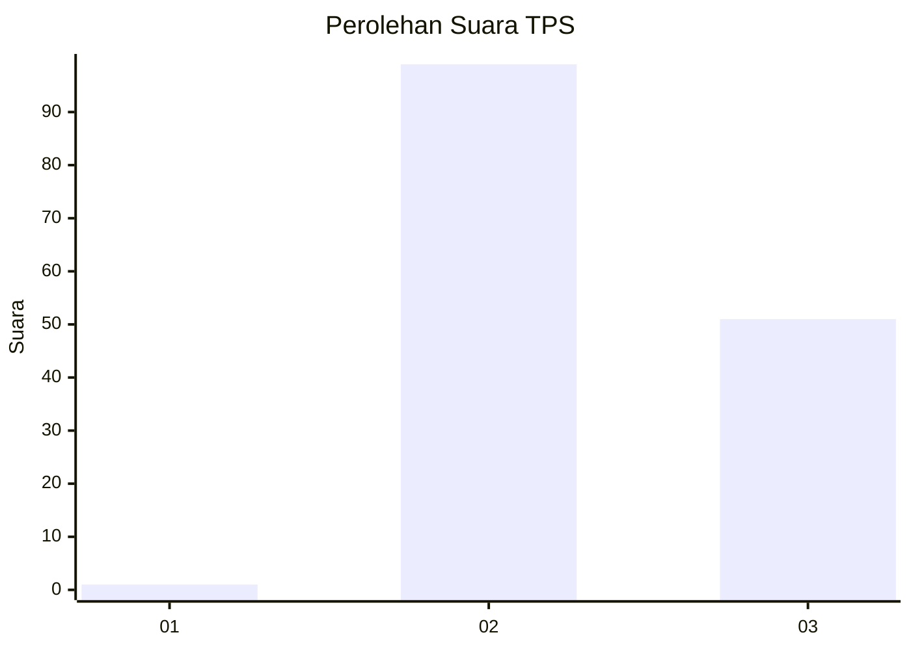
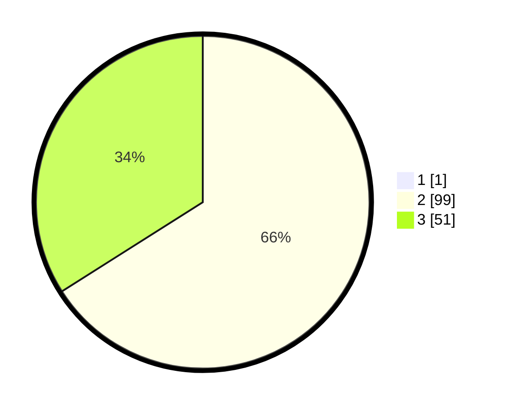

# Hasil

## Grafik

## Tabel

| No. | Nama Paslon    | Suara | Suara (raw) | Persentase |
|:--- |:-------------- | -----:| -----------:| ----------:|
| 1   | ANIES MUHAIMIN | 1     | [1][p-1]    | 0,66       |
| 2   | PRABOWO GIBRAN | 99    | [99][p-2]   | 65,56      |
| 3   | GANJAR MAHFUD  | 51    | [51][p-3]   | 33,77      |

[p-1]: https://github.com/gigit-pemilu/pemilu-2024/blob/main/pilpres/hitung-suara/sub/12-sumatera-utara/sub/11-dairi/sub/04-siempat-nempu/sub/2001-sinampang/sub/002-tps/sub/paslon-1.txt
[p-2]: https://github.com/gigit-pemilu/pemilu-2024/blob/main/pilpres/hitung-suara/sub/12-sumatera-utara/sub/11-dairi/sub/04-siempat-nempu/sub/2001-sinampang/sub/002-tps/sub/paslon-2.txt
[p-3]: https://github.com/gigit-pemilu/pemilu-2024/blob/main/pilpres/hitung-suara/sub/12-sumatera-utara/sub/11-dairi/sub/04-siempat-nempu/sub/2001-sinampang/sub/002-tps/sub/paslon-3.txt

## Foto C Plano

https://sirekap-obj-formc.kpu.go.id/8d50/pemilu/ppwp/12/11/04/20/01/1211042001002-20240215-023253--48112b16-02dc-4985-befe-b0635de29c95.jpg

https://sirekap-obj-formc.kpu.go.id/8d50/pemilu/ppwp/12/11/04/20/01/1211042001002-20240215-023426--e104f646-d248-4ecd-9259-d8db2018422b.jpg

https://sirekap-obj-formc.kpu.go.id/8d50/pemilu/ppwp/12/11/04/20/01/1211042001002-20240215-023539--e1b8afef-2f25-47b7-822c-33b09e9da959.jpg

## Metadata

| Key        | Value               |
| ---------- | ------------------- |
| Time Stamp | 2024-02-16 11:00:29 |

