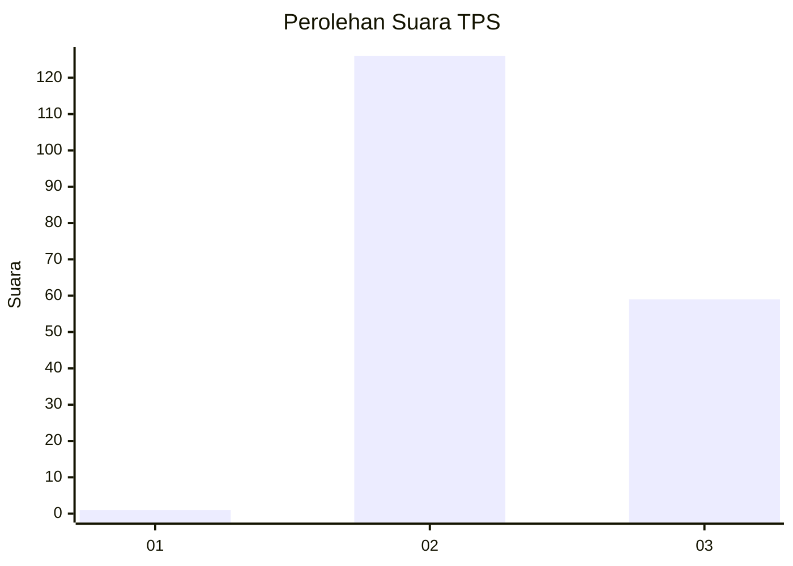
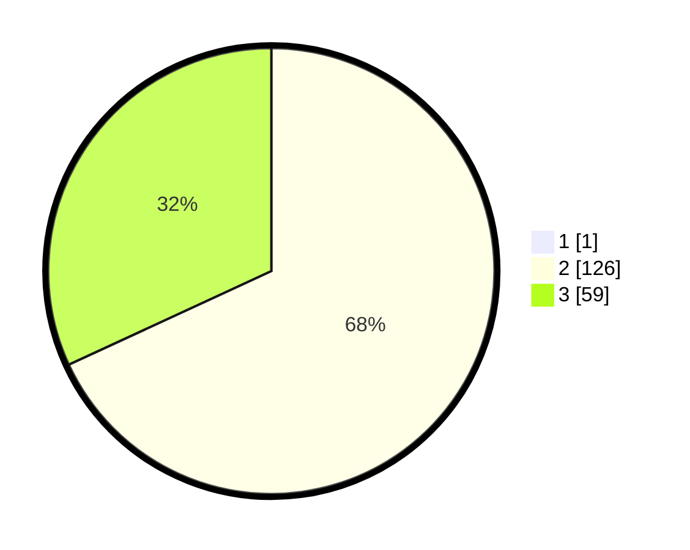

# Hasil

## Grafik

## Tabel

| No. | Nama Paslon    | Suara | Suara (raw) | Persentase |
|:--- |:-------------- | -----:| -----------:| ----------:|
| 1   | ANIES MUHAIMIN | 1     | [1][p-1]    | 0,54       |
| 2   | PRABOWO GIBRAN | 126   | [126][p-2]  | 67,74      |
| 3   | GANJAR MAHFUD  | 59    | [59][p-3]   | 31,72      |

[p-1]: https://github.com/gigit-pemilu/pemilu-2024/blob/main/pilpres/hitung-suara/sub/12-sumatera-utara/sub/11-dairi/sub/04-siempat-nempu/sub/2001-sinampang/sub/003-tps/sub/paslon-1.txt
[p-2]: https://github.com/gigit-pemilu/pemilu-2024/blob/main/pilpres/hitung-suara/sub/12-sumatera-utara/sub/11-dairi/sub/04-siempat-nempu/sub/2001-sinampang/sub/003-tps/sub/paslon-2.txt
[p-3]: https://github.com/gigit-pemilu/pemilu-2024/blob/main/pilpres/hitung-suara/sub/12-sumatera-utara/sub/11-dairi/sub/04-siempat-nempu/sub/2001-sinampang/sub/003-tps/sub/paslon-3.txt

## Foto C Plano

https://sirekap-obj-formc.kpu.go.id/f259/pemilu/ppwp/12/11/04/20/01/1211042001003-20240214-155027--d1be7806-6345-494f-a154-52b5061d747f.jpg

https://sirekap-obj-formc.kpu.go.id/f259/pemilu/ppwp/12/11/04/20/01/1211042001003-20240214-155115--285bd500-efdd-4416-a8e4-cc556f1dcfa0.jpg

https://sirekap-obj-formc.kpu.go.id/f259/pemilu/ppwp/12/11/04/20/01/1211042001003-20240214-155202--ab88f66f-bc4a-4616-a834-c9be1d83fa9c.jpg

## Metadata

| Key        | Value               |
| ---------- | ------------------- |
| Time Stamp | 2024-02-16 11:00:29 |

