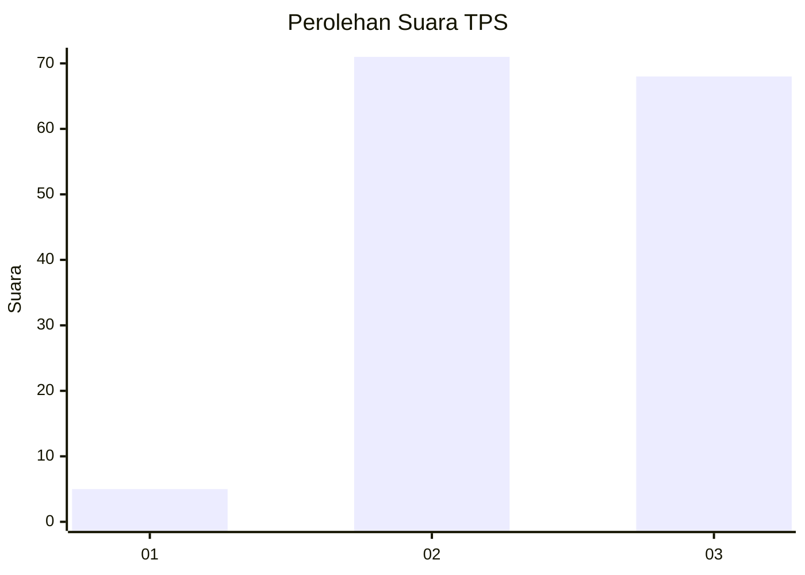
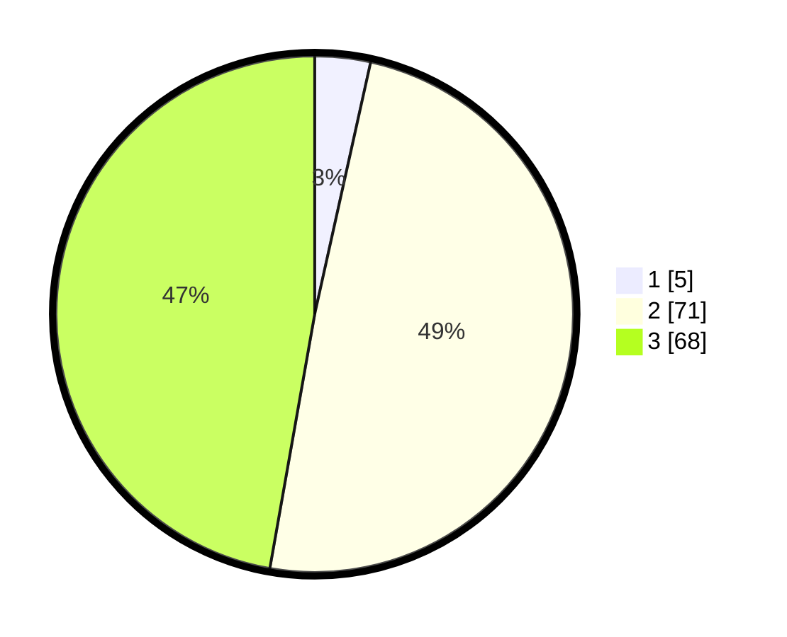

# Hasil

## Grafik

## Tabel

| No. | Nama Paslon    | Suara | Suara (raw) | Persentase |
|:--- |:-------------- | -----:| -----------:| ----------:|
| 1   | ANIES MUHAIMIN | 5     | [5][p-1]    | 3,47       |
| 2   | PRABOWO GIBRAN | 71    | [71][p-2]   | 49,31      |
| 3   | GANJAR MAHFUD  | 68    | [68][p-3]   | 47,22      |

[p-1]: https://github.com/gigit-pemilu/pemilu-2024/blob/main/pilpres/hitung-suara/sub/12-sumatera-utara/sub/11-dairi/sub/04-siempat-nempu/sub/2001-sinampang/sub/005-tps/sub/paslon-1.txt
[p-2]: https://github.com/gigit-pemilu/pemilu-2024/blob/main/pilpres/hitung-suara/sub/12-sumatera-utara/sub/11-dairi/sub/04-siempat-nempu/sub/2001-sinampang/sub/005-tps/sub/paslon-2.txt
[p-3]: https://github.com/gigit-pemilu/pemilu-2024/blob/main/pilpres/hitung-suara/sub/12-sumatera-utara/sub/11-dairi/sub/04-siempat-nempu/sub/2001-sinampang/sub/005-tps/sub/paslon-3.txt

## Foto C Plano

https://sirekap-obj-formc.kpu.go.id/c94c/pemilu/ppwp/12/11/04/20/01/1211042001005-20240214-233229--2b89838f-7e85-4ebc-80fb-ef21b0636c8c.jpg

https://sirekap-obj-formc.kpu.go.id/c94c/pemilu/ppwp/12/11/04/20/01/1211042001005-20240215-161111--badfa82e-df25-4321-b210-93cfe31bc81c.jpg

https://sirekap-obj-formc.kpu.go.id/c94c/pemilu/ppwp/12/11/04/20/01/1211042001005-20240215-163148--0a3af48d-4103-4da0-afda-8ca650e58965.jpg

## Metadata

| Key        | Value               |
| ---------- | ------------------- |
| Time Stamp | 2024-02-16 11:00:29 |

