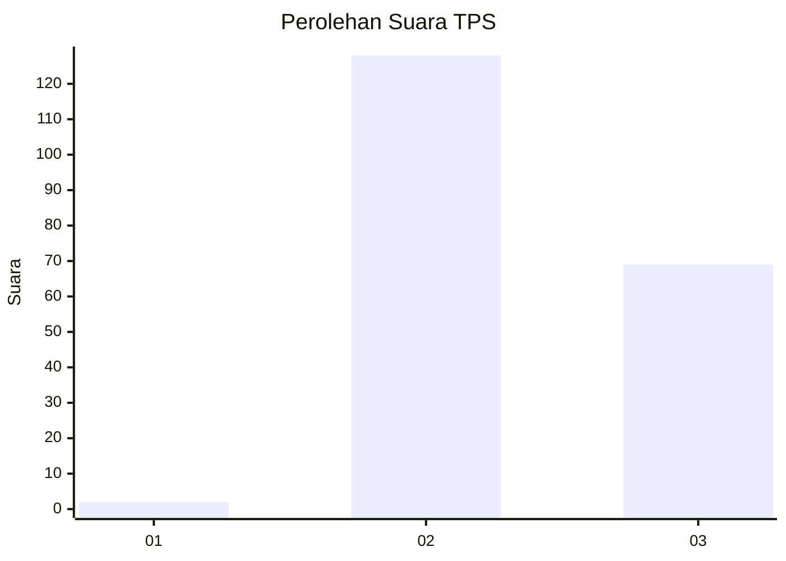
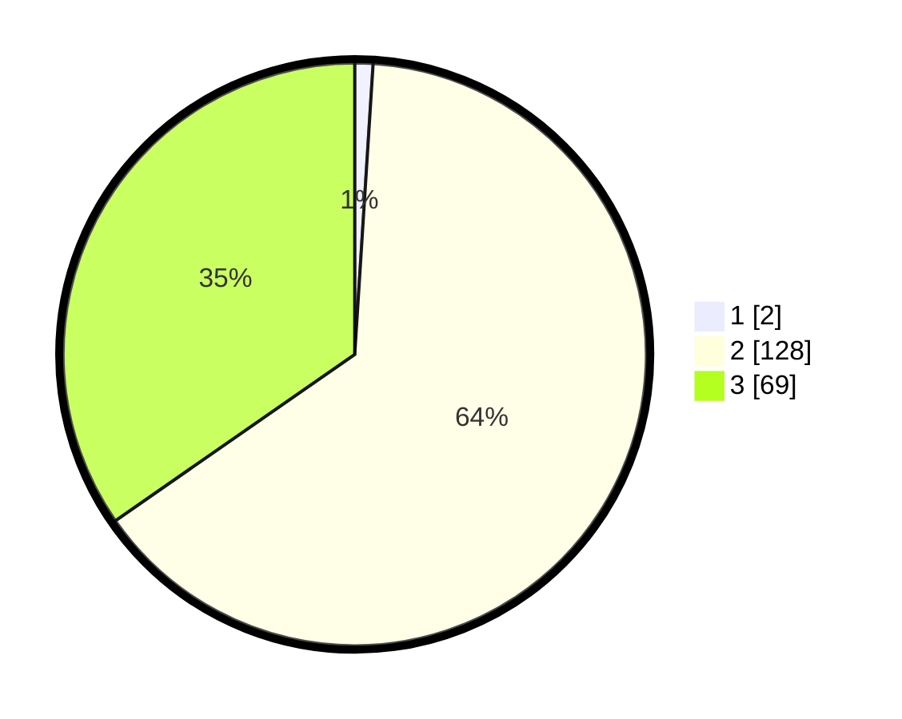

# Hasil

## Grafik

## Tabel

| No. | Nama Paslon    | Suara | Suara (raw) | Persentase |
|:--- |:-------------- | -----:| -----------:| ----------:|
| 1   | ANIES MUHAIMIN | 2     | [2][p-1]    | 1,01       |
| 2   | PRABOWO GIBRAN | 128   | [128][p-2]  | 64,32      |
| 3   | GANJAR MAHFUD  | 69    | [69][p-3]   | 34,67      |

[p-1]: https://github.com/gigit-pemilu/pemilu-2024/blob/main/pilpres/hitung-suara/sub/12-sumatera-utara/sub/11-dairi/sub/04-siempat-nempu/sub/2002-sihorbo/sub/002-tps/sub/paslon-1.txt
[p-2]: https://github.com/gigit-pemilu/pemilu-2024/blob/main/pilpres/hitung-suara/sub/12-sumatera-utara/sub/11-dairi/sub/04-siempat-nempu/sub/2002-sihorbo/sub/002-tps/sub/paslon-2.txt
[p-3]: https://github.com/gigit-pemilu/pemilu-2024/blob/main/pilpres/hitung-suara/sub/12-sumatera-utara/sub/11-dairi/sub/04-siempat-nempu/sub/2002-sihorbo/sub/002-tps/sub/paslon-3.txt

## Foto C Plano

https://sirekap-obj-formc.kpu.go.id/0b5a/pemilu/ppwp/12/11/04/20/02/1211042002002-20240215-002945--ad5a5b17-331d-4a92-ad5a-0dba2c42155d.jpg

https://sirekap-obj-formc.kpu.go.id/0b5a/pemilu/ppwp/12/11/04/20/02/1211042002002-20240215-002911--9ad647a2-e254-47e6-91d2-aa25f3458a86.jpg

https://sirekap-obj-formc.kpu.go.id/0b5a/pemilu/ppwp/12/11/04/20/02/1211042002002-20240215-003005--c0a06de9-0f8f-42bc-ae5a-9cc62b695b24.jpg

## Metadata

| Key        | Value               |
| ---------- | ------------------- |
| Time Stamp | 2024-02-16 11:00:29 |

